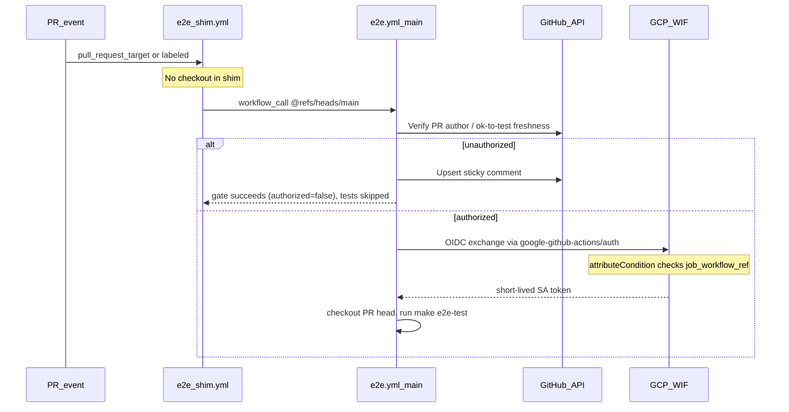

# 43. E2E WIF shim and PR authorization gate

Date: 2026-06-07

## Status

Accepted

## Context

Admin e2e tests run in GitHub Actions against live GitHub orgs and GCP
resources ([ADR 0010](0010-stored-session-for-e2e-browser-auth.md),
[ADR 0040](0040-org-pool-for-parallel-e2e-tests.md)). The workflow needs
short-lived GCP credentials for inference provisioning during install tests, but
PR-triggered workflows must not expose long-lived secrets or GCP access to
untrusted PR authors.

Issue [#1604](https://github.com/fullsend-ai/fullsend/issues/1604) proposed a
three-workflow shim → gate → test pattern. We simplify to two workflows while
keeping the security boundary at GCP Workload Identity Federation (WIF) bound
to the trusted `e2e.yml` workflow on `main`.

### Goal: secretless e2e (incremental)

The long-term goal is for authorized e2e runs to work **without** per-repo
GitHub secrets or variables for GCP and session material. This ADR delivers an
**increment toward** that goal, not the full outcome:

| Area | This change | Still required today |
|------|-------------|----------------------|
| GCP auth | WIF (short-lived); no SA JSON keys | Optional override secrets only |
| GCP project / WIF / SA | Workflow defaults to shared konflux e2e resources when secrets unset | Optional override secrets only |
| GitHub session | Unchanged | `E2E_GITHUB_SESSION`, password/TOTP secrets |
| Mint URL | Unchanged | `E2E_MINT_URL` secret |
| Fork PRs | `pull_request_target` shim inherits secrets/OIDC | Same session/mint secrets as same-repo PRs when authorized |

Follow-up work includes eliminating the remaining secrets ([ADR
0010](0010-stored-session-for-e2e-browser-auth.md)).

## Decision

### Two-workflow PR path

1. **`e2e_shim.yml`** — triggers on `pull_request_target` (base-branch workflow
   definition; inherits repository secrets and OIDC, including fork PRs). Does
   not checkout PR code. Calls
   `fullsend-ai/fullsend/.github/workflows/e2e.yml@refs/heads/main` via
   `workflow_call`, passing PR number and head SHA.

2. **`e2e.yml`** — trusted reusable workflow on `main`:
   - **Gate job:** authorize PR (org member/collaborator, or fresh `ok-to-test`
     label applied after the latest push). Remove stale `ok-to-test` labels.
     Post a sticky PR comment when unauthorized.
   - **E2e job:** checkout PR head, authenticate to GCP via WIF, run
     `make e2e-test`.

### Trusted paths that skip the gate

- `push` to `main` (path-filtered)
- `workflow_dispatch`

### PR authorization

Authorized when **either**:

- `author_association` is `OWNER`, `MEMBER`, or `COLLABORATOR`, or
- PR has `ok-to-test` and the most recent label event is **after** the latest
  commit on the PR head.

Stale `ok-to-test` labels are removed automatically.

### GCP credential boundary

A dedicated E2E WIF provider validates GitHub OIDC tokens with an attribute
condition scoped to:

- `repository == fullsend-ai/fullsend`
- `job_workflow_ref` starts with `fullsend-ai/fullsend/.github/workflows/e2e.yml@`

Only jobs running the trusted workflow definition from `main` can impersonate
the e2e service account. The shim uses `pull_request_target` so PR branches
cannot replace the workflow file that runs on the caller side.

### Default GCP configuration

When the corresponding repository secrets are unset, `e2e.yml` uses hardcoded
defaults for the shared konflux e2e infrastructure in [E2E GCP
setup](../guides/infrastructure/e2e-gcp-setup.md#canonical-resource-names).
The WIF provider path includes the GCP project number, which cannot be derived
at runtime without prior GCP credentials:

| Secret (optional) | Workflow default |
|-------------------|------------------|
| `E2E_GCP_PROJECT_ID` | `it-gcp-konflux-e2e-fullsend` |
| `E2E_GCP_SERVICE_ACCOUNT` | `fullsend-e2e@it-gcp-konflux-e2e-fullsend.iam.gserviceaccount.com` |
| `E2E_GCP_WIF_PROVIDER` | `projects/208332380190/locations/global/workloadIdentityPools/fullsend-e2e-pool/providers/github-oidc` |

Operators provision infrastructure using those canonical names; override
secrets only when pointing at different resources.

### Fork PRs

The shim uses `pull_request_target` (same pattern as the agent
`fullsend.yaml` shim) so fork PRs receive repository secrets and OIDC tokens
in the base-repo workflow context. This is safe because the shim never checks
out or executes PR code — it only forwards PR metadata to `e2e.yml@main`.
PR head code runs only inside the trusted reusable workflow after the
authorization gate.

## Consequences

- **Positive:** Progress toward secretless e2e: WIF replaces long-lived GCP SA
  keys; default GCP project, WIF provider, and service account reduce required
  configuration.
- **Positive:** Untrusted authors cannot run e2e with secrets without maintainer
  `ok-to-test`.
- **Positive:** WIF `job_workflow_ref` binding prevents credential theft via
  modified shim workflows.
- **Incomplete:** GitHub session and mint URL secrets are still required — full
  secretless e2e is follow-up work.
- **Negative:** Workflow-step changes to `e2e.yml` require merge to `main` or
  manual `workflow_dispatch` on a branch — test invocation customization
  belongs in `Makefile` / Go test code on the PR head.

## References

- Operator setup (verify-then-create): [E2E GCP setup guide](../guides/infrastructure/e2e-gcp-setup.md)
- Contributor guide: [E2E testing](../guides/dev/e2e-testing.md)
- Issues: [#1604](https://github.com/fullsend-ai/fullsend/issues/1604), [#817](https://github.com/fullsend-ai/fullsend/issues/817)

## Architecture

