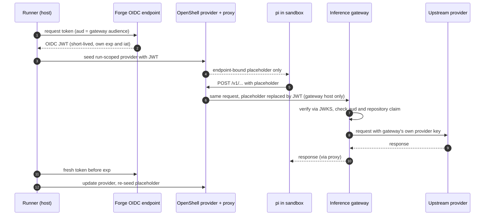

# 137. An inference gateway is a credential route of its own

Date: 2026-10-09

## Status

Accepted

## Context

fullsend reaches every model provider directly. For `openai` there are two
routes ([ADR 0092](0092-openai-wif-credential-delivery.md)). The first is a
WIF exchange, which needs admin access to the OpenAI organization. The second
is a static `OPENAI_API_KEY`, which is a long-lived provider key kept in forge
secret storage. Neither route can put an LLM gateway in front of the provider.
Such a gateway is an OpenAI- and Anthropic-compatible front door, such as
agentgateway, LiteLLM or APISIX. It checks the job's CI OIDC token against the
forge's JWKS and holds the provider key server-side.

This decision builds on four earlier ones:

- [ADR 0025](0025-provider-credential-delivery-for-sandboxed-agents.md):
  credential delivery tiers.
- [ADR 0033](0033-per-repo-installation-mode.md): pull-request events read
  config from the base branch.
- [ADR 0073](0073-named-mint-privilege-levels.md): the OIDC request variables
  stay runner-only (`oidcDenyKeys`).
- [ADR 0092](0092-openai-wif-credential-delivery.md): run-scoped provider,
  endpoint-bound placeholder, refresh path.

A gateway is not a base-URL knob on an existing route. It moves the trust
boundary, so it gets a record of its own.

The route was validated live on 2026-10-09 (see
[#7480](https://github.com/fullsend-ai/fullsend/issues/7480)). The test setup
was agentgateway, pi, and
[pi-inference-gateway](https://github.com/fullsend-ai/pi-inference-gateway)
v0.1.1. It used a GitHub Actions OIDC token and served GPT, Claude and Gemini.
The negative cases all returned 401/403 with no credential echoed: wrong
audience, wrong issuer, an expired token, another repository's token, and
`x-api-key`-only auth.

## Decision

**An inference gateway is a credential route of its own.** The gateway trusts
the forge's OIDC issuer directly. The runner hands it the job's OIDC token as
the bearer credential. The gateway holds the upstream provider key, so the
forge stores no reusable provider key.

### Route shape

- **No token exchange.** The OIDC assertion is the credential, and its `exp`
  is the credential's expiry.
- **The token is fetched with an explicit audience.** The runner seeds it into
  a run-scoped OpenShell provider as an endpoint-bound placeholder. This is
  ADR 0025 tier 2, the same pattern as ADR 0092.
- **The token is re-seeded before `exp`.** GitHub OIDC tokens are short-lived:
  `exp − iat` is 300 s in GitHub's documented example and on a real token
  checked on 2026-10-09. GitHub does not promise that value, so the runner
  schedules the refresh from each token's own `exp` and `iat` and never
  hard-codes 300 s. The runner fetches a fresh assertion, updates the
  provider, and re-seeds the in-sandbox placeholder through the ADR 0092
  refresh path. The placeholder is pinned per credential generation, so after
  each refresh the runner waits for the new generation and then re-seeds a
  token file that the extension re-reads on every request
  (`INFERENCE_GATEWAY_TOKEN_FILE`, which wins over
  `INFERENCE_GATEWAY_API_KEY`).
- **The refresh margin is derived from the token, not shared with ADR 0092.**
  The ADR 0092 margin and settle constants are sized for a longer-lived
  access token and do not fit a 300 s one. The gateway route uses its own
  margin, about half of `exp − iat`, and refresh, placeholder settle and
  re-seed must all finish inside it. With a 300 s token, any run longer than
  five minutes depends on this re-seed.
- **The real token stays on the host side of the OpenShell proxy.** The
  sandbox sees only the placeholder. The proxy substitutes it only on requests
  to the gateway host and its model API paths: `POST /v1/responses`,
  `POST /v1/messages` and `POST /v1/chat/completions`.

### Config shape

The route is configured by one `inference.gateway` block in the committed
`.fullsend/config.yaml`:

```yaml
inference:
  gateway:
    url: https://gateway.example.com
    audience: https://gateway.example.com
    models:
      gpt-6-luna: { api: openai-responses }
      claude-haiku-4-5: { api: anthropic-messages }
      example-org/open-model: { api: openai-completions, contextWindow: 131072 }
```

- **Fields.** `url` is https only; loopback is allowed only under test.
  `audience` is the OIDC audience the runner requests, and the token is valid
  only at the gateway. There is no `providers` field: for pi, the `gateway/`
  model prefix opts a model into this route. A field for other runtimes comes
  with their own decisions.
- **The model list takes exactly one of two forms.** Setting both is an error;
  setting neither is a partial block.
  - `models`, inline: a map of model id to settings. `api` is one of
    `openai-responses`, `anthropic-messages` or `openai-completions`, with
    optional `compat`, `contextWindow` and `maxTokens`.
  - `models_file`: a repository path, for example
    `.fullsend/inference-gateway.json`, to a file in the extension's own
    config format. It lets a repository use every per-model key the extension
    supports, plus `include` and `exclude`, without fullsend mirroring that
    schema. It is read from the same ref as `config.yaml`, so pull-request
    events read it from the base branch. It must hold exactly one entry,
    `providers.gateway`, and the runner accepts only `models`, `include`,
    `exclude` and `defaultApi` in it. The runner refuses a file that sets
    `baseUrl`, `baseUrlEnv`, any credential key, `headers`, `authHeader`,
    `modelsPath`, `discovery` or `fallbackModels`: the runner owns those, and
    discovery is off under `PI_OFFLINE`. The runner validates the file and
    renders it into its own guarded `inference-gateway.json`; the agent never
    reads the committed file directly.
- **All or none.** After the layers merge, a block missing `url`, `audience`
  or a model list is an error.
- **Pull-request events read the block from the base branch** (ADR 0033), so a
  pull request cannot redirect its own run.
- **There is no runner-variable form.** The `inference.openai` block has
  `FULLSEND_OPENAI_*` overrides; the gateway block deliberately has no
  equivalent. The committed file is the only source, so it cannot drift from
  a repository variable.
- **The layers merge field by field.** For example, a preset can carry `url`
  and `audience` while each repository opts in its own models.

### Precedence

The order is **gateway, then WIF, then static key, then error**. For pi, the
`gateway/` model prefix selects the gateway route, and `openai/` models keep
the ADR 0092 resolution.

- **A configured gateway never falls back.** If it is unreachable or refuses
  the token, the run fails. Falling back to a static key would mean that key
  could never be deleted.
- **A `gateway/` model needs a complete block.** With no block, or a partial
  one, the run is an error. It does not fall back to the `openai` provider.
- **A block that does not apply to the run is ignored.** For example, a local
  run has no OIDC endpoint. This matches how an inapplicable `inference.openai`
  WIF block is handled today.

### pi reaches the gateway through a separate `gateway` provider

pi calls the gateway through the `gateway` provider id, served by the
pi-inference-gateway extension. It does not redirect pi's built-in `openai`
provider.

| | Redirect built-in `openai` | Separate `gateway` provider |
|---|---|---|
| APIs covered | Responses (GPT) only | Responses, Messages and Chat Completions, chosen per model |
| Model families | GPT | GPT, Claude, Gemini, open-weight |
| Existing guards (`piOpenAIConfigGuard`) | must change | unchanged |
| Validated live | no | yes (2026-10-09 result on #7480) |

This choice has two consequences:

- **The runner renders the model list.** The sandbox runs `PI_OFFLINE=1`, so
  the extension never fetches `/v1/models`. The runner renders
  `inference-gateway.json` from the config block, either from the inline
  `models` map or from the validated `models_file`. The extension also reads
  an `inference-gateway.local.json` overlay that can replace `baseUrl` and
  `headers`, and the pi config directory is agent-writable between
  iterations. So the rendered file is runner-owned and digest-checked twice,
  once before `.env` is sourced and once after, as pi's manifest guard does.
  The guard refuses any `inference-gateway.local.json` and any
  `inference-gateway.json` that is not the runner's.
- **The extension loads only for `gateway/` models.** pi runs with
  `--no-extensions`, so the runner adds the pi-inference-gateway extension
  when the model prefix is `gateway`. Sub-agent model resolution also learns
  the `gateway` provider and takes its model ids from the block.
- **The `anthropic-messages` auth header is `authorization`.** Gateways that
  validate JWTs read `Authorization: Bearer`. The runner sets this in the
  rendered file, so the token never travels in pi's native `x-api-key`
  header.

### Request flow



### Gateway-side requirements

The route depends on the gateway enforcing these rules. Operators are
responsible for them, and each was verified live:

- remote JWKS for the forge's OIDC issuer
- a fixed audience equal to `inference.gateway.audience`
- an exact-match claim on `repository` (for example
  `example-org/example-repo`), so an unenrolled repository is refused and one
  repository's token is refused for another
- the caller's `Authorization` header is never forwarded upstream
- the `x-api-key` request header is stripped

Deploying and operating the gateway are out of scope.

### Threat-model delta versus ADR 0092

- **The credential is short-lived and accepted only by the gateway.** It sits
  behind a placeholder, as the ADR 0092 access token does. It lives only as
  long as the forge's OIDC token (300 s in GitHub's documented example), and
  only the gateway's audience accepts it.
- **There is a new service on the request path.** The gateway sees every
  prompt and completion, and it holds the provider key. A compromised gateway
  is a concentrated risk to every repository that uses it.
- **The forge stores nothing reusable.** Once the gateway route is live,
  `FULLSEND_OPENAI_API_KEY` can be deleted.
- **The agent cannot set the base URL.** The runner owns the
  `INFERENCE_GATEWAY_*` variables and refuses to launch without its own base
  URL. Neither the agent-writable `.env` nor plugin env can override them:
  after both are applied, the runner unsets the whole `INFERENCE_GATEWAY_*`
  family and re-exports only its own values (`BASE_URL`, `TOKEN_FILE` and, if
  needed, `PROVIDER_ID`). This is a new ordering, because plugin env is
  exported last today and only a deny-list protects it. Plugin env may not
  use the `INFERENCE_GATEWAY_` prefix.
- **The egress rules are scoped to the gateway host.** The gateway gets its
  own egress profile and provider, rendered per configured host with a
  per-host id, so two gateways on one shared OpenShell gateway do not collide
  and the direct OpenAI routes are untouched during rollout. The egress
  preflight that refuses uninspected credential endpoints runs for the
  gateway host as well.

### Deferred

These are deferred and named:

- Claude Code and Codex on the gateway route
- GitLab ID tokens, which arrive as an `id_tokens:` job variable rather than
  a request URL
- other gateways

## Consequences

- A repository can run GPT, Claude, Gemini and open-weight models on pi
  through a gateway, without WIF admin access or a stored provider key.
- Deleting `FULLSEND_OPENAI_API_KEY` is safe once a repository's runs use the
  gateway, because a configured gateway never falls back to it.
- A gateway outage fails runs for every repository behind it. This is by
  design.
- Every gateway model must be listed, either in `inference.gateway.models` or
  in the file named by `models_file`, because pi cannot discover models
  offline.
- Rotating the placeholder within a single running iteration before the
  token's `exp` is the main behaviour still to prove live. The runner, CLI, image and
  egress work is tracked in
  [#8280](https://github.com/fullsend-ai/fullsend/issues/8280).

## Related

- ADR 0025: credential delivery tiers
- ADR 0033: base-branch config reads
- ADR 0073: `oidcDenyKeys`
- ADR 0092: OpenAI WIF and static-key routes; the refresh path this route
  reuses
- [#8262](https://github.com/fullsend-ai/fullsend/issues/8262): pi-inference-gateway in the sandbox image
