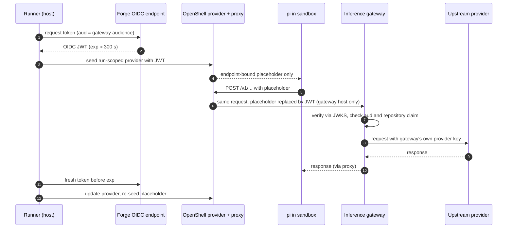

# 137. An inference gateway is a credential route of its own

Date: 2026-10-09

## Status

Accepted

## Context

fullsend reaches every model provider directly. For `openai` there are two
routes ([ADR 0092](0092-openai-wif-credential-delivery.md)). The first is a
WIF exchange, which needs admin access to the OpenAI organization. The second
is a static `OPENAI_API_KEY`, which is a long-lived provider key kept in forge
secret storage. Neither route can put an LLM gateway in front of the provider.
Such a gateway is an OpenAI- and Anthropic-compatible front door, such as
agentgateway, LiteLLM or APISIX. It checks the job's CI OIDC token against the
forge's JWKS and holds the provider key server-side.

This decision builds on four earlier ones:

- [ADR 0025](0025-provider-credential-delivery-for-sandboxed-agents.md):
  credential delivery tiers.
- [ADR 0033](0033-per-repo-installation-mode.md): pull-request events read
  config from the base branch.
- [ADR 0073](0073-named-mint-privilege-levels.md): the OIDC request variables
  stay runner-only (`oidcDenyKeys`).
- ADR 0092: run-scoped provider, endpoint-bound placeholder, refresh path.

A gateway is not a base-URL knob on an existing route. It moves the trust
boundary, so it gets a record of its own.

The route was validated live on 2026-10-09 (see
[#7480](https://github.com/fullsend-ai/fullsend/issues/7480)). The test setup
was agentgateway, pi, and
[pi-inference-gateway](https://github.com/fullsend-ai/pi-inference-gateway)
v0.1.1. It used a GitHub Actions OIDC token and served GPT, Claude and Gemini.
The negative cases all returned 401/403 with no credential echoed: wrong
audience, wrong issuer, an expired token, another repository's token, and
`x-api-key`-only auth.

## Decision

**An inference gateway is a credential route of its own.** The gateway trusts
the forge's OIDC issuer directly. The runner hands it the job's OIDC token as
the bearer credential. The gateway holds the upstream provider key, so the
forge stores no reusable provider key.

### Route shape

- **No token exchange.** The OIDC assertion is the credential, and its `exp`
  is the credential's expiry.
- **The token is fetched with an explicit audience.** The runner seeds it into
  a run-scoped OpenShell provider as an endpoint-bound placeholder. This is
  ADR 0025 tier 2, the same pattern as ADR 0092.
- **The token is re-seeded before `exp`.** GitHub OIDC tokens live 300 s. The
  runner fetches a fresh assertion, updates the provider, and re-seeds the
  in-sandbox placeholder through the ADR 0092 refresh path.
- **The real token stays on the host side of the OpenShell proxy.** The
  sandbox sees only the placeholder. The proxy substitutes it only on requests
  to the gateway host and its model API paths.

### Config shape

The route is configured by one `inference.gateway` block in the committed
`.fullsend/config.yaml`:

```yaml
inference:
  gateway:
    url: https://gateway.example.com
    audience: https://gateway.example.com
    providers: [openai]
    models:
      gpt-6-luna: { api: openai-responses }
      claude-haiku-4-5: { api: anthropic-messages }
      example-org/open-model: { api: openai-completions, contextWindow: 131072 }
```

- **All or none.** After the layers merge, a block missing any of `url`,
  `audience`, `providers` or `models` is an error. `url` must be https;
  loopback is allowed only under test.
- **Pull-request events read the block from the base branch** (ADR 0033), so a
  pull request cannot redirect its own run.
- **There is no runner-variable form.** The committed file is the only source,
  so it cannot drift from a repository variable.
- **The layers merge field by field.** For example, a preset can carry `url`
  and `audience` while each repository lists its own `providers`. A provider
  missing from `providers` keeps its direct route.

### Precedence

For a provider listed in `providers`, the order is **gateway, then WIF, then
static key, then error**.

- **A configured gateway never falls back.** If it is unreachable or refuses
  the token, the run fails. Falling back to a static key would mean that key
  could never be deleted.
- **A block that does not apply to the run is ignored.** For example, a local
  run has no OIDC endpoint. This matches how an inapplicable `inference.openai`
  WIF block is handled today.

### pi reaches the gateway through a separate `gateway` provider

pi calls the gateway through the `gateway` provider id, served by the
pi-inference-gateway extension. It does not redirect pi's built-in `openai`
provider.

| | Redirect built-in `openai` | Separate `gateway` provider |
|---|---|---|
| APIs covered | Responses (GPT) only | Responses, Messages and Chat Completions, chosen per model |
| Model families | GPT | GPT, Claude, Gemini, open-weight |
| Existing guards (`piOpenAIConfigGuard`) | must change | unchanged |
| Validated live | no | yes (2026-10-09 result on #7480) |

This choice has two consequences:

- **The runner renders the model list.** The sandbox runs `PI_OFFLINE=1`, so
  the extension never fetches `/v1/models`. The runner renders the `models`
  map from the config block (`id → api`, plus optional `compat`,
  `contextWindow` and `maxTokens`). The rendered config is runner-owned and
  digest-guarded, like pi's other runner-written config.
- **The `anthropic-messages` auth header is `authorization`.** Gateways that
  validate JWTs read `Authorization: Bearer`. pi's native `x-api-key` header
  is refused.

### Request flow



### Gateway-side requirements

The route depends on the gateway enforcing these rules. Operators are
responsible for them, and each was verified live:

- remote JWKS for the forge's OIDC issuer
- a fixed audience equal to `inference.gateway.audience`
- an exact-match claim on `repository` (for example
  `example-org/example-repo`)
- the caller's token is never forwarded upstream
- the `x-api-key` request header is stripped

Deploying and operating the gateway are out of scope.

### Threat-model delta versus ADR 0092

- **The credential is short-lived and accepted only by the gateway.** It sits
  behind a placeholder, as the ADR 0092 access token does. It lives at most
  300 s, and only the gateway's audience accepts it.
- **There is a new service on the request path.** The gateway sees every
  prompt and completion, and it holds the provider key. A compromised gateway
  is a concentrated risk to every repository that uses it.
- **The forge stores nothing reusable.** Once the gateway route is live,
  `FULLSEND_OPENAI_API_KEY` can be deleted.
- **The agent cannot set the base URL.** The runner owns the
  `INFERENCE_GATEWAY_*` variables and refuses to launch without its own base
  URL. Neither the agent-writable `.env` nor plugin env can override them:
  after both are applied, the runner unsets the whole family and re-exports
  only its own values. Plugin env may not use the `INFERENCE_GATEWAY_` prefix.

### Deferred

These are deferred and named:

- Claude Code and Codex on the gateway route
- GitLab ID tokens, which arrive as an `id_tokens:` job variable rather than
  a request URL
- other gateways

## Consequences

- A repository can run GPT, Claude, Gemini and open-weight models on pi
  through a gateway, without WIF admin access or a stored provider key.
- Deleting `FULLSEND_OPENAI_API_KEY` is safe once a repository's runs use the
  gateway, because a configured gateway never falls back to it.
- A gateway outage fails runs for every repository behind it. This is by
  design.
- Every gateway model must be listed in `inference.gateway.models`, because pi
  cannot discover models offline.
- Rotating the placeholder within a single running iteration before the 300 s
  `exp` is the main behaviour still to prove live. The runner, CLI, image and
  egress work is tracked in
  [#8280](https://github.com/fullsend-ai/fullsend/issues/8280).

## Related

- ADR 0025: credential delivery tiers
- ADR 0033: base-branch config reads
- ADR 0073: `oidcDenyKeys`
- ADR 0092: OpenAI WIF and static-key routes; the refresh path this route
  reuses
- [#8262](https://github.com/fullsend-ai/fullsend/issues/8262): pi-inference-gateway in the sandbox image
