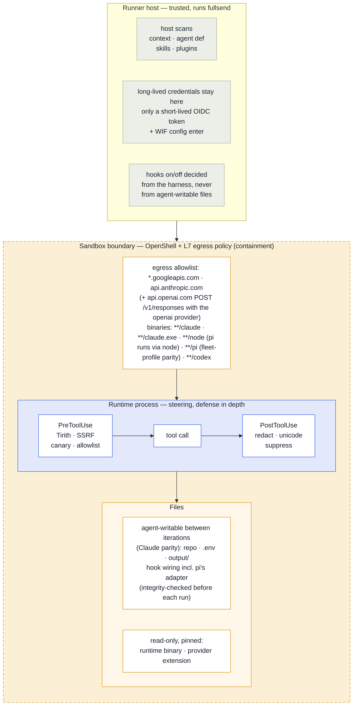
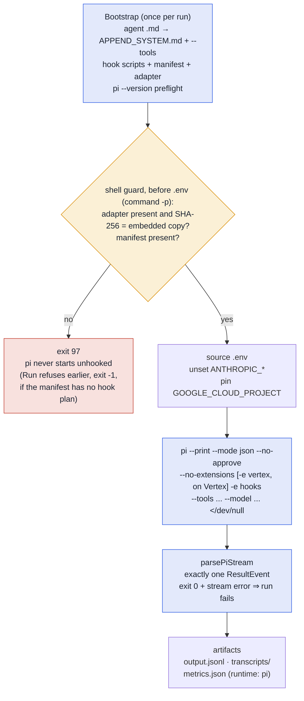
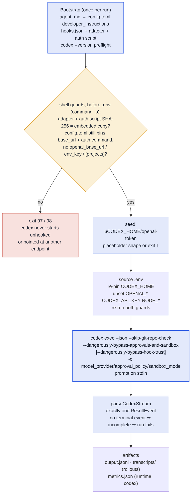

# Implementing an agent runtime

Everything needed to add or change a `runtime.Runtime` backend: the security
controls a runtime must wire, the interfaces it implements, the sandbox hook
contract its adapter must satisfy, and the on-disk layout it writes.

**Using** a runtime — picking one, choosing models, troubleshooting a run — is
[runtimes.md](../runtimes.md). This page is the implementer's half.

On this page:

- [Adding a runtime: checklist](#adding-a-runtime-checklist)
- [Security feature matrix](#security-feature-matrix) — what each runtime wires, and where
- [Runtime interface contract](#runtime-interface-contract)
- [Sandbox hook contract](#sandbox-hook-contract) — files, wiring, wire protocol, sanitizer scope, fail modes, Claude Code caveats
- [Pinned runtime binaries in the sandbox image](#pinned-runtime-binaries-in-the-sandbox-image)
- [Sandbox workspace layout](#sandbox-workspace-layout) and [agent rule layering](#agent-rule-layering)
- [Dummy runtime operations](#dummy-runtime-operations)
- [pi runtime internals (#6464)](#pi-runtime-internals-6464) — verification provenance for the pi backend
- [codex runtime internals (#6920)](#codex-runtime-internals-6920) — verification provenance for the codex backend

## Adding a runtime: checklist

1. Register the backend in `runtime.Resolve()`.
2. Implement `runtime.Runtime` and honour `runtime.SandboxHooksBootstrap`
   (see [Runtime interface contract](#runtime-interface-contract)). A runtime
   that ignores it installs **no** sandbox tool hooks.
3. Fill in every column of the [security feature matrix](#security-feature-matrix)
   for the new runtime — including the cells that are "not wired"; say so
   explicitly rather than leaving them blank. Internal test-only runtimes
   (e.g. `dummy`, `dummy-playback`) with no LLM interaction are exempt.
4. Add its row to the config-key table in
   [runtimes.md](../runtimes.md#harness-config-keys-per-runtime).
5. If the runtime's binary ships in the sandbox image, pin it the way the
   existing ones are pinned and prove the pin at build time
   ([Pinned runtime binaries](#pinned-runtime-binaries-in-the-sandbox-image)).
6. Name the process that opens the model connection in `runtimeEgressBinaries`
   (`internal/cli/runtime_binaries_test.go`) and make sure the inference
   profiles' `binaries:` globs match it — a runtime exec'd directly (no node
   wrapper) is not covered by `**/node`
   ([Egress binary identity](#egress-binary-identity-per-runtime)).

## Security feature matrix

The sandbox is the containment boundary; everything a runtime does with hooks and tool restrictions is steering inside it ([ADR 0027](../ADRs/0027-allowed-and-disallowed-tools-for-agents.md)). Read the matrix with that picture in mind:

> **Test-only runtimes (`dummy`, `dummy-playback`) are exempt from the
> matrix tables below.** They perform no LLM interaction, install no sandbox
> tool hooks, and have no security surface to document — the sandbox boundary
> is their only control. This exemption applies to all three tables
> (host-side controls, sandbox tool hooks, bootstrap and artifacts).



### Host-side controls (runner responsibility, runtime-agnostic)

| Feature | Where it runs | Claude Code | OpenCode (stub) | Pi | Codex | Notes for future runtimes |
|---------|---------------|-------------|-----------------|----|-------|---------------------------|
| **Host-side context injection scan** (unicode, SSRF patterns on repo context files) | Host + sandbox `scan context` | ✓ | N/A — stub | ✓ | ✓ — runner-side, so identical to Claude Code and pi | Harness `security.host_scanners`; heuristic scanners only — the DeBERTa ML model was removed from the sandbox in #6522 (its only consumer is the host-side `scan input`, not `scan context`) |
| **Host-side runtime content scan** (agent def, SKILL.md, plugin JSON before upload) | Host (`scanRuntimeContent`) | ✓ | N/A — stub | ✓ | ✓ — runner-side, so identical to Claude Code and pi | Uses `security.InputPipeline()`; not part of the `Runtime` interface |
| **Prompt injection (DeBERTa)** | Host `fullsend scan input` only | ✓ in the runner image (built `CGO_ENABLED=1 -tags ORT` with `libtokenizers.a` + ONNX Runtime >= 1.28); ✗ in the release tarballs, which stay `CGO_ENABLED=0` and untagged (#6522) | N/A — stub | Same as Claude Code — host-side, not a runtime distinction | Same as Claude Code — host-side, not a runtime distinction | Shipped enabled only in `ghcr.io/fullsend-ai/fullsend-runner`; the release tarball the composite action downloads has it compiled out, so CI runs never reach it. **Not an active control on the `fullsend run` path either way**: `RunMLScan` is called only from `fullsend scan input`, which nothing in this repo or `fullsend-ai/agents` invokes. See #6506 (decision), #6522 (build constraints) |

### Sandbox tool hooks (per runtime)

How the shared PostToolUse chain reaches each runtime — the three sanitizer rows below share it:

- **Claude Code:** `posttool_chain.py` runs on successful tool calls (#6357). On failed calls the same driver runs on `PostToolUseFailure`, where it detects, logs to `findings.jsonl` and warns the agent via `additionalContext` — Claude Code does not let a hook rewrite a failed call's output.
- **Pi:** `fullsend-hooks.js` `tool_result` → the same `posttool_chain.py` (sent `tool_response` + `tool_result`; `updatedToolOutput` applied to the result the model sees). pi's `tool_result` fires for failed calls too, so those are sanitized as well.
- **Codex:** `fullsend-codex-hook.py` (a `PostToolUse` handler in `hooks.json`) → the same `posttool_chain.py`. codex's `PostToolUse` fires for a command that exited non-zero as well, so failed calls are covered without a second phase — but **the rewrite cannot be applied**: codex accepts only `additionalContext` and `updatedMCPToolOutput` there, so the chain's `updatedToolOutput` is dropped and the model is warned that the output would have been redacted. A canary block still withholds the output entirely, because a codex `PostToolUse` block replaces the tool result with the reason.

| Feature | Where it runs | Claude Code | OpenCode (stub) | Pi | Codex | Notes for future runtimes |
|---------|---------------|-------------|-----------------|----|-------|---------------------------|
| **Tirith** (Bash command scanning) | Sandbox PreToolUse hook | ✓ (loaded via `--settings`, #6358) | N/A — stub | ✓ via `fullsend-hooks.js` (pi `tool_call` → `HookPlan` PreToolUse scripts) | ✓ via `fullsend-codex-hook.py` (a `PreToolUse` handler per `HookPlan` group in `$CODEX_HOME/hooks.json`; the script's `exit 1` + `decision:block` is translated to **exit 2 + reason on stderr**, the only reliable block on codex) | `tirith_check.py`; harness `security.sandbox_hooks.tirith`; fails open on missing binary/timeout unless `TIRITH_REQUIRED=1` |
| **SSRF pre-tool** | Sandbox PreToolUse hook | ✓ (`hooks-loaded.feature` runs under the dummy runtime, which installs no hooks — it guards the sandbox egress boundary; the hook itself is unit-tested) | N/A — stub | ✓ via `fullsend-hooks.js` | ✓ via `fullsend-codex-hook.py`; the group's `WebFetch` tool is dropped from the matcher because codex has no such tool — it fetches through the shell, which the `Bash` matcher already covers | `ssrf_pretool.py`; default on; when DNS resolution fails for a host on the `FULLSEND_EGRESS_ALLOWLIST`, the hook defers to the L7 egress proxy instead of failing closed — all other SSRF checks (scheme, hostname blocklist, IP blocklist, DNS rebinding) still apply. On GitLab CI, the forge host is also covered by the auto-generated `fullsend-gitlab-forge` provider profile (#6615), which opens the L7 proxy for the forge API |
| **Canary token detection** | Sandbox Pre/PostToolUse hooks | pre ✓; post-tool via `posttool_chain.py` on successful calls (`tool_response` / `updatedToolOutput`, #6357); failed calls: the same driver on `PostToolUseFailure` (detect + halt; the error text cannot be rewritten) | N/A — stub | ✓ pre via `tool_call`; post via `tool_result` (sequential chain, block withholds the result) | ✓ pre and post via `fullsend-codex-hook.py`. A post-tool hit **blocks**, which on codex replaces the tool result with the reason, so the flagged output never reaches the model — stronger than Claude Code. In the **artifacts** the canary is only pattern-redacted if it happens to look like a credential, not withheld: artifact filtering is redaction, not the chain. It does **not halt the session**: `continue:false` is unsupported on PreToolUse and inert on PostToolUse, so codex has no hook-driven stop ([ADR 0100](../ADRs/0100-codex-sandbox-hooks.md)) | `canary_pretool.py` / `canary_posttool.py`; both inert unless `FULLSEND_CANARY_TOKEN` is set — on codex that value is read at bootstrap and re-exported after `.env`, so an agent cannot clear it for a later iteration. Post-tool canary is an in-process chain stage so it cannot race sanitizer rewrites. Claude Code `decision:block` does not hide PostToolUse output, so the chain also redacts the token in `updatedToolOutput` |
| **Secret redaction** | Sandbox PostToolUse hook | ✓ shared chain (above) | N/A — stub | ✓ shared chain (above) | Model context: detect + warn only — codex cannot rewrite a built-in tool's output, so the redaction is dropped and the model gets an `additionalContext` warning instead. Artifacts: `output.jsonl` and the extracted rollout are filtered through the same Go `security.SecretRedactor` the progress parsers use, because codex's artifacts keep raw tool output where Claude Code's stream carries the post-hook result | `secret_redact_posttool.py` |
| **Unicode normalization** | Sandbox PostToolUse hook | ✓ shared chain (above) | N/A — stub | ✓ shared chain (above) | Detect + log only — same reason as secret redaction (shared chain, above) | `unicode_posttool.py` |
| **Context suppression** | Sandbox PostToolUse hook | ✓ shared chain (above) | N/A — stub | ✓ shared chain (above) | ✗ — it exists only to rewrite output, which codex does not allow for built-in tools; the stage still runs and its findings are logged, but nothing is condensed | `context_suppress_posttool.py` |
| **Tool allowlist** | Sandbox PreToolUse hook | opt-in; ✓ when enabled | N/A — stub | ✓ `tool_allowlist_pretool.py` via `tool_call` (names translated to Claude vocabulary first, #608) plus pi's native `--tools` from the agent `tools:` and the `Bash(a,b)` first-token allowlist enforced in the extension | opt-in; ✓ when enabled, via `fullsend-codex-hook.py` (names translated to Claude vocabulary first, #608). Unlike pi there is **no native allowlist**: codex has no `--tools`, so an agent's `tools:` frontmatter is documentation unless the harness enables this hook, and the `Bash(a,b)` first-token allowlist is recorded in the manifest but **not wired**. Note `apply_patch` arrives as `Edit`, so an agent allowlisted only for `Write` is blocked | `tool_allowlist_pretool.py`; requires `FULLSEND_TOOL_ALLOWLIST` (fail-closed when unset) |

### Bootstrap and artifacts (per runtime)

| Feature | Where it runs | Claude Code | OpenCode (stub) | Pi | Codex | Notes for future runtimes |
|---------|---------------|-------------|-----------------|----|-------|---------------------------|
| **Sandbox tool hooks wiring** | `SandboxHooksBootstrap` type assert in `Bootstrap` | ✓ scripts at `claude-config/hooks/`, wiring at `claude-config/hooks.json` via `--settings` (#6358) | ✗ — `Bootstrap` is a stub; must wire `security.HookPlan` via OpenCode plugin hooks | ✓ see [pi: hook adapter contract](#hook-adapter-contract) — scripts under `/sandbox/pi-config/hooks/`, `HookPlan` in `fullsend-manifest.json`, embedded `fullsend-hooks.js` loaded with `-e` under `--no-extensions`; fail-closed on a missing/altered adapter (exit 97) or a manifest without a hook plan (exit -1) | ✓ see [codex: hook adapter contract](#codex-hook-adapter-contract) — scripts under `/sandbox/codex-config/hooks/`, wiring in `$CODEX_HOME/hooks.json` rendered from `HookPlan`, embedded `fullsend-codex-hook.py` loaded with `--dangerously-bypass-hook-trust`; fail-closed on a missing or altered adapter, auth script or wiring (exit 97), on a tampered `config.toml` (exit 98) and on a manifest without a hook plan (exit -1) | Hook scripts and wiring plan are runtime-neutral (see [Sandbox hook contract](#sandbox-hook-contract)); a runtime that ignores `SandboxHooksBootstrap` installs **no** sandbox tool hooks — say so explicitly here |
| **Transcript / debug artifacts** | `TranscriptHandler` (+ optional `DebugLogNamer`) | ✓ (stream-json, `claude-debug.log`) | No-op — see #1935 | ✓ session JSONL under `PI_CODING_AGENT_SESSION_DIR` (`ExtractTranscripts`), `pi-debug.log` (`DebugLogNamer`; pi's stderr when `--debug` is set), `ParseTranscriptFile` judges the tee'd `--mode json` stream and session files | ✓ rollout session JSONL under `$CODEX_HOME/sessions/` (`ExtractTranscripts`; plain `.jsonl` only, each validated as a rollout envelope and redacted before it is kept), `codex-debug.log` (`DebugLogNamer`; codex has no debug flag, so Run exports `RUST_LOG` and captures stderr — redacted too), `ParseTranscriptFile` judges the tee'd `exec --json` stream | Format-specific; not shared across runtimes. Debug-log filename defaults to `agent-debug.log` unless the runtime implements `DebugLogNamer` |

### Fail modes

Harness `security.fail_mode` controls whether critical findings **block** the run (`closed`, default) or **warn** and continue (`open`). This applies to host scans, sandbox `scan context`, and the host-side runtime content scan alike.

## Runtime interface contract

| Interface | Responsibility |
|-----------|----------------|
| `runtime.Runtime` | Name, config dir, env exports, bootstrap, run loop, per-iteration cleanup, user processes cleanup |
| `runtime.BootstrapInput` | Portable agent name/path, skill dirs, and plugin dirs to upload |
| `runtime.SandboxHooksBootstrap` | Optional `BootstrapInput` extension — runtime-neutral sandbox tool hook config (`security.SandboxHookConfig`); every runtime should honour it |
| `runtime.TranscriptHandler` | Extract transcripts/debug logs; parse errors for CI annotations |
| `runtime.DebugLogNamer` | Optional — names the per-iteration debug-log artifact (default `agent-debug.log`) |
| `runtime.ContextBridger` | Optional — runtime auto-loads only `CLAUDE.md`, so the runner injects a `CLAUDE.md`→`AGENTS.md` pointer (Claude Code: yes; runtimes that read `AGENTS.md` natively: omit) |
| `runtime.OpenAICredentialSeeder` | Optional — for a runtime that reaches OpenAI through the run-scoped provider (ADR 0092): names the in-sandbox credential file the agent re-reads per request and the `sh` fragment that writes the current placeholder into it, so a mid-run credential refresh reaches the running process. Omit when the runtime has no OpenAI path; a stub returning `""` means "no re-seed" and the provider is still created and refreshed |

**Per-iteration cleanup contract.** When a validation retry reuses the sandbox, the runner calls `ClearIterationArtifacts` before the next iteration. Every runtime runs the shared `clearStrayProcesses` sweep first (it terminates the processes the previous iteration left running as the sandbox user, sparing the exec channel and the `sandbox.KeepAliveCommand` main process), then deletes the iteration's output, sessions and debug log. A failed sweep is reported as a warning and never fails the iteration. The runner holds its sandbox lock (`withSandboxLock` in `internal/cli/run.go`) across the call so the credential refreshers' uploads are never killed mid-write.

A runtime whose `Bootstrap` does not type-assert `SandboxHooksBootstrap` will **not** install Tirith, SSRF, canary, or the other hook scripts. The primary security boundary is the OpenShell sandbox, its L7 egress policy, and credential placeholders (ADR 0017, ADR 0025); the hooks are defense-in-depth that every runtime should wire rather than silently drop ([ADR 0090](../ADRs/0090-runtime-neutral-sandbox-hooks-contract.md)). Fill in the matrix column above either way.

## Sandbox hook contract

**Contract version: v2** — PostToolUse scripts consume Claude Code's `tool_response` (falling back to `tool_result` for adapters/tests) and replace output via `hookSpecificOutput.updatedToolOutput`. v1 (`tool_result` in/out only) was inert under Claude Code (#6357).

The hook scripts in `internal/security/hooks/*.py` are plain programs with no Claude Code dependency; Claude Code invokes them through `settings.json`. Any runtime can call them from its own tool-call interception point (OpenCode `tool.execute.before/after`, pi TypeScript extension API `tool_call`/`tool_result` with `{block: true, reason}` structured denial, Cursor hooks, ...).

### Files and wiring

- **Files:** `security.HookFiles(cfg)` returns `filename → script bytes` for the enabled hooks; `runtime.installHookScripts(sandbox, dir, cfg)` creates `dir` in the sandbox and uploads them there (executable) — any directory works. Claude uses `/sandbox/claude-config/hooks/` (`security.SandboxHooksDir`), with the wiring at `/sandbox/claude-config/hooks.json` (`security.SandboxHooksSettings`) loaded via `--settings`.
- **Plan:** `security.HookPlan(cfg)` returns ordered `HookGroup{Phase, Tools, Scripts}` entries. `GenerateHooksConfig` is rendered from `HookPlan`, so the two cannot diverge.
- **Phases:** `PreToolUse`, `PostToolUse`, `PostToolUseFailure`. The last carries Claude Code's failed-call payload (`hook_event_name`, `tool_name`, `tool_input`, a string `error`) and allows no output rewrite, so the chain halts there on a canary and otherwise only detects — logging credential-shaped and control content and returning an `additionalContext` warning. Adapters whose post-tool event already fires for failed calls (pi) map it onto nothing.
- **Tools:** `HookGroup.Tools` are Claude Code tool names (`Bash`, `Read`, `WebFetch`, `*` = all); runtimes with other names translate before matching (see [Tool-name vocabulary](#tool-name-vocabulary-608)).
- **PostToolUse is one script:** a single `posttool_chain.py` on `*` applies unicode → canary → suppress → redact in-process. Unicode normalization runs first because every later content decision is made on its output: an attacker who splits a canary or a secret with zero-width or fullwidth characters must not evade detection and then have the chain reassemble the clean value (Claude Code runs matching hooks in parallel and does not merge two `updatedToolOutput` rewrites). Individual sanitizer files and `canary_posttool.py` ship as libraries the driver imports; adapters should invoke the chain, not the stages.

### Tool-name vocabulary (#608)

`security.CanonicalClaudeTools` (`internal/security/canonical_tools.go`) lists the tool names Claude Code exposes; `security.LegacyClaudeTools` lists names Claude Code no longer has but that agent `tools:` frontmatter and adapters still use (`LS`, `MultiEdit`, `Task` → `Agent`, ...). `FULLSEND_TOOL_ALLOWLIST` and `security.HookGroup.Tools` are written in this vocabulary. Adapters must translate to it before invoking any hook script.

The vocabulary was verified 2026-08-23 against the live tools reference (the latest release); the CHANGELOG recorded no tool changes since the version pinned in the sandbox image at the time (2.1.234) — **re-check on every pin bump**, and note that the pin only describes what runs because of the build-time assertion in [Pinned runtime binaries](#pinned-runtime-binaries-in-the-sandbox-image).

It is a **reference** checked by tests, not validated at run time:

| Test | Pins |
|------|------|
| `TestHookPlan_ToolsAreCanonical` | every `HookPlan` tool |
| `TestPiToolNameMapsUseClaudeVocabulary` | the pi adapter's maps (`piToolForClaude`/`claudeToolForPi` in `internal/runtime/pi_agent.go` → `fullsend-manifest.json` `hooks.toolNames` → `fullsend-hooks.js` `claudeToolName()`) to canonical *or legacy* names — pi's `ls` maps to `LS`, which Claude Code no longer sends, so an agent allowlisted in canonical-only vocabulary sees pi's `ls` as a plain `tool_blocked` |
| `TestToolAllowlistHook_VocabularyMatchesGo` | the copy inside `tool_allowlist_pretool.py` identical to the Go set |

How `tool_allowlist_pretool.py` reports a name that does not match (the allowlist is exact-match and fail-closed, so an un-translated name is always **blocked** — the difference is the diagnosis):

| Situation | Finding | Severity / action | Reason text |
|-----------|---------|-------------------|-------------|
| Blocked name equals an allowlisted **Claude** name case-insensitively | `tool_name_unnormalized` | `high` / block | `ALLOWLIST_HOOK_ERROR: tool name '<name>' is not canonical Claude vocabulary (expected '<entry>'); the runtime adapter must translate it` (for a legacy entry: `... is not the legacy Claude name the allowlist uses (expected 'LS') ...`) |
| The *tool name* is the Claude one but the allowlist entry is not (e.g. `Bash` vs an allowlist written as `bash`) | `allowlist_entry_unnormalized` | `high` / block | `... is not Claude vocabulary (expected canonical name 'Bash'); fix the allowlist` |
| Neither side is a Claude tool name | `tool_name_case_collision` | `high` / block | says so and blames neither |
| No case-insensitive match | `tool_blocked` | `critical` / block | plain block |
| Non-string `tool_name` | — | block | blocks with the JSON contract rather than a traceback |

The three `high` findings do not trip `critical`-keyed escalation the way a forbidden tool does. MCP tools (`mcp__<server>__<tool>`) are not canonical — they are matched verbatim and a case variant is treated as a different tool (`tool_blocked`). The diagnostic only sees *case* variants: a renaming gap such as pi reporting every edit as `Edit` while an agent is allowlisted only for `MultiEdit` surfaces as a plain `tool_blocked`. No case-insensitive *allow* is performed.

### Wire protocol (per script)

JSON on stdin; the script's exit code and stdout are the reply.

| | Input | Reply |
|---|---|---|
| **PreToolUse** | `{"tool_name": ..., "tool_input": {...}}` | exit `0` = allow. Blocking scripts exit `1` and print `{"decision":"block","reason":"..."}`; the adapter must stop the tool call and surface the reason |
| **PostToolUse** | the same plus the tool output as `tool_response` (Claude Code; string or structured object such as Bash `{stdout, stderr, interrupted, isImage}`), `tool_result` accepted as a fallback | *Blocking* (standalone `canary_posttool.py`, and `posttool_chain.py` when its canary stage fires): exit `1` + `{"decision":"block",...}`; the adapter drops the result. *Sanitizing* stages (suppress/unicode/redact): always exit `0` and, when they changed something, print `{"hookSpecificOutput":{"hookEventName":"PostToolUse","updatedToolOutput": <same shape as the input value>}, "tool_result": <scan text>}`. Empty stdout = unchanged |

Shape rules:

- `updatedToolOutput` must match the tool's output shape — a bare string is ignored for built-in Claude Code tools.
- `scan_text` flattens every string field (including `stderr`), newline-joined so a needle cannot match across a field boundary (such a match would be unredactable, since the redactors rewrite each field independently); `apply_text` writes a replacement into the first text slot and blanks the rest, or leaves unrecognized structured shapes unchanged.
- Unicode normalization skips identifier fields (`hook_io.IDENTIFIER_KEYS`: paths, URLs, commands, exact-match edit strings) — NFKC would hand Claude a path that does not exist on disk; secret redaction still walks them, since it only replaces matched patterns.

### Sanitizer scope — what is rewritten, and what is not

The PostToolUse stages exist to remove *controls-relevant* content and nothing else, because an agent edits against what it reads — a rewritten `Read` result means `Edit.old_string` no longer matches the file, and a `Write` of what it saw persists the rewrite.

**Secret redaction** masks credential-shaped values only:

- the prefix patterns (`ghp_...`, `sk-...`, `AKIA...`, bearer headers, private-key blocks, database URLs);
- env/JSON shapes that need **both** a secret-bearing name (`..._TOKEN`, `api_key`, `accessToken` — not `TOKEN_URL`/`KEY_ID`/`publicKey`) **and** a value that is not an identifier, member path (`request.headers.authorization`), URL, path, placeholder or word phrase (`test-secret`, `ghs_policy_token`);
- a source-style `name = expr` counts only when the value is a quoted literal.

A sweep of 900 fullsend files through the chain rewrites only test files holding token-shaped fakes.

**Context suppression** condenses the output of exactly one verification command, and only from positive evidence:

- Commands: `go test`, `pytest`, `npm test`, `make test`, `pre-commit run`, `gitleaks detect`, `scan-secrets`, with optional setup prefixes (`cd`, `export`, `source`). The command must *start* with the tool, after wrappers that run it (`VAR=...`, `sudo`, `nice`, `timeout <n>`, `env VAR=...`, `uvx`, `npx`, `uv run`, `mise exec --`, stacked; `python3.12 -m pytest` counts). A command that merely mentions it, such as `grep -n scan-secrets hooks.py`, keeps its output.
- Evidence: `ok <pkg>`, `N passed`, `<hook>...Passed`, `no leaks`. Silence is never condensed into "passed" — a hook whose interpreter is missing is silent too, and Claude Code's Bash result carries no exit code — so linters and `go vet`/`go build`, whose clean run prints nothing, are never condensed.
- Pass-through, untouched: pipelines (`| tail` can cut the `FAIL` line; a `|` inside quotes such as `-run 'A|B'` is not a pipeline), `$(...)`, chains of two tools (`pytest; go test`, and deliberately also `go test && go vet` — one summary cannot speak for two), a trailing `echo $?`, and any output carrying a failure marker (`FAIL`, `panic:`, `Traceback`, `3 failed`). Comment lines and backslash continuations are tolerated.

**Unicode** strips invisible, bidi, tag, NUL and ANSI/OSC characters and runs of variation selectors, but keeps compatibility characters (fullwidth, ligatures, CJK punctuation) and single emoji/CJK selectors. NFKC is applied to a *detection copy* (canary, secret patterns); a field is emitted normalized only when the normalized copy reveals an escape sequence or a secret the original hid.

Every rewrite attaches `hookSpecificOutput.additionalContext` so the agent knows the output was changed and why. Every hook entry carries `timeout: 30` — Claude Code's 600 s default fails open, and so does the 30 s one (PreToolUse blockers included); the scripts finish in milliseconds and `tirith_check.py` bounds its own scan at 5 s, so the budget is headroom, not a ceiling the scripts approach.

### Hook fail modes

| Component | On malformed / oversized input (> 10 × 1024 × 1024 characters, text-mode stdin) | On its own error |
|-----------|-------------------------------------------|------------------|
| Blocking scripts (all PreToolUse, standalone `canary_posttool.py`) | fail **closed** — block | block |
| `tirith_check.py` | block | fails **open** when the `tirith` binary is missing, times out or errors — unless `TIRITH_REQUIRED=1` (`appendHookEnv` writes it when Tirith is enabled; adapters must make sure it reaches the script) |
| Sanitizing scripts / each `posttool_chain.py` sanitizer stage | fail **open** — pass through unchanged (exit 0; the unicode hook logs an `input_truncated` finding) | pass through; recorded in `findings.jsonl` as `<stage>_stage_error` |
| `posttool_chain.py` canary stage | fails **closed** whenever `FULLSEND_CANARY_TOKEN` is set: input the driver cannot read blocks (`exit 1`, `continue: false`) instead of skipping detection; with no canary token configured it stays fail-open | a scan that raises is treated as a hit; a hit whose redaction cannot be verified clean withholds the output entirely; `exit 1` is unconditional |

Also: empty/whitespace-only stdin is treated as "no tool call" and allowed by every script; a payload without `tool_name` blocks only in the allowlist hook; adapters must not treat a sanitizer's empty stdout as an error; detection and redaction share one case-insensitive matcher (`hook_io.canary_pattern`), so a token that is detected is always one that can be redacted.

### Environment

`runtime.appendHookEnv` writes into `/sandbox/workspace/.env`; the runtime must launch the scripts with that file sourced (Claude's run command does). When the CLI layer resolves a forge egress entry (for example, the GitLab forge host and port via `gitlab.ResolveForgeHostPort()`), it passes it through `SandboxHookConfig.WithForgeEgressEntry()` and `appendHookEnv` merges it into `FULLSEND_EGRESS_ALLOWLIST` so the SSRF hook defers to the L7 proxy for the forge API (#6615). Findings go to `/sandbox/workspace/.security/findings.jsonl`.

| Variable | Read by | Behaviour |
|----------|---------|-----------|
| `TIRITH_FAIL_ON`, `TIRITH_REQUIRED` | `tirith_check.py` | written by `appendHookEnv`; `TIRITH_REQUIRED=1` turns the fail-open into fail-closed |
| `FULLSEND_EGRESS_ALLOWLIST` | `ssrf_pretool.py` | comma-separated `host:port` entries, exact hostnames only — wildcards are skipped with a warning on stderr; on DNS failure the hook defers to the L7 proxy for allowlisted hosts instead of failing closed; if DNS succeeds but resolves to a blocked IP, the allowlist is not consulted |
| `FULLSEND_TOOL_ALLOWLIST` | `tool_allowlist_pretool.py` | fail-closed when unset |
| `FULLSEND_CANARY_TOKEN` | both canary hooks | no-ops when empty; supply it via harness `env.sandbox`/`host_files` |
| `FULLSEND_TRACE_ID` | all scripts | correlates findings with the run |

### Suppression reachability

Under Claude Code a non-zero-exit command never reaches `PostToolUse` at all, so the suppressors only ever see zero-exit output; a tool that exits 0 with nothing to say is the case that used to be summarized as "passed". Adapters whose post-tool event also fires for failures (pi's `tool_result`) do deliver failed calls to the same chain, which is why the positive-evidence rule matters on both.

### Claude Code caveats (#6358, #6357)

1. **Loading — fixed by #6358.** The hook wiring is written to the runner-owned `/sandbox/claude-config/hooks.json` and passed explicitly via `--settings`, so it loads regardless of the CLI's working directory (previously it sat unread in `/sandbox/workspace/.claude/`); the `hooks-loaded.feature` behaviour scenario guards the "silently not loaded" regression class. Claude Code still auto-loads a target repo's own `<repo>/.claude/settings.json` hooks from `<cwd>` — a separate exposure to assess.
2. **Payload — fixed in #6357, contract v2.** Scripts read `tool_response` (fallback `tool_result`) and replace output via `hookSpecificOutput.updatedToolOutput` with the original shape preserved. Sanitizer order and canary detection share `posttool_chain.py` so two PostToolUse hooks cannot race. `scan_text` inspects every string field (including `stderr`).
3. **Failed tool calls.** Claude Code fires `PostToolUse` only when a tool **succeeds**; a failed call (non-zero-exit Bash included) fires `PostToolUseFailure`, which delivers the error text but supports no output rewrite.
   - `HookPlan` wires the same `posttool_chain.py` there, where it runs canary detection (halt) plus detection-only secret and unicode passes that log to `findings.jsonl` and return an `additionalContext` warning — `additionalContext` is the only output the event accepts, so a credential or an ANSI/zero-width sequence in a failed command's output still reaches the transcript unmasked and the agent is told not to copy or obey it.
   - Scanning covers every string in the payload rather than one named key (the documented field is `error`; doc versions differ), halting via `continue: false` (the only decision control the event honours).
   - Detection also runs on a detection copy — NFKC-normalized with combining marks, format characters (zero-width, bidi, tag), line/paragraph separators, control characters and whole ANSI/OSC sequences removed, i.e. everything the unicode stage strips from a successful call — so it sees through the same obfuscation on both paths.
   - Suppression, unicode normalization and redaction cannot apply to a failed call under Claude Code; pi sanitizes those too, because its `tool_result` event fires for failures.
   - `interrupted` on a Bash `tool_response` marks a cancelled tool, not an exit code — the `Exit code` prefix check in `looks_failed` therefore serves the v1 adapter path only.
4. **Blocking.** Claude Code keys on the stdout JSON on any exit code (`decision:"block"` is deprecated for PreToolUse but still maps to `deny`) and treats a bare exit `1` as non-blocking (exit `2` is its own blocking code); a local control run confirmed the scripts' "exit 1 + `{"decision":"block"}`" convention does block once the settings are loaded. For PostToolUse, `decision:"block"` **only appends `reason` next to the tool result — Claude still sees the original output**. `canary_posttool.py` therefore also emits `updatedToolOutput` with the token redacted to `[CANARY_REDACTED]`, and sets the universal `continue: false` field — the documented control that actually halts the session — so a leak still terminates the run.

Net: after #6358 and #6357, both PreToolUse and PostToolUse halves of the contract are effective under Claude Code.

## Pinned runtime binaries in the sandbox image

`images/sandbox/Containerfile` pins every runtime binary and provider extension; `fullsend-code` extends that image, so both inherit the same pins. What is pinned, and what to re-check when a pin moves:

| Binary | Pin | Re-check on bump |
|--------|-----|------------------|
| Claude Code | `ARG CLAUDE_CODE_VERSION` (npm, Renovate-tracked). The OpenShell base image ships its **own** unpinned Claude Code at `/usr/local/bin/claude` (whatever `curl claude.ai/install.sh` fetched when the base was built), and `/usr/local/bin` precedes npm's `/usr/bin` on the sandbox `PATH` — so the Containerfile replaces that file with a symlink to the npm install and fails the build unless `claude --version` equals the pin (#6612; before that fix the base image's 2.1.156 shadowed every pin). `TestSandboxImageClaudeCodePinWins` guards the step | the [tool-name vocabulary](#tool-name-vocabulary-608); the hook contract caveats above; the alias table — `opus`/`sonnet`/`haiku` resolve from the running version's built-in defaults on Vertex, and `ANTHROPIC_DEFAULT_*_MODEL` does not steer the request there, so a harness or `agents:` entry that needs a specific generation must name the id |
| pi | `ARG PI_VERSION` (npm, `--ignore-scripts`, Renovate-tracked; `TestSandboxImagePinsAreRenovateTracked`) | `parsePiStream` fixtures (`internal/runtime/testdata/pi/regen.sh`); the extension compatibility notes in [pi runtime internals](#pi-runtime-internals-6464) |
| `pi-anthropic-vertex` | `ARG PI_ANTHROPIC_VERTEX_VERSION` + tarball SHA256, under `/usr/local/share/pi-extensions/anthropic-vertex` | its `sync/compat.json` against the pinned pi; the `@anthropic-ai/sdk` override vs pi's `packages/ai/package.json` |
| `pi-xai-vertex` | `ARG PI_XAI_VERTEX_VERSION` + tarball SHA256, under `/usr/local/share/pi-extensions/xai-vertex` | its `peerDependencies` floor (it mirrors no pi internals) |
| Codex | `ARG CODEX_VERSION` (npm, Renovate-tracked; `TestSandboxImagePinsAreRenovateTracked`). The OpenShell base image already installs `@openai/codex` under the same npm prefix (`/usr`, binary `/usr/bin/codex`) — 0.117.0 on the base pinned today — so the pinned install replaces it in place. `/usr/local/bin/codex` is then symlinked at the npm install and the build fails unless `codex --version` reports `codex-cli <pin>`: nothing shadows the pin there today, and the symlink plus assertion make sure nothing can start to, the way the base image's Claude Code did in #6612. `TestSandboxImageCodexPinWins` guards the step | the codex stream parser fixtures (#6920); the JSONL event and hook wire shapes the codex runtime depends on |

The run log's `Agent: <model> (vX.Y.Z)` line is the ground truth for which Claude Code version served a run; the Containerfile pin is a claim, the assertion at build time is what makes it true.

The image also creates each runtime's config directory when the binary refuses to start without one: `CODEX_HOME` (`sandbox.SandboxCodexConfig`) is created owned by the sandbox user and baked as an `ENV` default, so an ad-hoc `codex` invocation from Bash behaves like the runtime's own `EnvExports()`. `TestSandboxImageCodexDefaults` keeps the path in the image and the Go constant in step (the pi equivalent is `TestSandboxImagePiDefaults`).

## Egress binary identity per runtime

The inference profiles (`profiles/fullsend-vertex-ai.yaml` in this repo and in fullsend-ai/agents; `profiles/fullsend-openai.yaml`, which has no fleet copy — the runner imports the embedded scaffold) carry a `binaries:` list. OpenShell's OPA (`sandbox-policy.rego`, `binary_allowed`) matches each glob against the kernel-resolved `/proc/<pid>/exe` of the process that opens the connection **or of any of its ancestors**. That gives two kinds of runtime:

- **Wrapped by node** (pi, codex): `**/node` admits them through the ancestor, so a pin bump cannot take them off the allowlist unless the wrapper disappears.
- **Exec'd directly** (Claude Code): `claude` on PATH is a symlink to the npm package's `bin/claude.exe`, so the connecting process has no wrapper ancestor and only a glob on the real file name admits it. A renamed native binary breaks every run of that runtime on its first model call with `API Error: Error code policy_denied`, 0 tokens, and the only explanation is the gateway's `NET:OPEN … DENIED … binary '…' not allowed in policy '_provider_<name>'` line (#6971).

`TestScaffoldProfilesAllowRuntimeBinaries` (`internal/cli/runtime_binaries_test.go`) fails for any selectable runtime without a mapping and pins the ones below.

| Runtime | Process that opens the connection | Profile glob(s) | Evidence |
|---------|-----------------------------------|-----------------|----------|
| Claude Code | `bin/claude.exe` in the npm package — 2.1.2xx's `install.cjs` places the native binary there ("Always write to bin/claude.exe"); the Containerfile installs it *with* scripts so that runs | `**/claude`, `**/claude.exe` | gateway deny log in #6971; `npm view @anthropic-ai/claude-code@<pin> bin` |
| pi | `node` (`bin = dist/bundle/cli.js`; no native network path in the package) | `**/node` | `images/sandbox/Containerfile`, `npm view @earendil-works/pi-coding-agent@<pin> bin` |
| Codex | `vendor/<triple>/bin/codex`, spawned by the npm launcher `bin/codex.js` under node; codex also spawns `codex-code-mode-host` (default-enabled in 0.152.1), covered by ancestor matching, not by name | `**/node` (ancestor), `**/codex` (the process) | `npm pack --dry-run "@openai/codex@<pin>-linux-x64"` |
| OpenCode (stub) | exec'd directly, like Claude Code: `opencode-ai` ships a stub `bin/opencode.exe` that `postinstall.mjs` replaces with `opencode-linux-x64/bin/opencode`; with `--ignore-scripts` the stub stays | to be decided against the Containerfile install (`**/opencode.exe` or `**/opencode`); the test fails the moment `opencode` joins `config.ValidRuntimes` until a mapping exists | `npm view opencode-ai bin optionalDependencies`, `postinstall.mjs` |

## Sandbox workspace layout

The sandbox has two key directories that map to Claude Code's config levels (plus a runner-owned config directory per additional runtime, e.g. `pi-config/` for pi and `codex-config/` for codex):

```
/sandbox/
├── pi-config/                       ← PI_CODING_AGENT_DIR (pi runtime; written by PiRuntime.Bootstrap)
│   ├── APPEND_SYSTEM.md                Agent definition body (appended to pi's default system prompt)
│   ├── settings.json                   defaultProjectTrust: never, defaultTools (all built-ins), quietStartup, retry/compaction on
│   ├── skills/<name>/SKILL.md          Harness skills (pi's native skill discovery)
│   ├── hooks/*.py                      Security hook scripts (same files as claude-config/hooks/)
│   ├── fullsend-hooks.js               Hook adapter extension (loaded with -e; --no-extensions otherwise)
│   ├── fullsend-manifest.json          Agent tools/allowlist, HookPlan, pi version — read by Run and the extension
│   └── sessions/                       PI_CODING_AGENT_SESSION_DIR (session JSONL → transcripts)
│
├── codex-config/                    ← CODEX_HOME (codex runtime)
│                                       Created by the sandbox image (codex will not start without it);
│                                       populated by CodexRuntime.Bootstrap (#6920, follow-up PR)
│
├── claude-config/                   ← CLAUDE_CONFIG_DIR (personal level)
│   ├── agents/
│   │   └── <name>.md                   Agent definition (filename derived from the agent name)
│   ├── skills/
│   │   ├── code-review/SKILL.md        Built-in skills (personal level — wins on collision)
│   │   ├── pr-review/SKILL.md
│   │   └── ...
│   ├── plugins/
│   │   └── ...                         Plugin state (simplified; see bootstrapPlugins())
│   ├── hooks/                          Security hook scripts (PreToolUse, PostToolUse)
│   └── hooks.json                      Hook wiring (loaded via --settings in buildRunCommand)
│
└── workspace/                       ← SandboxWorkspace
    ├── .env                            Environment variables (sourced before claude)
    ├── .env.d/                         Additional env files (host_files expand)
    │
    └── <repo-name>/                 ← Claude Code's working directory (cd target)
        ├── CLAUDE.md                   Project instructions (repo's own or injected bridge)
        ├── AGENTS.md                   Project rules (repo's own or org default injected)
        ├── .claude/skills/             Repo skills (project level — shadowed on collision)
        │   └── custom-lint/SKILL.md
        └── src/...                     Target repo source code
```

## Agent rule layering

When `fullsend run` executes an agent, Claude Code loads instructions from
multiple sources. These compose — they occupy different layers, not competing
slots:

```
┌────────────────────────────────────────────────────────┐
│  Layer 1: Agent Definition (system prompt)             │
│  Source: /sandbox/claude-config/agents/<name>.md       │
│  Loaded via: --agent flag                              │
│  Controls: role, task, tools, disallowedTools, model,  │
│            built-in skills list                        │
│  Authority: highest — repo cannot modify               │
├────────────────────────────────────────────────────────┤
│  Layer 2: Project Instructions (advisory)              │
│  Source: /sandbox/workspace/<repo>/CLAUDE.md           │
│         /sandbox/workspace/<repo>/AGENTS.md            │
│  Loaded via: Claude Code auto-loads from working dir   │
│  Controls: conventions, architecture, domain context   │
│  Authority: advisory — cannot override layer 1         │
├────────────────────────────────────────────────────────┤
│  Layer 3: Skills                                       │
│  Personal: /sandbox/claude-config/skills/ (fullsend)   │
│  Project:  <repo>/.claude/skills/ (repo)               │
│  Precedence: personal > project (name collision →      │
│              fullsend wins, repo shadowed with warning)│
│  Repo skills extend the agent; use config-driven       │
│  agent registration for org-level skill overrides      │
└────────────────────────────────────────────────────────┘
```

### AGENTS.md injection logic

`run.go` step 8a (`hasAgentsMD()` / `injectClaudeMDPointer()`):

1. If target repo has no AGENTS.md → inject org-level default from config repo,
   add to `.git/info/exclude`
2. If the runtime implements `ContextBridger` (Claude Code does), target
   repo has AGENTS.md but no CLAUDE.md → inject bridge CLAUDE.md pointing to
   AGENTS.md, add to `.git/info/exclude`
3. If target repo has both → use as-is

### Context file security scanning

`run.go` steps 8c and 9b:

Repo context files (CLAUDE.md, AGENTS.md, SKILL.md) are scanned in two
defense-in-depth passes before the agent starts:

1. **Host-side (Path A, step 8c):** `scanRepoContextFiles()` runs the
   `InputPipeline` (unicode normalizer, context injection scanner) on the
   host before files enter the sandbox.
2. **Sandbox-side (Path B, step 9b):** `buildScanContextCommand()` runs
   `fullsend scan context` inside the sandbox after all files are assembled.

Critical findings block the run in `fail_mode: closed`.

## Dummy runtime operations

The `dummy` runtime executes a YAML script of operations inside the real sandbox (behaviour tests only). Besides `write_fixture` and `fail`, dispatch behaviour tests use:

| Op | Args | Purpose |
|----|------|---------|
| `assert_env` | `VAR_NAME` | Assert env var is set and non-empty in the sandbox |
| `assert_file` | `path` | Assert file exists and is readable under the workspace |
| `assert_json` | `path,json_path` | Assert JSON file exists and dot-path field is present and non-null (uses `jq`) |

## Dummy-playback runtime

The `dummy-playback` runtime replays canned agent results from an ordered
playlist without LLM inference (behaviour tests only). It reads
`.fullsend/results/playlist.yaml`, serves the current entry's `result.json`
to the sandbox output directory, copies companion files, and advances the
playlist position.

### Playlist format

```yaml
current: 1          # 1-indexed position; the runtime serves results[current-1]
results:
  - triage/round-1  # directory name under .fullsend/results/
  - code/round-1
  - review/round-1
```

Each entry names a subdirectory of `.fullsend/results/`. The subdirectory must
contain a `result.json` (the agent result to replay). Any other files are
treated as companion files:

- Files under a `repo/` subdirectory are placed relative to the target repo
  checkout inside the sandbox, simulating code changes the agent would have
  made.
- All other files are placed relative to the sandbox workspace root.

### Playback comment tracking

When a `.fullsend/playback-comment-url` file exists, the runtime reads the
current playlist position from a forge comment (via `gh api` or `glab api`)
instead of the local `playlist.yaml`. After serving a result, it updates the
comment with the new position. The file format is `<cli>\n<api-path>` (e.g.
`gh\n/repos/owner/repo/issues/comments/123`). Legacy single-line files
default to `gh`.

### Security

- Path traversal: entry names are validated to stay within the results
  directory.
- Argument injection: the `playback-comment-url` API path must start with `/`
  to prevent flag injection into `gh`/`glab` CLI calls.
- Context propagation: forge API calls use `context.WithTimeout` to prevent
  indefinite blocking.

## pi runtime internals (#6464)

User-facing pi behaviour is in [Pi](../runtimes/pi.md). This section keeps the
verification provenance: what was checked against pi's source, on which version, and what must be
re-checked on a `PI_VERSION` or extension bump.

One iteration, end to end — the amber decision is what makes "hooks enabled" enforceable, since pi silently skips a missing `-e` extension:



### Posture

- **No permission system at all** — pi's stated posture is "run in a container". The OpenShell sandbox + L7 egress policy + credential placeholders (ADR 0017/0025) are the boundary, with the fullsend extension adapter as defense-in-depth (same posture as accepted for OpenCode in #1260 / ADR 0090).
- **No built-in MCP** — out of scope; fleet uses none.
- **No `--max-turns`/`--timeout`** — the runner's exec timeout covers it; pi's `bash` tool has no default command timeout either (`core/tools/bash.ts`), so a runaway command is bounded only by the iteration timeout, as with Claude Code.
- **Reads AGENTS.md natively** — no CLAUDE.md bridge needed (does not implement `ContextBridger`).
- **Tool names are lowercase** (`bash`, `read`, `write`, `edit`) — the hook adapter translates to the contract's Claude-name vocabulary (#608).
- **Fast release cadence** (~weekly minors; 0.84.0 changed the `message_update` wire shape) — pin exact versions; `parsePiStream` fixtures are hand-authored to `packages/coding-agent/docs/json.md` (and `core/agent-session.ts` for the session-level events) for the pinned version; `internal/runtime/testdata/pi/regen.sh` re-records `basic_run.ndjson` from a live run.

### Runs unattended

Parity with `claude -p --dangerously-skip-permissions`, verified against pi v0.84.2 source and empirically on the pinned build:

- pi has no tool-approval layer at all (nothing in `core/tools/*` or `core/bash-executor.ts` prompts).
- In `--print` mode extensions get a no-op UI context, so `ctx.ui.confirm/select/input/editor` resolve immediately (`modes/print-mode.ts`, `core/extensions/runner.ts`).
- `--no-approve` sets the project-trust override, so the trust-gated project resources — `.pi/{settings.json,extensions,skills,prompts,themes,SYSTEM.md,APPEND_SYSTEM.md}` and `.agents/skills` (`core/trust-manager.ts`); `AGENTS.md` itself is still read as context — are ignored without a dialog (`cli/args.ts`, `main.ts`). `defaultProjectTrust: never` in the global settings covers the no-flag case (verified on the pinned build: a planted `.pi/extensions/evil.js` in the repo does not load under `--no-approve` and does under `--approve`).
- First-run setup, theme selection, telemetry consent and the version check are interactive-only code paths (`PI_TELEMETRY=0`, `PI_SKIP_VERSION_CHECK=1`/`PI_OFFLINE=1` set anyway).
- A missing credential raises `No API key found` and exits 1 — no `/login` prompt (`core/agent-session.ts`, `modes/print-mode.ts`); retries are bounded (`retry.maxRetries: 3`, 2/4/8 s) and compaction is automatic.
- **The one blocker found:** print mode reads a non-TTY stdin to EOF before the first prompt, even with a positional message (`main.ts` `readPipedStdin`), so an exec that keeps stdin open with no writer hangs pi — `Run` therefore appends `</dev/null` to the `pi` invocation; an idle upstream pipe then exits immediately (verified: open pipe without the redirect → killed by timeout; with it → proceeds).

### Process and exit codes

- **Hardening levers in use**
  - `Run` executes `pi --print --mode json --no-approve --no-extensions --no-prompt-templates --no-themes --session-dir /sandbox/pi-config/sessions [-e /usr/local/share/pi-extensions/anthropic-vertex | -e /usr/local/share/pi-extensions/xai-vertex] [-e /sandbox/pi-config/fullsend-hooks.js] [--tools ...] --model <provider/id> --thinking <effort|high> '<RunParams.Prompt, default "Run the agent task">' </dev/null [2>>/sandbox/workspace/pi-debug.log]`.
  - `settings.json` sets `defaultProjectTrust: never` (repo-owned `.pi/` never loaded) and `defaultTools: [read, bash, edit, write, grep, find, ls]` — pi alone activates only the first four; `--tools`, when emitted, replaces the set. The `grep` and `find` tools shell out to `rg` and `fd` (pi's `utils/tools-manager.ts`), which the sandbox image ships because `PI_OFFLINE=1` and the egress policy both stop pi's own GitHub-release download.
  - `PI_OFFLINE=1`/`PI_TELEMETRY=0`/`PI_SKIP_VERSION_CHECK=1` come from `EnvExports`. Context files (`AGENTS.md`) and skills stay on — they are the harness's own inputs.
  - `PI_CODING_AGENT_DIR/extensions/` is arbitrary TypeScript loaded at startup and the config dir is not a permission boundary, which is why only the explicit `-e` paths load (at most one vendored provider extension plus the hook adapter).
  - Right after `.env` is sourced, `Run` re-exports `EnvExports()` (`PI_CODING_AGENT_DIR`, the session dir, the offline switches) so a rewritten `.env` cannot relocate pi's config directory.
  - For the built-in `openai` provider (`openai/<id>`, [ADR 0092](../ADRs/0092-openai-wif-credential-delivery.md)) no extension loads and no `--api-key` is passed; `Run` instead seeds `auth.json` under `PI_CODING_AGENT_DIR` with the placeholder the sandbox environment carries for `OPENAI_API_KEY` (`PiOpenAIAuthSeed`, before `.env` is sourced), because pi re-reads that file on every revision change and resolves the key per request. The runner re-runs the same seed through `sandbox exec` after each credential refresh, which is what lets a running iteration follow a refresh on OpenShell 0.0.115, where a revision-scoped placeholder stays pinned to its generation and the unrevisioned alias is refused (`--api-key` would outrank the file and pin the iteration).
  - `Run` unsets `OPENAI_BASE_URL`/`AZURE_OPENAI_API_KEY`/`OPENAI_API_KEY`/`NODE_OPTIONS`/`NODE_PATH` after `.env`, and fails the iteration with exit 1 when the environment holds anything but a gateway placeholder at seed time (before `.env`).
  - A config-dir integrity guard exits 98 when `models.json` exists or `auth.json` is anything but pi's own `{}` or exactly the seeded placeholder entry — `models.json` is the only way to move the provider's base URL, a redirect to another allowed REST host is the placeholder-leak path ADR 0025 describes, and pi itself writes an empty `auth.json` on every start so only its content counts. The guard runs before the agent-writable `.env` is sourced and again after it behind `unset -f test command grep tr sed printf`, whether or not hooks are enabled.
- **`--mode json` exits 0 on model error** — only text mode maps `stopReason: error|aborted` to exit 1. `parsePiStream` is the intended detector (assistant `stopReason` on `message_end.message` / last `agent_end.messages` entry) for the runner's exit-0-override (#2786/#5361). `Run` tees the stream to `output.jsonl`, `ParseTranscriptFile` reads it, and `Run` itself returns 1 on a stream-reported error, so the override and the runtime agree.
- **Exit code** — `Run` returns 1 when pi exited 0 but the stream's single `ResultEvent` reports an error (model error, incomplete stream), so the runner's exit-0 override and this agree; `ParseTranscriptFile` gives the same verdict from the tee'd `output.jsonl`.

### Agent definition translation

The Claude-style agent `.md` is parsed by `Bootstrap`:

| Agent `.md` | pi | Note |
|---|---|---|
| body | `APPEND_SYSTEM.md` | pi's default prompt and tool guidance are kept; `SYSTEM.md` would replace them — a deliberate difference from Claude Code, whose `--agent` makes the body *the* system prompt. The lifecycle run should confirm the fleet prompts tolerate pi's preamble, otherwise switch to `--system-prompt` |
| frontmatter `tools:` | `--tools` + an advisory Bash allowlist | pi enforces this strictly; Claude Code ≥ 2.1.119 enforces it unreliably |
| `model:` | fallback for the harness `model:` | |
| `description` | header line | |

`metrics.json`/`InitEvent` carry the provider-stripped model id (`claude-opus-4-6`), as for Claude Code; the provider is `gen_ai.system`'s job. For a provider whose ids are publisher-qualified this keeps that segment (`xai/grok-4.6`), since it is the wire id. Everything `Run` and the hook extension need is in `fullsend-manifest.json` because `Bootstrap` and `Run` are separate calls with no shared process state.

### Hook adapter contract

`Bootstrap` installs `security.HookFiles` under `/sandbox/pi-config/hooks/`, writes the `HookPlan` into `fullsend-manifest.json` and loads the embedded `fullsend-hooks.js` extension with `-e` under `--no-extensions` (per pi v0.84.2 `docs/extensions.md`).

`fullsend-hooks.js` sends the scripts `{tool_name, tool_input, tool_result, tool_response}` with Claude tool names (`bash→Bash`, `read→Read`, `write→Write`, `edit→Edit`, `grep→Grep`, `find→Glob`, `ls→LS`; `path` mirrored to `file_path`) and reads back either the v1 `tool_result` or the v2 `hookSpecificOutput.updatedToolOutput` (#6357), so the same extension works before and after the PostToolUse chain lands.

- PreToolUse groups run in `HookPlan` order and stop at the first block; a script that cannot be spawned blocks; PostToolUse blocks withhold the result and mark it `isError`.
- An unreadable manifest, or one without a hook plan, blocks every tool call.
- Because pi silently skips a missing `-e` path, `Run` checks — before sourcing the agent-writable `.env`, with `command -p sha256sum` / `command -p cut` so nothing in the shell environment can stand in for them — that the adapter exists and matches the embedded copy's SHA-256 and that the manifest exists, failing closed (exit 97) otherwise; it refuses to start at all (exit -1) when security is enabled but the manifest carries no hook plan; and it decides whether to load the adapter from the runner's security signal rather than the manifest.
- The manifest and the hook scripts themselves stay agent-writable between iterations — the same residue Claude Code has with `claude-config/hooks.json` and its scripts (both are written once at `Bootstrap`).
- Edit inputs keep pi's `edits[]` shape, with `path` mirrored to `file_path` and the first `oldText`/`newText` pair mirrored to `old_string`/`new_string`; no shipped script reads the latter.
- pi fires `tool_result` for failed calls too, so — unlike Claude Code's `PostToolUse` — errored tool output is sanitized as well.
- The `tool_call`/`tool_result` event shapes the adapter relies on (`toolName`, `input`, `content`, `isError`; `{block, reason}` and `{content, isError}` replies) are verified against pi v0.84.2 `src/extensions/types.ts`/`runner.ts`; the lifecycle run is the live confirmation.

### Claude-on-Vertex via an interim extension

pi's `google-vertex` provider is Gemini-only and the upstream `anthropic-vertex` provider is an open PR (earendil-works/pi#5262, still open as of 2026-08-22). The sandbox image vendors [`twoGiants/pi-anthropic-vertex`](https://github.com/twoGiants/pi-anthropic-vertex) v0.1.13 (commit `d3c9d10d`, MIT; reviewed — a ~300-line entry point plus ~220 lines mirrored from pi's `streamSimple` helpers; it registers provider `anthropic-vertex` and delegates streaming to pi's built-in Anthropic provider through an `AnthropicVertex` client) under `/usr/local/share/pi-extensions/anthropic-vertex`, pinned by tag + tarball SHA256 (`PI_ANTHROPIC_VERTEX_VERSION`/`_SHA256`). It is root-owned and outside `PI_CODING_AGENT_DIR`, so pi never auto-loads it; for the `anthropic-vertex` provider `Run` passes it with `-e` (`runtime.piVertexExtensionPath`; providers without a vendored extension get pi's built-ins only).

**Project, region, and credentials:**

| | Resolution | Note |
|---|---|---|
| Project | `GOOGLE_CLOUD_PROJECT`, then `GCLOUD_PROJECT`, then `ANTHROPIC_VERTEX_PROJECT_ID`, then `GOOGLE_CLOUD_PROJECT_ID` | The fleet env exports both the first and the third; `Run` pins `GOOGLE_CLOUD_PROJECT` to `ANTHROPIC_VERTEX_PROJECT_ID` when that is set, so the extension's first-wins order cannot diverge from Claude Code |
| Region | `CLOUD_ML_REGION`, then `GOOGLE_CLOUD_LOCATION`, default `us-east5` | |
| Auth | Google's `google-auth-library` reading `GOOGLE_APPLICATION_CREDENTIALS` | In CI that is the Workload Identity Federation `external_account` config the runner delivers via `host_files` (ADR 0025 tier 4), whose `credential_source.file` is the OIDC token at `/sandbox/workspace/.gcp-oidc-token` that the runner refreshes every 4 minutes; the library exchanges it at `sts.googleapis.com` for a short-lived access token (direct federated identity, no impersonation) — exactly the path Claude Code uses, under the same `*.googleapis.com` egress allowlist and `**/node` binary rule |

**Credential hygiene:** the bundled Vertex client (`@anthropic-ai/vertex-sdk` 0.14.4 over `@anthropic-ai/sdk` 0.91.1) honours `ANTHROPIC_VERTEX_BASE_URL` as its endpoint and would send a stray `ANTHROPIC_API_KEY` to Google as `X-Api-Key`; `ANTHROPIC_AUTH_TOKEN` and `ANTHROPIC_BASE_URL` are overridden by the Google bearer and the explicit Vertex base URL, but pi's built-in `anthropic` provider reads `ANTHROPIC_AUTH_TOKEN` and the SDK would read `ANTHROPIC_BASE_URL` for any provider that leaves `baseURL` unset. So `Run` unsets `ANTHROPIC_API_KEY`/`ANTHROPIC_AUTH_TOKEN`/`ANTHROPIC_BASE_URL`/`ANTHROPIC_VERTEX_BASE_URL` after sourcing `.env` for the `anthropic-vertex` provider (matched case-insensitively, as pi resolves provider prefixes) and keeps them for a direct `anthropic` provider, which needs the key.

**Known risks — re-check on every `PI_VERSION` or extension bump:**

- v0.1.13 was synced against pi 0.81.1 (upstream sync issue twoGiants/pi-anthropic-vertex#24 is open) and its mirrored option mapping can drift.
- The extension pins `@anthropic-ai/sdk` via `overrides`, and that must match the SDK version in pi's `packages/ai/package.json` (both 0.91.1 today) because the Vertex client is cast to pi's Anthropic client type.
- It copies pi's first-party Anthropic `compat` flags (strict tools, eager input streaming, adaptive thinking) onto the Vertex models — the Run PR must smoke an adaptive and a non-adaptive model against Vertex and, if Vertex rejects any of these, override them in `PI_CODING_AGENT_DIR/models.json` rather than patching the extension.

Replace with the upstream provider once #5262 ships in a pinned release.

### Grok-on-Vertex via a fullsend-owned extension

pi's built-in `xai` provider targets xAI's native API (`api.x.ai`, needs `XAI_API_KEY`) and `google-vertex` is Gemini-only, so neither reaches Grok on Vertex, which speaks the OpenAI-completions protocol. The sandbox image vendors [`fullsend-ai/pi-xai-vertex`](https://github.com/fullsend-ai/pi-xai-vertex) (MIT) under `/usr/local/share/pi-extensions/xai-vertex`, pinned by tag + tarball SHA256 (`PI_XAI_VERTEX_VERSION`/`_SHA256`, Renovate-tracked like the Anthropic one) and registering provider `xai-vertex` with model `xai/grok-4.6`.

- **No mirrored internals.** Unlike the Anthropic extension it registers `openAICompletionsApi()` and lets pi do streaming, tools and usage — so there is no `sync/compat.json` drift to re-check on a `PI_VERSION` bump; confirm its `peerDependencies` floor instead.
- **Auth** is ambient ADC through `google-auth-library` reading `GOOGLE_APPLICATION_CREDENTIALS`, the same WIF `external_account` path as Claude-on-Vertex and under the same `*.googleapis.com` egress allowlist, so no new credential plumbing.
- **Endpoint** is fixed to the **global** location (`/locations/global/endpoints/openapi`) because Vertex serves this model only there — regional endpoints answer `FAILED_PRECONDITION` — so `CLOUD_ML_REGION`/`GOOGLE_CLOUD_LOCATION` are deliberately ignored for this provider.
- **`Run`** passes it with `-e` (`runtime.piXaiVertexExtensionPath`), unsets `XAI_API_KEY` after sourcing `.env` so pi's built-in `xai` provider cannot shadow it, and defaults `XAI_VERTEX_PROJECT_ID` to `ANTHROPIC_VERTEX_PROJECT_ID` (then `GOOGLE_CLOUD_PROJECT`) **only when the runner has not set it**, so the fleet's Vertex project is the default without becoming a ceiling. Each Vertex provider resolves its own project variable, so one pi process can serve Grok, Claude and Gemini from different GCP projects; overriding an explicit value would collapse that and leave no way to point Grok at a project where it is actually enabled in Model Garden (the call then fails 403 `PERMISSION_DENIED`, and the extension does not warn because it did have a project — just the wrong one).
- **Model spec.** pi sends `Model.id` on the wire verbatim and Vertex wants the publisher-qualified name, so the id keeps its slash and the canonical spec is the three-segment `xai-vertex/xai/grok-4.6`. `translatePiModel` normalises the short `xai/...` form and a bare id under `FULLSEND_PI_PROVIDER=xai-vertex` to that form, case-insensitively — matching the gate, which compares the prefix `piModelProvider` folded to lower case — because a spec that escapes normalisation reaches pi's built-in `xai` provider with `XAI_API_KEY` still set. A harness (or an `agents:` entry's `model:`) can name the three-segment spec directly, or select this provider with a bare `model:` plus `FULLSEND_PI_PROVIDER`.

### Binary present but unhooked

The pinned `pi` CLI and the vendored Vertex extensions ship in every sandbox image (so Bootstrap/Run work targets a reviewed version), so an agent on another runtime can invoke `pi -e /usr/local/share/pi-extensions/anthropic-vertex` ad hoc from Bash with none of that runtime's tool hooks — and in a Claude-on-Vertex sandbox the ADC credentials and project id it needs are already in the environment, so that is a working nested agent, not an inert binary. This is the same class of exposure as any interpreter the agent can run (`python`, `node`, `curl` with the same ADC token): the sandbox tool hooks are defense-in-depth and only see the top-level tool call (ADR 0090); the boundary remains the OpenShell sandbox, its L7 egress allowlist and the credential placeholders, which a nested `pi` cannot escape either. The image bakes `PI_OFFLINE=1`/`PI_TELEMETRY=0` and the runner-owned config paths as defaults; treat the `N/A — stub` matrix cells as "not wired", not "cannot run".

### Not yet exercised

`runtime: pi` is selectable, but no fleet lifecycle run on Vertex has been recorded yet:

- The Vertex model ids and the copied `compat` flags have not been exercised against Vertex — smoke an adaptive and a non-adaptive model first; override with `--model`/`FULLSEND_MODEL` if an id is rejected.
- Parser fixtures are hand-authored to the v0.84.2 wire docs — re-record with `internal/runtime/testdata/pi/regen.sh` once a run exists; `extension_error` events are not mapped.
- The behaviour scenario `features/runtime/pi.feature` (a real haiku run on Vertex of a minimal tool-using agent, asserting `metrics.json` `runtime: pi`, a `toolCall` in the pi session transcript and token usage) is gated on `BEHAVIOUR_CAPABILITIES=runtime-pi` until `fullsend-sandbox:latest` carries `PI_VERSION`; `features/triage/triage.feature` asserts the runtime selected from the repo config on every run.
- Pilot on a disposable org with `triage`/`prioritize` (no sub-agent assumptions) before `code`/`fix`. `review`/`retro` rely on Claude sub-agent rosters and are not supported: pi v0.84.2 has no sub-agent tool or `agents/*.md` concept in core — only the bundled example extension (`examples/extensions/subagent/`, spawns `pi -p --mode json` children without our hook adapter, Vertex provider, `--no-approve` or session dir) and the SDK route (`createAgentSession()` per child; parent extensions do not fire for children). A fullsend-owned sub-agent extension with the full child flag set is a follow-up tracked on #6527 (runtime parity backlog); until then `Bootstrap` appends a runtime note telling the agent no sub-agent tool exists and to execute sub-agent definitions itself, in order.

### OpenAI via Workload Identity Federation

GPT models run on pi's built-in `openai` provider with no OpenAI credential in the sandbox ([ADR 0092](../ADRs/0092-openai-wif-credential-delivery.md)): `fullsend run` exchanges the job's GitHub OIDC token for a ≤1 h access token (`internal/inference/openaiwif`, or `OPENAI_API_KEY` from the runner environment for local runs), imports the `fullsend-openai` profile from the scaffold embedded in the binary (profiles are deliberately not layered into `.fullsend/profiles`, whose wholesale import would replace the fleet's canonical profiles), creates a run-scoped OpenShell provider `openai-<sandbox suffix>` of that type carrying it, and deletes that provider when the run ends; the `fullsend-openai` profile allows only `POST /v1/responses` on `api.openai.com`, and only for `**/node` (pi) and `**/codex` (the codex runtime's native binary, #6920). The provider is created only for a run whose selected runtime will actually call OpenAI (`runtime.NeedsOpenAIProvider`); a harness may declare it for every runtime, and a run that does not need it says so and skips it. A per-provider refresher re-exchanges a fresh assertion shortly before `expires_in` and hot-updates the provider (a static key only has its expiry pushed out), and is stopped before the deferred cleanup deletes — or, when a kept sandbox still references it, expires in place — the provider.

### Other clouds

pi ships native `amazon-bedrock` (SDK default credential chain, incl. `AWS_WEB_IDENTITY_TOKEN_FILE`) and `azure-openai-responses` (`api-key` only, no Entra ID) providers; neither is wired into `Run`'s alias table, credential hygiene or the runner's OIDC refresh yet, and no egress profile allows their hosts. Follow-up tracked against #6464.

## codex runtime internals (#6920)

User-facing codex behaviour gets its own page with the runtime (`docs/runtimes/codex.md`, PR E),
alongside [Claude Code](../runtimes/claude.md) and [Pi](../runtimes/pi.md). This section keeps the
verification provenance: what was checked against codex's source, on which version, and what must be
re-checked on a `CODEX_VERSION` bump. The decisions are
[ADR 0099](../ADRs/0099-codex-agent-runtime.md) (credential delivery) and [ADR 0100](../ADRs/0100-codex-sandbox-hooks.md)
(sandbox hooks).

Everything below was read at tag `rust-v0.152.1`. Two of the findings are the reason the hook
adapter exists at all, because forwarding the scripts' own convention would fail **open**.

One iteration, end to end:



### Posture

- **No permission system in use** — `codex exec` runs with `approval_policy = "never"` and
  `sandbox_mode = "danger-full-access"`, both also passed as `-c` overrides. The OpenShell sandbox,
  its L7 egress policy and the credential placeholders are the boundary ([ADR 0017](../ADRs/0017-credential-isolation-for-sandboxed-agents.md),
  [ADR 0025](../ADRs/0025-provider-credential-delivery-for-sandboxed-agents.md)); the hook adapter is defense in depth
  ([ADR 0090](../ADRs/0090-runtime-neutral-sandbox-hooks-contract.md)).
- **The project is never trusted.** No `[projects]` entry is written, so the target repo's own
  `.codex/` layer — settings, instructions and repo-authored hooks — is never loaded. This is
  codex's equivalent of pi's `defaultProjectTrust: "never"`.
- **Config layering.** The sandbox image bakes a root-owned managed `/etc/codex/config.toml`; the
  runner's `$CODEX_HOME/config.toml` layers above it, and the `-c` SessionFlags above that. Only
  the `-c` layer is beyond an agent's reach between iterations, which is why the security-relevant
  keys are passed there as well as written to the file.
- **Reads AGENTS.md natively** (cwd chain plus `$CODEX_HOME/AGENTS.md`) — so `CodexRuntime` does not
  implement `ContextBridger` and the runner injects no `CLAUDE.md` pointer.
- **Tool names**: the shell tool is already `Bash`; `apply_patch` covers Claude's `Write` and `Edit`
  and carries them as matcher aliases; `spawn_agent` carries `Agent`. `Read`, `Glob`, `Grep`,
  `WebFetch` and `WebSearch` have no codex tool — codex does that work through the shell, so the
  `Bash` groups already cover it.
- **Skills** come from `$CODEX_HOME/skills`, which `Bootstrap` populates. Codex also discovers a
  repo's `.agents/skills`; whether the untrusted-project setting suppresses that is an open item for
  the first fleet run.

### Process and exit codes

- `Run` executes `codex exec --json --skip-git-repo-check --dangerously-bypass-approvals-and-sandbox
  [--dangerously-bypass-hook-trust] -C <repo> --model <id> -c model_provider=fullsend-openai
  -c approval_policy=never -c sandbox_mode=danger-full-access [-c model_reasoning_effort=<effort>]
  -o <workspace>/output/last-message.txt -` with the prompt piped to stdin.
- **The prompt is never on argv.** On a retry iteration it carries the previous failure's text
  (#1050/#6494), and argv is world-readable in the sandbox. `-` is codex's explicit
  read-from-stdin sentinel; the pipe closes when `printf` finishes, so there is none of the
  open-stdin hang pi needs `</dev/null` for.
- **`codex exec` has no `--debug` flag.** Its tracing goes to stderr at **error level by default** —
  unlike pi, a codex run is not silent there: the denied `GET /v1/models` and every hook block are
  logged — and `RUST_LOG` raises the level. Debug mode exports `RUST_LOG` and appends stderr to
  `codex-debug.log`; without it those error lines reach the runner console, since `Run` hands
  `os.Stderr` to the exec stream.
- **Model**: `openai/<id>` or a bare `<id>`, resolved through `EffectiveModel` — the same chain
  `NeedsOpenAIProvider` decides from, so the launch and the run-scoped provider decision cannot
  disagree about which model a run calls. The fallback is the **runner-held** copy of the agent
  definition's `model:`, not the manifest's: the manifest is agent-writable and carries no digest,
  so reading it there would let an agent move a validation retry onto a different model, and a
  different cost tier, than the run was authorised for. The **Claude model aliases (`opus`, `sonnet`, `haiku`,
  `fable`) deliberately do not apply to codex**, and codex does not consult the per-repo
  `models.aliases` overrides either, so a Claude alias can never resolve to a GPT model behind the
  operator's back. A Claude alias, any non-`openai/` prefix, or no model at all is an error naming
  both fixes (`FULLSEND_CODEX_MODEL=openai/<id>` for the repo, or `model: openai/<id>` on the
  agent's `agents:` entry or the harness) rather than a 404 mid-run.
- **Effort** maps 1:1 — every value `config.ValidEffortLevels()` accepts (`low`, `medium`, `high`,
  `xhigh`, `max`) is also a codex `ReasoningEffort`. An unset effort omits the override so the
  model's own default applies. `FallbackModels` is warned about and ignored; codex has no chain.
- **Exit code**: `codex exec` exits 0 on a failed turn *and* on an interrupted one, so the stream's
  verdict overrides it, exactly as for pi. Distinct guard exits: **97** (a runner-owned file is
  missing or no longer matches its embedded copy) and **98** (`config.toml` no longer pins the
  provider endpoint or its auth command, or trusts the project).
- **Cost is never reported** — the stream carries no cost field, so `total_cost_usd` stays 0. The
  model id in `metrics.json` comes from the run parameters, not the wire.

### Credential path

Codex's built-in `openai` provider reads `OPENAI_API_KEY` once at startup, and built-in provider ids
cannot be overridden, so it cannot follow the mid-run refresh a short-lived WIF token requires
([ADR 0092](../ADRs/0092-openai-wif-credential-delivery.md)). Instead:

- `config.toml` declares a custom provider `fullsend-openai` (`wire_api = "responses"`) whose
  `auth.command` is an absolute path to the runner-written `openai-token.sh`.
- Codex runs that command, uses its trimmed stdout verbatim as the bearer token, caches it for
  `refresh_interval_ms` (30 s here; codex's default is 300 s) and re-runs it on expiry and on the
  401 retry path. A non-zero exit or empty stdout **fails the request with no fallback to the
  environment**, which is what makes the path fail closed.
- The script prints the placeholder from `$CODEX_HOME/openai-token`, which `CodexRuntime`'s
  `OpenAICredentialSeeder` implementation seeds at iteration start and the runner re-seeds through
  `sandbox exec` after every refresh. Anything that is not a gateway placeholder fails the run
  rather than being forwarded, and the script never echoes the value it rejects.
- `supports_websockets` is left unset: custom providers default to false, which keeps codex on
  HTTP/SSE `POST /v1/responses` — the only thing the `fullsend-openai` egress profile allows.

### codex hook adapter contract

`Bootstrap` installs `security.HookFiles` under `/sandbox/codex-config/hooks/`, renders
`$CODEX_HOME/hooks.json` from `security.HookPlan`, and uploads the embedded
`fullsend-codex-hook.py` beside the scripts. Each plan group becomes one handler,
`python3 <adapter> <phase> <script...>`, so the scripts still run in plan order inside one process —
the ordering the PostToolUse chain depends on.

Matcher translation, per group:

| `HookGroup.Tools` | codex matcher | Note |
|---|---|---|
| `Bash` | `Bash` | codex's shell tool has the same name |
| `Write`, `Edit`, `MultiEdit` | `apply_patch` | the canonical name; `Write`/`Edit` would also match as aliases |
| `Agent`, `Task` | `spawn_agent` | not reachable in v1 — no sub-agent roster is wired |
| `Read`, `Glob`, `Grep`, `LS`, `WebFetch`, `WebSearch` | *dropped, with a note* | no codex tool; the `Bash` groups cover this work |
| `*` (`security.AllTools`) | *matcher key omitted* | an absent matcher matches every tool |
| `PostToolUseFailure` (any tools) | *not wired* | codex has no such event and does not need one — see below |

Tokens are joined with `|` and stay within `[A-Za-z0-9_|]`, which is the character set codex treats
as an **exact alternation** rather than a regex, so there is no anchoring question and no substring
match. A group whose tools all drop renders no handler rather than a matcher-less one, which would
silently widen it from a few tools to all of them.

Three codex behaviours are load-bearing, and the adapter exists because of the first two:

1. **A hook that exits anything but 0 or 2 is recorded as `Failed`, and a failed hook does not
   block.** The shared scripts block with `exit 1` plus `{"decision":"block","reason"}`, so
   forwarding them verbatim would make every PreToolUse hook advisory. The adapter translates a
   block to **exit 2 with the reason on stderr**. An exit 2 whose stderr is empty is *also* `Failed`,
   so the reason is never allowed to be empty.
2. **Only a synchronous handler can apply control effects.** A handler with `"async": true` still
   runs and still reports, but its block decision is discarded — so the rendered `hooks.json` never
   carries an `async` key at all, and `TestCodexHooksJSON_NeverAsync` asserts its absence.
3. **`PostToolUse` output is `deny_unknown_fields` and accepts only `additionalContext` and
   `updatedMCPToolOutput`.** The sanitizers' `updatedToolOutput` would make the hook `Failed`, so
   the adapter drops the rewrite and emits an `additionalContext` telling the model the output it is
   about to read contains content that would have been redacted and is untrusted.

Consequences of those, recorded in the matrix and [ADR 0100](../ADRs/0100-codex-sandbox-hooks.md):

- **No hook-driven session halt.** `continue: false` is rejected as unsupported on PreToolUse (so
  emitting it would fail the hook open) and, on PostToolUse, sets no stop the outcome carries. A
  canary hit therefore blocks — which on codex **replaces the tool result with the reason**, so the
  flagged output never reaches the model, stronger than Claude Code — but the run continues.
- **Failed commands are covered without a second phase.** A shell command that exits non-zero still
  produces a successful tool result as far as the registry is concerned, so `PostToolUse` fires for
  it. `HookPlan`'s `PostToolUseFailure` group therefore maps onto nothing, as it does for pi. The
  exception is a command that leaves a live PTY session behind: codex emits no `PostToolUse` payload
  for those, so a backgrounded command's output is not scanned.
- **A PreToolUse block reaches the model as a decline**, quoting the reason and the command, rather
  than as a tool failure.

### Where the guards' expected values come from

Everything under `CODEX_HOME` is agent-writable between iterations, so a guard is worth only as much
as the place its expected value comes from. There are two trustworthy places — this binary, and
**runner-held digests**, meaning digests the runner records outside the sandbox at Bootstrap and injects into the launch command at Run — and the manifest is not one of them:

| File | Anchor | Guard |
|---|---|---|
| hook adapter, auth script | **compile-time** — `go:embed`ed, so the digest is a literal in the run command | SHA-256, exit 97 |
| the shared hook scripts | **compile-time** for the bytes, **runner-held** for which names — Bootstrap records the name → digest map for the set the harness enabled | SHA-256 per filename, plus an exhaustive directory check, exit 97 |
| `config.toml`, `hooks.json` | **runner-held** — rendered per run, so Bootstrap records what it uploaded outside the sandbox and Run injects it into the launch command (`codex_integrity.go`) | whole-file SHA-256, exit 98 |
| `fullsend-manifest.json` | none — it is a file in the same agent-writable directory | information only; never authority |

The hook-script check makes codex **stricter than Claude Code and pi**, where the scripts stay
agent-writable between iterations with no integrity check at all. Each digest is bound to its
*filename*, and the directory must hold exactly those entries and nothing else:

- rewriting `tirith_check.py` to exit 0 fails — the obvious case;
- **overwriting `tirith_check.py` with `hook_io.py`'s bytes** also fails. It would otherwise pass a
  set-of-digests check while silently neutering Tirith, because `hook_io.py` is a library module
  with no `__main__`: it exits 0 with empty stdout, which the adapter reads as "allow";
- **a planted package directory** — `hooks/json/__init__.py` — fails. A `*.py` glob never saw it,
  and normal Python prepends a script's own directory to `sys.path`, so it would be imported when a
  hook script did `import json`;
- **a symlink to an allowed file** fails: `test -f` and `sha256sum` both follow one, `find` does not;
- deleting a script fails too, since the expected name is checked by name.

All five were reproduced under `/bin/sh` before the guard was rewritten, and each has a case in
`TestCodexHookScriptsGuard_Executes`.

That guard runs once, before codex starts. The agent then has the whole iteration — with full
sandbox access — to rewrite a script before the next tool call reaches it, a window Claude Code and
pi leave open too. On codex it is cheap to close: the run command exports the name → digest map into
the codex process's environment after `.env` and before launch, and a running process's environment
is not something the agent can reach, so **the adapter re-reads and re-verifies each script
immediately before spawning it** and blocks on a mismatch. A missing or malformed map is itself a
block, since the adapter only ever runs when the runner enabled hooks.

**PATH is pinned across `.env` for the same reason the interpreter is.** The hook scripts resolve
their tools by name — `tirith_check.py` runs a bare `tirith` — so a `.env` that prepends a directory
holding a fake `tirith` that exits 0 neuters the entire PreToolUse chain while every digest stays
green. Reproduced before the pin existed. `Run` captures `PATH` into a readonly variable before
sourcing `.env` and restores it afterwards, and unsets `LD_PRELOAD`, `LD_LIBRARY_PATH` and
`LD_AUDIT`, which would otherwise load code into any dynamically linked program the run starts —
codex's own binary, `tirith`, `git` — before its `main`. The adapter strips `LD_*` and `PYTHON*`
from the children's environment too, while passing the scripts' own configuration through.

**Why not record the config digest in the manifest.** It would be a digest in the same
agent-writable directory as the file it describes, so an agent could rewrite both and the guard would pass. That is
not theoretical: `projects."<repo>".trust_level = "trusted"` in `config.toml` makes codex load the
target repo's own `.codex/config.toml`, which then supplies `developer_instructions`, `model`, and —
under `--dangerously-bypass-hook-trust` — repo-authored hooks. Verified against 0.152.1: with the
line the repo layer applied, without it it did not. An earlier grep-based guard here looked for a
`[projects` header and missed the dotted-key spelling entirely, which is why the check is a
whole-file digest and not a pattern.

**What `-c` can and cannot pin.** A `-c` override beats the file for
`model_providers.<id>.base_url` and `.auth.command` (verified: a config naming an unreachable host
still reached `api.openai.com`), so both are passed as SessionFlags as well as covered by the digest.
There is **no such pin for project trust** — `-c projects={}` and a scalar
`-c projects."<repo>".trust_level="untrusted"` were both tried and neither overrides the file.

`Run` also refuses to start (exit -1) when security is enabled but the manifest carries no hook
plan, and decides whether hooks are expected from the runner's own signal rather than from the
manifest.

**The hook interpreter is pinned twice.** codex spawns a hook through the shell it inherits,
*after* the agent-writable `.env` has been sourced, so a bare `python3` in `hooks.json` would be
resolved through a PATH the agent controls — a poisoned interpreter running under the hash-pinned
adapter. Bootstrap resolves the absolute path in its preflight and renders it with `-I`, which also
ignores `PYTHONPATH` and the user site directory; `Run` unsets `PYTHONPATH`, `PYTHONHOME` and
`PYTHONSTARTUP` after `.env` for good measure.

**The hook scripts' own configuration is re-asserted the same way.** `appendHookEnv` writes
`TIRITH_FAIL_ON`, `TIRITH_REQUIRED` and `FULLSEND_EGRESS_ALLOWLIST` into the agent-writable
workspace `.env` at bootstrap, and the harness supplies `FULLSEND_CANARY_TOKEN` and
`FULLSEND_TOOL_ALLOWLIST` through the same file — so without re-assertion, iteration 1 could widen
the SSRF allowlist, clear `TIRITH_REQUIRED` or delete the canary token for iteration 2. `Run`
re-exports all five after `.env`. The first three come from `SandboxHookConfig`; the harness pair has
no typed runner-side copy, so Bootstrap reads it back from `.env` — which at that point is still
exactly what the runner wrote, since no agent iteration has run — and records it beside the
digests. Reading it in `Run` instead would read whatever the previous iteration left behind, which
is the exposure being closed.

The adapter then spawns each hook script the same way, which needs care in two directions. `-I`
alone breaks the scripts, because they import their siblings (`hook_io`, the sanitizer stages), so
the verified hooks directory is put back on `sys.path` explicitly — and **appended, not prepended**. Prepending would
place it ahead of the standard library and re-open the hole `-I` closes, since `import json` in a
hook script would find a planted `hooks/json/` first; verified both ways, and the sibling imports
resolve either way because no hook module shadows a stdlib name. Bootstrap's preflight asserts the
interpreter is at least Python 3.11 rather than assuming the `-I` behaviour that ordering rests on.

The children also run with **`-B`**, which `-I` does not imply and `PYTHONDONTWRITEBYTECODE` cannot
supply because `-E` makes it inert. Without it the first hook that imports a sibling writes
`hooks/__pycache__/*.pyc`, nothing clears the hooks directory between iterations, and the exhaustive
directory guard then refuses to start iteration 2 of a validation-loop retry — a self-inflicted
fail-closed lockout, reproduced as four `.pyc` files after a single chain run.

### What the local smoke proved

A real `codex exec --json` run against `api.openai.com` inside the pinned sandbox image
(`localhost/fullsend-sandbox:codex`, codex-cli 0.152.1, arm64), with the runner's own `config.toml`,
`hooks.json` and adapter in place:

| Question | Answer |
|---|---|
| Is `hooks.json` loaded with no `[hooks]` table in `config.toml`? | **Yes** — discovery reads the file independently, so no empty table is needed. Both phases fired. |
| Is a hook block reported to the model as *declined* rather than *failed*? | **Yes.** codex surfaces `Command blocked by PreToolUse hook: <reason>. Command: <cmd>`, and the agent's own summary was "blocked by a safety hook that prevents dotfile overwrites". |
| Does a PostToolUse block withhold the output? | **Yes** — a canary in a `cat` result never reached the model, which reported only that it had been blocked. |
| Are a repo's `.agents/skills` discovered with the project untrusted? | **Yes** — Claude Code parity (repo `.claude/skills` load there too); those SKILL.md files are covered by the host-side runtime content scan and the in-sandbox `scan context` pass. |
| Do codex's own bundled skills appear? | They did — `skill-installer`, `plugin-creator`, `imagegen`, `skill-creator`, `openai-docs` — until `[skills.bundled] enabled = false` was added, after which only the harness's skills and the image's own `github` skill remain. |
| Is `POST /v1/responses` the only request? | **No.** With a custom provider codex also issues `GET /v1/models` at startup (`codex_models_manager`), which fails to decode OpenAI's public catalog shape and is logged as a non-fatal ERROR. The `fullsend-openai` egress profile denies it, so expect that denial in a run's logs; the model call itself is `POST /v1/responses`. |
| Does `codex doctor` accept the rendered config? | Yes: `config.toml parse ok`, `default model provider fullsend-openai`, `OpenAI auth is not required for the active model provider`, and `Responses WebSocket is not enabled for the active provider` — the last confirming the HTTP/SSE path the egress profile requires. |

A full `fullsend run` through OpenShell then confirmed the credential path end to end
(`--runtime codex --model openai/gpt-5-mini --forge github`, arm64, 2026-09-02):

- **Egress, from the sandbox OCSF log.** `POST /v1/responses` **ALLOWED** ×3 under the run-scoped
  provider's policy; `GET /v1/models` **DENIED** ×2 by the L7 engine, 3 ms apart — one attempt and
  its immediate retry, not a loop, and the first allowed `POST` followed 100 ms later, so it delays
  nothing. codex also probes `chatgpt.com:443` and `api.github.com:443`, both **DENIED** at L4.
- **Hooks.** The agent's `ls -la` ran; its `~/.bashrc` overwrite was blocked by the PreToolUse chain
  (`Command blocked by PreToolUse hook: Tirith [HIGH] dotfile_overwrite …`) and the agent reported it
  as blocked rather than failed.
- **Artifacts.** `metrics.json` carried `"runtime": "codex"`, `"model": "gpt-5-mini"`,
  `"tool_calls": 1`, token usage, and `"total_cost_usd": 0`; the rollout transcript was extracted.
- **Credential rotation on a kept sandbox.** `openshell provider update` produced a new placeholder
  generation in the sandbox environment while the token file still held the old one; running
  `OpenAIAuthSeed()` through `sandbox exec` — what the runner's refresher does — rewrote the file to
  the new generation, and a further `codex exec` completed a turn on it. That is the whole reason
  the credential goes through a file rather than the environment.
- **Cleanup.** A run that fails at model resolution still tears down the sandbox and deletes the
  run-scoped provider: the cleanup is deferred from provider creation, well before `Run`. With
  `--keep-sandbox` the provider is expired in place instead and the run prints the
  `openshell provider delete` command — that is by design, not a leak.

Two artefacts of the run are worth knowing about:

- The `command_execution` item in the stream keeps the command's raw `aggregated_output` even when a
  PostToolUse hook blocked the result, and the rollout session file keeps the same output. Both are
  uploaded as run artifacts, so `Run` and `ExtractTranscripts` filter them through the shared
  `security.SecretRedactor` (`codex_redact.go`): the stream is redacted on the tee branch, so the
  parser still sees exactly what codex emitted and only the file on disk is masked.
- The sessions directory is agent-writable, so a file being there and ending in `.jsonl` is a claim
  rather than a fact. `ExtractTranscripts` collects regular `.jsonl` files only — never
  `.jsonl.zst`, since codex writes the running session uncompressed and a plaintext file merely
  *named* that shipped as an artifact the redactor then declined to rewrite — and **every line** of
  a candidate must parse as a rollout envelope (`session_meta`, `response_item`, `event_msg`, …),
  since checking only the first would let a file open with one genuine envelope and carry anything
  after it. Each is downloaded to a staging name, validated, redacted and only then renamed into
  place, so a crash cannot leave raw tool output at the path the artifact collector reads; reads are
  bounded, so a planted multi-gigabyte file is refused rather than read into the runner in full.
- `--dangerously-bypass-hook-trust` emits its warning as an `error`-type *item*, which the stream
  parser correctly treats as a warning rather than a run failure.
- A model the account cannot serve on the Responses API fails as five `error` reconnect events and a
  `turn.failed` carrying the 404, not as a startup error — which is why `Run` returns 1 from the
  stream verdict rather than trusting the exit code.

### Not yet exercised

`runtime: codex` is selectable per repo or per agent. Outstanding:

- **No default behaviour-CI coverage.** Codex has no Vertex path, so `features/runtime/codex-openai.feature`
  is gated on an OpenAI organization being mapped to the pool repositories, the same block
  `pi-openai.feature` sits behind. Until then the evidence is unit tests, recorded stream fixtures
  and local smoke runs.
- The rollout session files are archived as transcripts but not error-classified: only the tee'd
  `exec --json` capture yields a verdict, which is what the runner's exit-code override reads.
- Sub-agent rosters are not wired, so `review`/`retro` are unsupported; `Bootstrap` appends a runtime
  note telling the agent to execute sub-agent definitions itself, in order, as it does for pi.

### Re-check on a `CODEX_VERSION` bump

| What | Why it matters | Where |
|---|---|---|
| Hook exit-code semantics (0/2 blocking, everything else `Failed`) | the adapter's block translation is built on it; a change makes hooks fail open | `codex-rs/hooks/src/events/{pre,post}_tool_use.rs` |
| `async` and `can_apply_control_effects` | a synchronous-only rule that changed would alter what the wiring must omit | `codex-rs/hooks/src/engine/mod.rs` |
| `PostToolUse` output fields | if `updatedToolOutput` ever lands, the sanitizers can start redacting again | `codex-rs/hooks/src/schema.rs` |
| Hook payload shape (`tool_name`, `tool_input.command` as a string, `tool_response`) | the scripts read these keys directly | `codex-rs/core/src/{hook_runtime.rs,tools/context.rs}` |
| `auth.command` semantics (trimmed stdout, non-zero exit fails, no env fallback) | the whole credential path | `codex-rs/login/src/auth/external_bearer.rs` |
| `supports_websockets` default for custom providers | a true default would take traffic off `POST /v1/responses` and break the egress profile | `codex-rs/model-provider-info/src/lib.rs` |
| `[skills.bundled]` and skill discovery | the bundled skills are disabled by the runner-owned config; a renamed key would silently bring `skill-installer` and friends back into the agent's roster | `codex-rs/config/src/skills_config.rs` |
| The native binary's path inside the platform package (`vendor/<triple>/bin/codex` at 0.152.1) | the `fullsend-openai` profile names it as `**/codex`; the node ancestor still admits a renamed file, but the pin in `runtimeEgressBinaries` should follow the rename | `npm pack --dry-run "@openai/codex@<pin>-linux-x64"` |
| Whether a custom provider still issues `GET /v1/models` at startup | the `fullsend-openai` egress profile denies it; if the request ever became fatal or retried, it would delay or fail every first turn | `codex-rs/models-manager/` |
| `ConfigToml` keys and the `ReasoningEffort` enum | a renamed or removed key silently changes behaviour; `--strict-config` reports it | `codex-rs/config/src/config_toml.rs`, `codex-rs/protocol/src/openai_models.rs` |
| JSONL event structs and rollout file naming | the stream parser and transcript extraction | `codex-rs/exec/src/exec_events.rs`, `codex-rs/thread-store/src/local/helpers.rs` |
