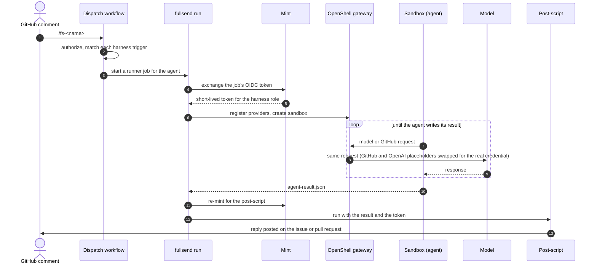

# Bring Your Own Agent

Add a custom agent to fullsend — from `agent new` to a running pipeline. This
guide gets you from nothing to a running agent, then documents every piece
you might want to change by hand.

To configure an existing agent (model, timeout, skills, env vars) without
building from scratch, see
[Configuring Agent Behavior](customizing-agents.md). For a quick overview of
all customization options, see
[Customizing Agents](customizing-overview.md).

## Quick start

[`fullsend agent new`](../../cli/agent.md#agent-new) writes every file an
agent needs and registers it, so you edit prose rather than plumbing:

```bash
fullsend agent new lint-docs --fullsend-dir .fullsend \
  --role triage --description "Check docs changes for broken links"
```

```
  ✓ Created agent "lint-docs" in .fullsend
  harness/lint-docs.yaml
  agents/lint-docs.md
  schemas/lint-docs-result.schema.json
  scripts/post-lint-docs.sh
  policies/base.yaml
  ✓ Added agent "lint-docs"

Next:
  ...
```

1. **Generate.** The command needs the fullsend CLI on your `PATH` and a
   repository already scaffolded with
   [`fullsend github setup`](../getting-started/configuring-github.md) — see
   [Before you begin](#before-you-begin) for the full prerequisite list.
   The generated agent works on GitHub: its harness, prompt and post-script
   all use GitHub. On GitLab, scaffold with
   `fullsend repos install --forge gitlab` and adapt those three files; for the
   harness `role:` and its credentials, see
   [Custom roles](../getting-started/configuring-gitlab.md#custom-roles) and
   the [role-credential contract](../../contributing/gitlab-role-credentials.md).
   The command above generates an
   agent on the default route, Claude on Vertex (when the repository's default
   runtime is `claude` or unset) — for OpenAI, or a mix of the
   two, see [Pick a route](#pick-a-route).
2. **Fill in the prompt.** `agents/lint-docs.md` is the only file with
   sections left for you to fill — it ships with marked sections because
   deciding what the agent actually does is the one thing the generator
   cannot do for you. Everything else is complete.
3. **Dry-run locally.**

   ```bash
   POST_LINT_DOCS_DRY_RUN=1 fullsend run lint-docs --fullsend-dir .fullsend \
     --target-repo . --env-file .env.local
   ```

   This runs the real sandbox and prints the comment instead of posting it.
   A run that finds nothing to report ends like this:

   ```text
     ✓ Agent exited with code 0 (39.2s)
     ...
     • Running post-script: .fullsend/scripts/post-lint-docs.sh
   post-lint-docs: status=ok, nothing to post (dry run: did not check for an earlier findings comment to replace)
     ✓ Post-script completed (0.3s)
   ```

   `.env.local` needs `GITHUB_ISSUE_URL`, `ISSUE_NUMBER`, `REPO_FULL_NAME`,
   `GH_TOKEN`, and whatever the agent's route needs besides those — see
   [Pick a route](#pick-a-route). `GH_TOKEN` must be a real token: a
   connectivity check runs before the agent does. See
   [Running agents locally](running-agents-locally.md).
4. **Commit and comment.** Commit `.fullsend/`, then comment `/fs-lint-docs`
   on an issue or pull request to run it in CI.

## Pick a route

The route — which model, on which credential path — decides what a local
run needs in `.env.local` beyond the GitHub variables every route uses
(`GITHUB_ISSUE_URL`, `ISSUE_NUMBER`, `REPO_FULL_NAME`, `GH_TOKEN`). Pick the
row that matches the agent you want; CI is covered below the table.

| Route | `agent new` flags | harness `providers:` | Env beyond the GitHub variables |
|-------|-------------------|-----------------------|----------------------------------|
| Claude on Vertex | `--runtime claude`, or none when the repository's default runtime is `claude` or unset | `vertex-ai`, `github-ro` (`github` for `--role coder`), `openai` | `ANTHROPIC_VERTEX_PROJECT_ID`, `CLOUD_ML_REGION`, `GOOGLE_APPLICATION_CREDENTIALS` |
| codex on OpenAI | `--runtime codex --model openai/<id>` | `github-ro` (`github` for `--role coder`), `openai` | `OPENAI_API_KEY` |
| pi on Vertex | `--runtime pi` | `vertex-ai`, `github-ro` (`github` for `--role coder`), `openai` | `ANTHROPIC_VERTEX_PROJECT_ID`, `CLOUD_ML_REGION`, `GOOGLE_APPLICATION_CREDENTIALS` |
| pi on OpenAI | `--runtime pi --model openai/<id>` | `github-ro` (`github` for `--role coder`), `openai` | `OPENAI_API_KEY` |
| pi, OpenAI parent + Vertex sub-agents | `--runtime pi --model openai/<id>`, then uncomment the generated `overlays:` block | `github-ro`/`github`, `openai`, plus `vertex-ai` once uncommented | `OPENAI_API_KEY`, plus the three Vertex variables once uncommented |
| pi, Vertex parent + sub-agents on OpenAI | `--runtime pi`, then `fullsend agent set <name> --fullsend-dir .fullsend --subagent default=openai/<id>` (or `<persona>=openai/<id>` for one persona) | `vertex-ai`, `github-ro`/`github`, `openai` | The three Vertex variables above, plus `OPENAI_API_KEY` |

Notes on the last two rows:

- **OpenAI parent, Vertex sub-agents.** `agent new --model openai/<id>` ends
  the harness with the Vertex settings commented out. Remove the `# ` from
  every line under the first one, add `Agent` to the `tools:` list in
  `agents/<name>.md`, and add the three Vertex variables. Without the
  credentials file the run stops before the sandbox starts, rather than the
  sub-agents failing part-way through. Codex gets no such block — its
  sub-agents take OpenAI model ids only.
- **Vertex parent, sub-agents on OpenAI.** The harness must declare the
  `openai` provider, which `agent new` already does for every route;
  `agent set --subagent` points sub-agents at it, and you add `Agent` to the
  `tools:` list in `agents/<name>.md` so the agent can dispatch them; without
  it, no sub-agent is found and no OpenAI credential is created. `default`
  routes an `Agent` call that names no persona and omits `model`, and any
  persona with no model of its own; a persona
  name, such as `challenger` from a review skill, covers that persona only.
  An explicit `model` argument on an anonymous call (for example,
  `model: "sonnet"`) still wins and is not rerouted to OpenAI — omit `model`
  when you want the configured default:

  ```bash
  fullsend agent set lint-docs --fullsend-dir .fullsend --runtime pi \
    --subagent default=openai/gpt-5.6-luna
  ```

  ```text
    ✓ Set agent "lint-docs": runtime="pi" model="" effort="" (empty = inherit) subagents: default=openai/gpt-5.6-luna
  ```

  The run then creates the OpenAI credential before the sandbox and logs
  `subagents: default → openai/gpt-5.6-luna (children that name no persona)`.
  See [pi § Route a persona to OpenAI](../../runtimes/pi.md#route-a-persona-to-openai).

In CI you set none of these variables yourself. The dispatch workflow and
`fullsend run` take them from what the setup commands record:

- **Vertex route:** the `FULLSEND_GCP_PROJECT_ID` and
  `FULLSEND_GCP_WIF_PROVIDER` secrets and the `FULLSEND_GCP_REGION` variable,
  which [`fullsend github setup`](../getting-started/configuring-github.md)
  writes. The Workload Identity Federation provider it records comes from
  [`fullsend inference provision`](../../cli/inference.md).
- **OpenAI route:** the Workload Identity Federation identifiers that
  [`fullsend inference openai request` and `import`](../../cli/inference.md)
  record. `request` writes the document an OpenAI administrator answers;
  `import` writes their reply into `.fullsend/config.yaml`, which you commit
  (or, with `--variables`, into three `FULLSEND_OPENAI_*` repository
  variables). A `FULLSEND_OPENAI_API_KEY` secret works instead — see
  [`fullsend run` § OpenAI credentials on pi and codex](../../cli/run.md#openai-credentials-on-pi-and-codex).

## How a run works

One run goes from a slash-command comment to a posted reply:



The dispatch workflow matches the comment against the `trigger:` of every
registered harness and starts `fullsend run` for each match. `fullsend run`
gets a short-lived GitHub token for the harness's `role:` from the mint (a
local run without `--mint-url` or `FULLSEND_MINT_URL` skips this and uses
your `GH_TOKEN`), sets up the providers on the OpenShell gateway, and starts
the sandbox. For GitHub and OpenAI the agent never holds a real credential:
the gateway gives it a placeholder and swaps in the real value on each
request a declared provider covers. On the Vertex route the GCP credentials
file is copied into the sandbox, and the model calls use it directly. After
the sandbox exits, `fullsend run` re-mints a token (again only with a mint)
and hands it to the post-script, which posts the reply. Scripts cannot mint
their own.

**What lives where.** Your repository holds everything that is specific to
the agent: the harness, the agent's prompt, the result schema, the sandbox
policy, the post-script, and any pre-script you add. The `fullsend` binary
holds the rest: the dispatch logic, `fullsend run`, and the definitions of the built-in
providers and their profiles (`vertex-ai`, `github-ro`, `github`, `openai`,
and others), which is why a generated harness names providers without any
files under `providers/`. The mint is a hosted service.

## What gets generated

For each field below: whether `agent new` writes it, what sets it, and when
you would add or change it by hand.

| File | Field | Written by `agent new`? | Set by | Add or change by hand when |
|------|-------|--------------------------|--------|------------------------------|
| `harness/<name>.yaml` | `agent:` | always | `agents/<name>.md` | — |
| `harness/<name>.yaml` | `policy:` | always, `policies/base.yaml` | — | point it at another policy file, or a pinned URL |
| `harness/<name>.yaml` | `readonly_repo:` | for `--role review` | `--role` | — |
| `harness/<name>.yaml` | `description:` | always | `--description` / spec `description` | — |
| `harness/<name>.yaml` | `role:` | always | `--role` / spec `role` | — |
| `harness/<name>.yaml` | `slug:` | always | `--slug` / spec `slug` | the GitHub App is installed under a different slug |
| `harness/<name>.yaml` | `image:` | always; the default image is pinned to a digest | `--image` / spec `image` | run a different image |
| `harness/<name>.yaml` | `providers:` | always | `--runtime` / `--model` (see [Pick a route](#pick-a-route)) | a provider the route doesn't cover — see [Remote providers and profiles](customizing-agents.md#remote-providers-and-profiles) |
| `harness/<name>.yaml` | `model:`, `effort:` | always | `--model` / `--effort` or spec keys | — |
| `harness/<name>.yaml` | `post_script:` | always, `scripts/post-<name>.sh` | — | a `pre_script:` — never generated, see [Scripts](#scripts) |
| `harness/<name>.yaml` | `host_files:` | Vertex routes only: the GCP credentials file, marked `optional: true` | `--runtime` / `--model` | a file your prompt reads, such as pre-script output |
| `harness/<name>.yaml` | `env.runner`, `env.sandbox` | always: the GitHub variables, plus the Vertex variables on a Vertex route | `--runtime` / `--model` | a variable your prompt reads beyond those |
| `harness/<name>.yaml` | `timeout_minutes:` | always | `--timeout-minutes` / spec `timeout_minutes` | — |
| `harness/<name>.yaml` | `trigger:` | always | `--on` / `--trigger` or spec `on`/`trigger` | — |
| `harness/<name>.yaml` | `validation_loop:` | only when asked for | `--validation-loop` / spec `validation_loop` | — |
| `harness/<name>.yaml` | `overlays:` (commented) | only for pi on an `openai/` model | — | uncomment for Vertex sub-agents ([Pick a route](#pick-a-route)); write your own for other conditional fields |
| `harness/<name>.yaml` | `skills:`, `base:` | never | — | see [Skills](#skills), [Harness composition with `base`](#harness-composition-with-base) |
| `agents/<name>.md` | `name:`, `model:` | always | `<name>` / resolved model | — |
| `agents/<name>.md` | `description:` | always | `--description` / spec `description` | — |
| `agents/<name>.md` | `tools:` | always, a role/runtime default | — | tighten the Bash allowlist, or add `Agent` for any sub-agents |
| `agents/<name>.md` | `skills:`, `disallowedTools:` | never | — | see [Skills](#skills) |
| `schemas/<name>-result.schema.json` | `status`, `summary`, `comment` | always | — | add a field for a richer result; update `post-<name>.sh` to read it |
| `config.yaml` `agents:` entry | `name:`, `source:` | always, unless `--no-register` | `<name>` / `harness/<name>.yaml` | — |
| `config.yaml` `agents:` entry | `runtime:` | only when a runtime is given | `--runtime` / spec `runtime` | — |
| `config.yaml` `agents:` entry | `model:`, `effort:`, `subagents:` | never — `agent set` writes these, not `agent new` | `fullsend agent set` | per-agent tuning after generation |

## Troubleshooting

Rows are keyed on the exact error text where one exists. Longer commands sit
in the code block below the table, not in a cell.

| Error | Cause | Fix |
|-------|-------|-----|
| `API Error: Error code policy_denied` on the first model call (0 tokens, ~2s) | The gateway denied the agent's *binary*, not the model. Built-in profiles already allow the runtime binaries; this comes from a custom profile | Check that profile's `binaries:` list (for Claude, both `**/claude` and `**/claude.exe`) — see the grep command below |
| Agent crashes at 0s, sandbox can't reach the model | `vertex-ai` is missing from `providers:`, or `ANTHROPIC_VERTEX_PROJECT_ID` or `CLOUD_ML_REGION` is set but empty | Add `vertex-ai` to `providers:`. Locally, give the variables real values in `--env-file`; in CI, check the `FULLSEND_GCP_PROJECT_ID` secret and the `FULLSEND_GCP_REGION` variable — re-run `fullsend github setup`, or set one with `fullsend github set <owner/repo> <key> <value>` |
| `Provider "..." declared in harness but no definition found in ...`, then the agent crashes at 0s | A `providers:` entry names neither a built-in bare name nor a file that exists | Use a [built-in name](#pick-a-route), or commit `providers/<name>.yaml` under your own name |
| Agent never fires, no error anywhere | The harness has no `trigger:` | `agent new` always writes one; a hand-written harness needs one too — see [Triggers](../../cli/agent.md#triggers) |
| `"role field is required"` | `role:` is missing from the harness | Add `role:` |
| `403` / "role not allowed" from the mint | `role:` is not one the hosted mint serves | Use one of the roles in the [role table](../../cli/agent.md#roles); for a custom role see [Custom Agent Identity](custom-agent-identity.md) |
| `unknown role "..."` from `agent new` | Same as above, caught at generation time | See the role table in [`agent new`](../../cli/agent.md#roles) |
| `validating files: policy: stat .../policies/base.yaml: no such file or directory` | The harness points at a policy file that isn't committed next to it | Commit `policies/base.yaml` with the agent, or point `policy:` at a committed or pinned URL |
| `host_files[0]: GOOGLE_APPLICATION_CREDENTIALS is empty; mark the mount optional or provide a credential file` | pi on `openai/`, Vertex sub-agent block uncommented, no credentials file set | Set `GOOGLE_APPLICATION_CREDENTIALS` — see [Pick a route](#pick-a-route). Don't mark the mount optional |
| `validating env:` followed by unresolved host variables at `fullsend run` | A `${VAR}` in the harness is unset | Supply it via `--env-file` locally. In CI, the variables a generated harness uses come from the setup commands in [Pick a route](#pick-a-route) |
| `provider credentials are not declared by profile 'fullsend-github-ro'` (or `'fullsend-github'`) | A stale `profiles/fullsend-github*.yaml` from fullsend v0.44.0 or earlier is still listed alongside the bare `github-ro`/`github` provider | Finish [Upgrading agents generated before built-in providers](#upgrading-agents-generated-before-built-in-providers) |
| The same error on your machine, with bare names and no `fullsend-github*` profile left | The OpenShell gateway still holds an older profile with that id; `fullsend run` cannot replace a profile while a provider uses it | Delete and re-create the providers — see the command below |
| `provider profile 'fullsend-github-ro' requires static credentials: GH_TOKEN` at `fullsend run` | `GH_TOKEN` is unset or empty on the machine running `fullsend run` | Put a real token in your env file, e.g. `echo "GH_TOKEN=$(gh auth token)" >> .env.local` |
| `Vertex inference requires GOOGLE_APPLICATION_CREDENTIALS to point to an existing file` (or `a regular/non-empty file`) | The variable is unset or points at a missing path, directory, or empty file | Point it at a real file — [Get GCP credentials](running-agents-locally.md#get-google-cloud-platform-credentials) |
| `reading behaviour script .../behaviour/current-scenario.yaml: ... no such file or directory` | `--runtime dummy` with no scripted result | Write `.fullsend/behaviour/current-scenario.yaml` — see [Testing locally](#testing-locally) |
| `sub-agent model resolves to Vertex, but GOOGLE_APPLICATION_CREDENTIALS is not set` at `fullsend run`, or `provider "anthropic-vertex" is not available in this run (Vertex sub-agents need GOOGLE_APPLICATION_CREDENTIALS ...` in a sub-agent's result | pi on `openai/` dispatched a Vertex sub-agent with no credentials file in the sandbox: the variable is unset, or the harness has no `host_files` mount for it | Set `GOOGLE_APPLICATION_CREDENTIALS` and use the overlay from [Pick a route](#pick-a-route), or keep sub-agents on `openai/` models; see [pi › Vertex sub-agents under an OpenAI parent](../../runtimes/pi.md#vertex-sub-agents-under-an-openai-parent) |
| Agent can't find input files | Pre-script output paths don't match `host_files` entries | Align the two |
| Provider blocks requests | A second profile with the same `fullsend-<name>` id as a built-in provider, or a custom provider whose profile or definition is missing | For a built-in name, remove the other profile with that id. For a custom provider, list its profile in `openshell.profiles:` and commit its definition under `providers/` |
| Schema validation fails | Compare the sandbox output against the schema in `validation_loop` / `FULLSEND_OUTPUT_SCHEMA` | Re-run with `--keep-sandbox` to inspect |
| Agent not found | Verify registration | `fullsend agent list` |
| Agent not triggered by events | Verify the `trigger` expression | See [Verifying your trigger](cel-triggers-reference.md#verifying-your-trigger) |
| `allowed_remote_resources` error | URL agents need a matching prefix | `fullsend agent add` sets this automatically |
| `fullsend run` fails locally | Missing route credentials (GCP on the Vertex route, `OPENAI_API_KEY` on the OpenAI route) or sandbox image | See [Running agents locally](running-agents-locally.md) |
| Integrity hash mismatch | Remote content changed | `fullsend agent update <name>` |

```bash
# API Error: Error code policy_denied — see which binary was denied:
grep DENIED <run-dir>/logs/openshell-sandbox.log

# OpenShell gateway still holds a stale GitHub profile:
openshell provider list | awk '$2=="fullsend-github-ro" || $2=="fullsend-github"{print $1}' \
  | xargs -r openshell provider delete
# Each run re-creates the providers it needs.
```

See [Debugging network policies locally](running-agents-locally.md#debugging-network-policies-locally)
for more on the first command.

## Upgrading agents generated before built-in providers

`agent new` on v0.44.0 and earlier wrote `providers/*.yaml` and
`profiles/fullsend-*.yaml`, and the harness referenced them by path. Those
copies no longer receive fixes, and `fullsend run` warns about them:

```text
  ! provider "vertex-ai": the name is reserved for the definition built into fullsend, and a future release rejects the copy at ".../.fullsend/providers/vertex-ai.yaml". It is still used for now. Declare the bare name "vertex-ai" and delete the copy, or rename it to a name fullsend does not ship
  ! provider "github-ro": the name is reserved for the definition built into fullsend, and a future release rejects the copy at ".../.fullsend/providers/github-ro.yaml". It is still used for now. Declare the bare name "github-ro" and delete the copy, or rename it to a name fullsend does not ship
  ! provider profile "fullsend-vertex-ai" will be rejected in a future release: the id is reserved for the copy built into fullsend. Your copy is still used for now. Remove it from openshell.profiles and declare the bare provider name "vertex-ai" instead
  ! provider profile "fullsend-github-ro" will be rejected in a future release: the id is reserved for the copy built into fullsend. Your copy is still used for now. Remove it from openshell.profiles and declare the bare provider name "github-ro" instead
```

Make all four changes below in one commit. A harness with only some of them
mixes a copied GitHub provider or profile with a built-in one, and the two
may not agree on the `GH_TOKEN` credential (see the stale-profile rows in
[Troubleshooting](#troubleshooting)).

1. In `harness/<name>.yaml`, replace each built-in `providers:` path with
   its bare name (`providers/vertex-ai.yaml` becomes `vertex-ai`).
2. Remove the `profiles/fullsend-*.yaml` entries from `openshell.profiles:`.
   Keep entries for your own profiles, and delete the block if it is empty.
3. Under `env.sandbox`, delete the `GH_TOKEN: ${GH_TOKEN}` line. Keep the
   one under `env.runner`. The built-in GitHub providers give the sandbox a
   placeholder token; that line would put the real token in the sandbox.
4. Delete `providers/<built-in name>.yaml` and `profiles/fullsend-*.yaml`.
   Do steps 1–3 in every harness in the directory first: while a copy sits
   in `providers/`, even a bare name uses the copy, and the run keeps
   warning that it does.

The next `fullsend run` prints none of the warnings and reports each
provider as built in:

```text
    Provider "vertex-ai": using the definition shipped with fullsend (no providers/vertex-ai.yaml in the workspace)
    Provider "github-ro": using the definition shipped with fullsend (no providers/github-ro.yaml in the workspace)
```

## Building an agent by hand

`agent new` does steps 1, 2, and 4 of the sequence below for you — read on
when you need to go beyond what it generates, or want to write an agent from
scratch.

1. **Create the harness and agent definition** — write a harness YAML file
   that defines _how_ the agent runs and a Markdown file that defines _what_
   it does. See [Minimum viable agent](#minimum-viable-agent).
2. **Add a CEL trigger** — write a trigger expression so dispatch knows when
   to launch your agent. See
   [CEL Triggers Reference](cel-triggers-reference.md).
3. **Test locally** — run your agent with `fullsend run` before deploying to
   CI. See [Testing locally](#testing-locally).
4. **Register and deploy** — add your agent to `config.yaml` so dispatch
   discovers it. See [Registering your agent](#registering-your-agent).

### Before you begin

- **fullsend CLI** installed and available on your PATH.
- **Repository scaffolded.** Run [`fullsend github setup`](../getting-started/configuring-github.md) first — it creates `.fullsend/config.yaml` and the dispatch workflow. It does **not** create `policies/`; [`fullsend agent new`](#quick-start) writes that one, and you commit it with the agent. Writing the harness by hand instead? [Minimum viable agent](#minimum-viable-agent) lists what to supply. GitLab repositories are scaffolded instead with `fullsend repos install --forge gitlab` and use role-specific project access tokens rather than GitHub Apps — see [Configuring GitLab](../getting-started/configuring-gitlab.md).
- **Inference set up for CI (CI only).** For agents running in GitHub Actions, on the Vertex route run [`fullsend inference provision`](../../cli/inference.md) to set up Workload Identity Federation, then give the provider it prints to [`fullsend github setup`](../getting-started/configuring-github.md), which stores it with the project and region. On the OpenAI route run [`fullsend inference openai request` and `import`](../../cli/inference.md), or set a `FULLSEND_OPENAI_API_KEY` secret.
- **GitHub Apps installed (CI only).** Your org needs the fullsend GitHub Apps — see [Configuring GitHub](../getting-started/configuring-github.md).

### How agents work

A fullsend agent has two parts:

1. **Harness file** (YAML) — _how_ the agent runs: sandbox image, policy, scripts, skills, credentials, timeouts.
2. **Agent definition** (Markdown) — _what_ the agent does: prompt, tools, model, skills.

Once registered, your agent runs automatically when a matching GitHub event arrives — an issue is opened, a label is applied, a comment is posted, or a PR is submitted. The harness `trigger` field contains a [CEL expression](cel-triggers-reference.md) that fullsend evaluates against incoming events to decide whether your agent should run. See [How a run works](#how-a-run-works) for the full pipeline from comment to posted reply.

You do not need to write a GitHub Actions workflow file for each custom agent. The dispatch workflow that `fullsend github setup` installs handles discovery and routing for all registered agents.

For local development and debugging, you can also run an agent directly with `fullsend run my-agent` — see [Testing locally](#testing-locally).

**Security model:** agents run inside a sandboxed environment. The sandbox policy enforces filesystem access, landlock, and process identity. Network access is typically managed via **provider profiles** referenced by name in the harness `providers:` list — the shared `policies/base.yaml` that `agent new` writes contains no network rules, since built-in agents use providers. Custom agents can also use inline `network_policies` in a per-agent policy file if providers don't cover their needs. Pre-scripts run on the trusted runner _before_ the sandbox starts; post-scripts run _after_ it exits.

### Minimum viable agent

You need a harness, an agent definition, and one supporting file. [`fullsend agent new`](#quick-start) writes all of them; the layout below is what it produces, and what you create yourself if you are building from scratch:

```
.fullsend/
+-- harness/my-agent.yaml                  # Execution config (you write)
+-- agents/my-agent.md                     # Agent prompt (you write)
+-- policies/base.yaml                     # Sandbox policy — commit it; CI never supplies one
```

Commit all three. `fullsend github setup` creates none of them.

**`harness/my-agent.yaml`:**
```yaml
agent: agents/my-agent.md
image: ghcr.io/fullsend-ai/fullsend-sandbox:latest  # Pin to a digest before CI use
policy: policies/base.yaml
providers:
  - vertex-ai
role: triage                        # a role your mint SERVES — not the agent's name (see note below)
slug: my-org-my-agent               # install-time App discovery only; the mint never reads it
trigger: |
  event.entity.kind == "work_item"
    && event.transition.kind == "label_changed"
    && event.transition.label.name == "ready-for-my-agent"
    && event.transition.label.action == "added"
timeout_minutes: 15
# privilege_levels:            # optional; omitted = write for every stage
#   runtime: read              # LLM sandbox token; pre/post scripts stay write
```

> **`role` is not the agent's name.** The agent's name is `name:` in its `.md`;
> `role:` selects which GitHub App and permissions the mint issues. On the
> default (hosted) mint, `role:` must be one of the built-in roles it serves —
> `triage`, `coder`, `review`, `retro`, `prioritize`, `fullsend`. Pick the one
> whose permissions fit what your agent does (a code-writing agent uses
> `role: coder`). A made-up role like `role: my-agent` returns `403` from the
> mint. To use a *new* role or your *own* identity, you need your own mint —
> see [Custom Agent Identity](custom-agent-identity.md).

**`vertex-ai` above is a bare provider name**, not a path. Every provider
name fullsend ships —
`vertex-ai`, `github`, `github-ro`, `github-artifacts`, `gitleaks`,
`package-registries`, `atlassian-cloud`, `openai` — resolves to the
definition and profile built into the `fullsend` binary: no `providers/`
file, no `profiles/` file, and no `openshell.profiles` entry to add, so
nothing to keep in sync. These names are reserved for the built-in copies.
If a harness still uses its own copy under one (a `providers/<name>.yaml`
file, a path or URL entry, or an `openshell.profiles` entry with the
`fullsend-<name>` id), `fullsend run` uses that copy and prints a warning; a
later release rejects it. To customise a provider, define it under your own
name — see [Remote providers and profiles](customizing-agents.md#remote-providers-and-profiles).

> **Note (CI only):** the embedded `vertex-ai` profile controls network access only; real credentials are delivered via `host_files` (see [real-world example](#real-world-example-the-triage-agent)). Make sure you've completed the GCP prerequisites in [Before you begin](#before-you-begin).

**`agents/my-agent.md`:**
````markdown
---
name: my-agent
description: One-line description of what this agent does.
tools: Bash(gh,jq)
model: opus
---

You are my-agent. Your job is to [task description].

## Steps
1. Fetch input from environment variables
2. Analyze and process
3. Write JSON result to `$FULLSEND_OUTPUT_DIR/agent-result.json`

Do NOT push code, create issues, or modify anything directly.
Your only output is the JSON result file.
````

The agent's environment also carries its budget: `FULLSEND_TIMEOUT_MINUTES` (the harness's
`timeout_minutes`) and `FULLSEND_ITERATION_DEADLINE` (Unix seconds at which the iteration is killed),
and `TRACEPARENT` (this iteration's agent-span W3C trace context, so runtime telemetry joins the
Fullsend trace; empty when telemetry produced no valid span context). Write the result before the
deadline — see [`fullsend run` § Budget and deadline](../../cli/run.md#budget-and-deadline).

Network access (which APIs the agent can reach) is controlled by provider profiles or inline `network_policies`. The eight builtin provider names (`vertex-ai`, `github`, `github-ro`, `github-artifacts`, `gitleaks`, `package-registries`, `atlassian-cloud`, `openai`) resolve against the definition and profile built into the `fullsend` binary with no `openshell.profiles` entry at all. A fully custom provider type is different: it needs a provider definition (local or remote) together with a matching `openshell.profiles` entry (or one inherited via `base:` composition) to be imported — see [Remote providers and profiles](customizing-agents.md#remote-providers-and-profiles). For endpoints not covered by providers, inline `network_policies` in the policy YAML also work. Providers are the pattern used by fullsend's built-in agents, but custom agents can use whichever approach fits.

**Next steps:** [Register your agent](#registering-your-agent) so dispatch discovers it, then [write a CEL trigger](cel-triggers-reference.md#writing-cel-triggers) to control when it runs. To iterate on your agent locally before registering, see [Testing locally](#testing-locally).

### Real-world example: the triage agent

The [fullsend-ai/agents](https://github.com/fullsend-ai/agents) triage agent is a full production agent. The harness below is adapted from the current [`harness/triage.yaml`](https://github.com/fullsend-ai/agents/blob/main/harness/triage.yaml) (field order adjusted for readability):

```yaml
agent: agents/triage.md
doc: docs/triage.md
model: opus
image: ghcr.io/fullsend-ai/fullsend-sandbox:latest
policy: policies/triage.yaml

role: triage
slug: fullsend-ai-triage

host_files:
  - src: common/env/gcp-vertex.env
    dest: /sandbox/workspace/.env.d/gcp-vertex.env
    expand: true
  - src: ${GOOGLE_APPLICATION_CREDENTIALS}
    dest: /tmp/.gcp-credentials.json
  - src: ${GCP_OIDC_TOKEN_FILE}
    dest: /sandbox/workspace/.gcp-oidc-token
    optional: true
  - src: env/triage.env
    dest: /sandbox/workspace/.env.d/triage.env
    expand: true

skills:
  - skills/issue-labels

pre_script: scripts/pre-triage.sh
post_script: scripts/post-triage.sh

validation_loop:
  script: scripts/validate-output-schema.sh
  schema: schemas/triage-result.schema.json
  max_iterations: 2

timeout_minutes: 10

overlays:
- when: 'runtime.forge == "github"'
  pre_script: scripts/pre-triage.sh
  post_script: scripts/post-triage.sh
  env:
    runner:
      GITHUB_ISSUE_URL: ${GITHUB_ISSUE_URL}
      GH_TOKEN: ${GH_TOKEN}
    sandbox:
      GITHUB_ISSUE_URL: "${GITHUB_ISSUE_URL}"
      GH_TOKEN: "${GH_TOKEN}"
```

Key patterns to note:

- **`policy: policies/triage.yaml`** is a per-agent policy that includes filesystem, landlock, process, and network rules (via inline `network_policies`). This agent predates the provider-based pattern — new agents can use `providers:` instead (see [Minimum viable agent](#minimum-viable-agent)).
- **`host_files`** copy credentials from the trusted runner into the sandbox. `expand: true` resolves `${VAR}` references before copying.
- **`validation_loop.schema`** references the JSON schema file directly — the validation script checks agent output against it.
- **`overlays`** uses CEL `when` expressions to conditionally apply scripts, skills, providers, openshell, host_files, and env vars. Resolution merges all matching entries in order: every entry whose `when` evaluates to true is applied, with later matches taking precedence over earlier ones. The CEL environment exposes `event` (the triggering event), `runtime.forge` (the effective forge platform), and `config` (per-repo config from config.yaml). When running without an event context (e.g., `fullsend run` or `fullsend lock`), `event` is an empty map — use `has(event.source)` to guard event field access: `has(event.source) && event.source.system == "jira"` instead of just `event.source.system == "jira"` to avoid "no such key" errors.
- **`common/env/gcp-vertex.env`** is referenced by relative path because both files live in the same repo. If your agent lives in a different repo, reference it by URL (see [Harness Field Reference — Referencing resources](../../reference/harness-reference.md#referencing-resources-local-vs-remote)) or copy it locally.

For the complete list of harness fields, see the [Harness Field Reference](../../reference/harness-reference.md).

### Agent definitions

The agent definition is Markdown with YAML frontmatter:

| Field | Purpose |
|-------|---------|
| `name` | Must match the filename (sans `.md`) |
| `description` | One-line summary |
| `tools` | Allowed Bash commands (e.g., `Bash(gh,jq)`) |
| `model` | LLM model |
| `skills` | Skill names to mount |
| `disallowedTools` | Forbidden Bash patterns |

When writing the agent body:
- The agent writes a JSON result file; scripts handle all mutations.
- Be specific — define scoring dimensions, thresholds, output schemas.
- Include decision points (branch on confidence, clarity scores, etc.).

### Skills

A skill is a directory with a `SKILL.md` file that teaches the agent domain knowledge:

```
skills/issue-labels/
  SKILL.md            # Required: frontmatter + instructions
  scripts/            # Optional: helper scripts
  references/         # Optional: reference data
```

Reference in the agent frontmatter by name (`skills: [issue-labels]`) and in the harness by path (`skills: [skills/issue-labels]`). Skills can also be URLs with integrity hashes. See [Configuring with Skills](customizing-with-skills.md) for details on creating and managing skills.

For details on skill authoring, precedence, and extension points, see
[Configuring with Skills](customizing-with-skills.md).

### Scripts

Pre and post scripts run on the trusted runner outside the sandbox.

- **Pre-scripts** prepare the environment — fetch data, reset state, write files for `host_files` to copy in.
- **Post-scripts** act on agent output — apply labels, post comments, create PRs.

**Security:** treat agent output as untrusted input. Validate JSON structure, validate field values against allowlists, quote all variables, and limit string lengths.

Post-scripts act with the role's minted token. Actions that need permissions no role grants (re-running CI jobs, dispatching workflows, deploying) belong in a follow-up workflow you own, chained on the run's artifact — see [Chaining Follow-up Workflows](chaining-follow-up-workflows.md).

### Harness composition with `base`

Inherit from an existing harness and override only what differs:

```yaml
base: https://raw.githubusercontent.com/fullsend-ai/agents/<sha>/harness/triage.yaml#sha256=abc...

model: sonnet
slug: my-org-triage
skills:
  - skills/my-enhancement
timeout_minutes: 15
```

Base chains support up to 5 levels (`MaxBaseDepth` in `internal/harness/compose.go`). Circular references are detected and rejected. Resolution order: base chain, child overrides, overlay resolution. See the [Harness Field Reference](../../reference/harness-reference.md#field-merge-rules-for-base-and-overlays) for how each field type combines.

> **Overlay precedence with `base:`:** Overlays are concatenated base-first, child-appended — the same ordering as `plugins`, `providers`, and `api_servers`. Because `ResolveOverlays` merges all matching entries in order (later matches take precedence), child overlay entries override base overlay entries with the same condition. This follows the child-overrides-base convention used by scalar and map merges.

> **Note:** `allowed_remote_resources`, `allow_runtime_fetch`, and `max_runtime_fetches` are NOT inherited from base harnesses — the child must declare its own. This prevents a base harness from injecting arbitrary URL prefixes or enabling runtime fetching in the child.

> **Org-level fallback:** Separately from base-harness inheritance, the org-level `allowed_remote_resources` from `config.yaml` acts as a fallback for all URL resolution. URLs trusted at the org level are accepted even when the child harness omits the field. This is a distinct trust layer from base composition — the org-level list is set by organization administrators, not by base harness authors.

To configure an existing agent without building from scratch, see [Configuring Agent Behavior](customizing-agents.md#configuration-with-base-composition).

### Testing locally

Before registering, verify your agent works locally. Use `fullsend run` as a development and debugging tool — it runs your agent directly without going through dispatch:

```bash
fullsend run my-agent \
  --fullsend-dir .fullsend \
  --target-repo ./my-repo \
  --env-file .env.local
```

The `--env-file` supplies variables your harness references: `GH_TOKEN` and the GitHub variables on every route, plus `ANTHROPIC_VERTEX_PROJECT_ID`, `CLOUD_ML_REGION` and `GOOGLE_APPLICATION_CREDENTIALS` on the Vertex route or `OPENAI_API_KEY` on the OpenAI route (see [Pick a route](#pick-a-route)). See [Running agents locally](running-agents-locally.md) for prerequisites and troubleshooting.

Most agents need additional flags for credentials and target repo — see [Running agents locally](running-agents-locally.md) for the full list.

**Testing without a model.** The `dummy` runtime runs the real sandbox and the real post-script but replaces the model with a scripted result, so you can exercise the whole pipeline without spending any inference. It needs no model credentials: no `OPENAI_API_KEY`, and no `GOOGLE_APPLICATION_CREDENTIALS` unless the harness requires the file (a `pi` harness with the Vertex block uncommented does). A harness generated for the Vertex route, or a `pi` harness with the Vertex block uncommented, passes `ANTHROPIC_VERTEX_PROJECT_ID` and `CLOUD_ML_REGION` into the sandbox, so set those two to any value.

Write the script at `.fullsend/behaviour/current-scenario.yaml`. This one writes a result matching the `lint-docs` schema (`status`, `summary`, `comment`):

```yaml
ops:
  - description: Write the agent result
    op: write_fixture
    args: output/agent-result.json, fixtures/agent-result.json
    content: |
      {
        "status": "findings",
        "summary": "2 broken links added in docs/",
        "comment": "### Broken links\n\n- `docs/a.md:14` -> `../missing.md`\n- `docs/b.md:3` -> `/docs/gone.md`"
      }
```

`write_fixture` writes `content` to the path before the comma; the path after the comma is used only by the behaviour-test suite. Other ops are listed in [Behaviour testing](../dev/behaviour-testing.md#dummy-agent-tables). Run it:

```bash
POST_LINT_DOCS_DRY_RUN=1 \
  GITHUB_ISSUE_URL="https://github.com/OWNER/REPO/pull/99" \
  ISSUE_NUMBER=99 \
  REPO_FULL_NAME=OWNER/REPO \
  GH_TOKEN="$(gh auth token)" \
  ANTHROPIC_VERTEX_PROJECT_ID=unused CLOUD_ML_REGION=unused \
  fullsend run lint-docs --fullsend-dir .fullsend \
    --runtime dummy --target-repo .
```

Drop `--runtime dummy` and supply the route's real variables to run it with a model instead — the sandbox, post-script, and validation (when the harness has one) are exactly the same either way; only the agent's own reasoning differs.

### Registering your agent

Register agents in `.fullsend/config.yaml` so fullsend discovers them. Registration is what makes your agent visible to dispatch — without it, the agent can only be invoked via `fullsend run`.

Authentication for CLI commands uses `GH_TOKEN`, `GITHUB_TOKEN`, or `gh auth token` (in that order). For URL agents, the CLI resolves GitHub blob URLs to `raw.githubusercontent.com` URLs automatically.

Harness agents route via CEL triggers on arbitrary labels — there is no prefix constraint.

#### CLI

```bash
# Add (auto-pins URL with SHA256):
fullsend agent add \
  https://github.com/fullsend-ai/agents/blob/main/harness/triage.yaml \
  --fullsend-dir .fullsend

# Add local:
fullsend agent add harness/my-agent.yaml --name my-agent --fullsend-dir .fullsend

# List / update / remove:
fullsend agent list --fullsend-dir .fullsend
fullsend agent update triage <sha> --fullsend-dir .fullsend
fullsend agent update code --fullsend-dir .fullsend   # re-pins base: in a local harness
fullsend agent remove triage --fullsend-dir .fullsend
```

#### Config file (`.fullsend/config.yaml`)

```yaml
version: "1"
roles: [triage, coder, review]
agents:
  - https://raw.githubusercontent.com/fullsend-ai/agents/<sha>/harness/triage.yaml#sha256=abc...
  - name: my-cool-agent
    source: harness/my-cool-agent.yaml
allowed_remote_resources:
  - https://raw.githubusercontent.com/fullsend-ai/fullsend/
  - https://raw.githubusercontent.com/fullsend-ai/agents/
```

**Notes:**
- `roles` controls which built-in agent roles are enabled. Valid values: `fullsend`, `triage`, `coder`, `review`, `fix`, `retro`, `prioritize`. Custom agents registered via `agents:` do not need to appear in this list.
- URL entries are automatically pinned with `#sha256=...` by `fullsend agent add`.
- URLs must be covered by `allowed_remote_resources` in the same config.
- On name collision, config-registered agents take precedence over built-in agents.
- Individual agents can be disabled with `enabled: false` — see [Disabling Agents](customizing-agents.md#disabling-agents).
- Per-repo config is read from the **base branch**, not from PR branches.

## See also

- [Customizing Agents](customizing-overview.md) — overview of all customization approaches
- [fullsend-ai/agents](https://github.com/fullsend-ai/agents) — reference implementation used throughout this guide
- [Harness Field Reference](../../reference/harness-reference.md) — complete harness YAML field reference, merge rules, and resource referencing
- [Custom Agent Identity](custom-agent-identity.md) — using a standalone mint for custom GitHub App identity
- [Chaining Follow-up Workflows](chaining-follow-up-workflows.md) — act on an agent's result from your own workflow with the job token
- [CEL Triggers Reference](cel-triggers-reference.md) — dispatch flow, NormalizedEvent fields, transition kinds, and trigger patterns
- [Configuring with Skills](customizing-with-skills.md) — creating and managing skills; [authoring augmentations](customizing-with-skills.md#authoring-skills-that-augment-defaults)
- [`author-fullsend-augmentations` skill](../../../skills/author-fullsend-augmentations/SKILL.md) — discovery-driven guide for writing skills and sub-agents that complement shipped defaults
- [Configuring with AGENTS.md](customizing-with-agents-md.md) — repo-level instructions for all agents
- [Configuring Agent Behavior](customizing-agents.md) — harness configuration and `base:` composition
- [Default, derived, and custom agents](../../agents/topics/default-vs-custom.md) — when configuration crosses into custom agent territory
- [Escalation ladder](../../agents/topics/escalation-ladder.md) — prove-it path before deriving or replacing a core agent
- [Standalone mint](../infrastructure/standalone-mint.md) — custom agent roles and identity
