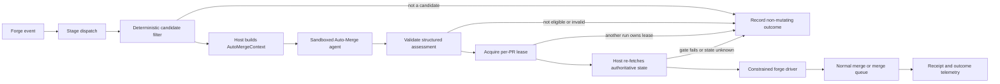

# Auto-Merge Contract v1

Normative behavior for Fullsend's dedicated Auto-Merge stage. The architectural
decision and rationale are recorded in
[ADR 0110](../../../ADRs/0110-dedicated-auto-merge-authority-boundary.md).

## Status and scope

This specification defines the contract that the first mutation-capable
Auto-Merge implementation must satisfy. It is intentionally more detailed than
the ADR: the ADR decides where merge authority lives; this document defines the
components, inputs, state transitions, refusal behavior, security properties,
and evidence required to exercise that authority.

In this document, **Auto-Merge system** means the complete Fullsend lifecycle:

1. the stage dispatcher and deterministic candidate filter;
2. the sandboxed Auto-Merge agent, which makes a non-authoritative eligibility
   assessment;
3. the trusted host-side authorization gate and forge driver; and
4. the forge's normal branch-protection or merge-queue mechanism.

The **Auto-Merge agent** is only item 2. It does not merge pull requests, mint
credentials, override policy, or decide which repository or revision receives
a mutation.

Version 1 is GitHub-first and same-repository only. GitLab support,
cross-repository pull requests, broad source-code cohorts, and model-selected
policy are outside the first mutation-capable release.

## Desired outcome

Fullsend should be able to merge a narrowly allowlisted class of pull requests
without a human clicking the merge button, while preserving the same repository
policy, required checks, required reviews, CODEOWNERS rules, and merge queue that
would govern a human merge.

The feature is successful only when an autonomous merge is:

- **authorized** by current repository policy and trusted human intent;
- **bound** to the exact head revision that was reviewed;
- **least-privileged**, with no merge-capable credential exposed to the model;
- **fail-closed** when required state is stale, missing, contradictory, or
  unknown;
- **idempotent** across duplicate events and concurrent runs;
- **explainable** through stable reason codes, traces, and a durable merge
  receipt; and
- **reversible operationally** through tested kill switches and cohort rollback.

Reducing clicks is not sufficient if any of these properties is lost.

## Non-goals

Version 1 does not:

- make Review responsible for merging;
- restore or alias `CODE_AUTO_MERGE` or `CODE_AUTO_MERGE_METHOD`;
- allow the Code agent to merge a pull request it created or modified;
- give the Auto-Merge model a GitHub write token or arbitrary mutation tool;
- bypass branch protection, required reviews, required checks, or merge queues;
- infer authorization from a PR title, label, author identity, or model output
  alone;
- auto-merge changes to Fullsend policy, agent definitions, workflows,
  credentials, release infrastructure, or other protected paths;
- replace forge-native or third-party automation such as Renovate's own
  `automerge` setting; those remain separately governed policy surfaces; or
- promise that a merged change is defect-free. Auto-Merge automates a bounded
  authorization decision and must still be measured against post-merge
  outcomes.

## Required invariants

Every implementation and test suite must preserve these invariants.

**AM-1 — One Fullsend-owned path.** The dedicated `auto-merge` stage is the
only Fullsend-owned autonomous-merge path. Code, Review, Fix, Retro, and custom
post-scripts must not provide an alternate environment-variable or side-effect
path to autonomous merge.

**AM-2 — Assessment is not authority.** An agent result can recommend
`eligible`; it cannot grant merge authority. Only the host-side gate may
authorize the forge driver after fresh revalidation.

**AM-3 — Exact-head binding.** The reviewed head SHA, evaluated head SHA,
freshly observed head SHA, and head supplied to the mutation operation must be
equal. Any mismatch produces a non-mutating stale result.

**AM-4 — Current policy wins.** The final gate uses current policy, rulesets,
reviews, checks, holds, cohort membership, and pull-request state. A cached
pre-inference snapshot cannot authorize a mutation.

**AM-5 — Unknown never passes.** Unavailable or indeterminate authoritative
state is represented explicitly as unknown and results in `waiting`,
`needs_human`, or `platform_error`; it is never converted to eligible.

**AM-6 — Normal forge enforcement.** The driver requests only a repository-
allowed merge method or the required merge queue. It never uses an
administrator bypass or weakens repository protection.

**AM-7 — Credential isolation.** The Auto-Merge evaluator sandbox receives no
merge-capable credential. The host exposes only a constrained operation bound
to the selected repository, pull request, expected head, and policy snapshot.

**AM-8 — Human veto.** A trusted current hold, changes-requested review, missing
required human approval, or human-required finding vetoes autonomous merge.
An untrusted actor cannot grant authority or remove a trusted veto.

**AM-9 — At-most-once mutation request.** A run may issue at most one merge or
queue request. A repository/PR lease and idempotency key prevent concurrent runs
from issuing duplicate requests for the same head and policy version.

**AM-10 — Observe/live parity.** Observe mode executes the same candidate,
assessment, and final authorization logic as live mode. Its only intentional
difference is that it has no write capability and replaces the mutation with a
recorded preview.

**AM-11 — Auditable outcome.** Every terminal decision has stable reason codes.
Every mutation request has a durable receipt that identifies the reviewed head,
policy, actors, checks, mechanism, and result without recording credentials.

## Architecture and authority boundary

### Component responsibilities

#### Stage dispatcher

The dispatcher decides whether an event should cause an Auto-Merge evaluation.
It authenticates and authorizes the triggering actor under Fullsend's existing
dispatch contract, debounces duplicate events, and scopes concurrency by forge,
repository, and pull request. Dispatch is permission to evaluate, not permission
to merge.

#### Deterministic candidate filter

The filter performs cheap, authoritative checks before model inference. It
rejects obviously ineligible pull requests and emits reason codes without
spending model capacity. It must not reinterpret unknown state as a pass.

#### Auto-Merge agent

The agent receives read-only, host-assembled evidence and evaluates semantic
questions that deterministic checks cannot answer reliably. Examples include
whether a dependency-only diff actually matches its claimed cohort, whether
lockfile churn is suspicious, whether issue intent appears only partially
satisfied, and whether discussion contains uncertainty that should be escalated.

The agent must treat pull-request content, comments, commit messages, files, and
tool output as untrusted data. It returns one schema-validated assessment. It
cannot choose a different repository, pull request, head SHA, policy, merge
method, capability, or command.

#### Host-side authorization gate

The gate is the sole Fullsend component allowed to convert an eligible
assessment into a mutation request. It re-fetches all high-value state after the
assessment, validates exact-head and policy continuity, acquires the per-PR
lease, and constructs the constrained driver request.

#### Forge driver

The driver implements the smallest supported operation: request the configured
normal merge or queue path for one pull request at one expected head revision.
It validates its arguments independently, uses a scoped host-side identity, and
returns a typed result. It does not expose arbitrary GitHub API access to the
agent.

#### GitHub

GitHub branch protection, rulesets, required checks, required reviews, allowed
merge methods, and merge queue remain the final enforcement boundary. A
Fullsend eligibility result never substitutes for those controls.

## Operating modes

Repository policy selects exactly one mode.

- **`disabled`** — no Auto-Merge agent run and no mutation. The system may
  record that a candidate was skipped only if normal platform telemetry does so
  without creating user-visible noise.
- **`observe`** — run the complete evaluation and final gate, record the result
  and hypothetical forge path, but provide no merge-capable credential and make
  no GitHub mutation.
- **`explicit`** — evaluate only after a trusted human explicitly requests
  Auto-Merge. The request is a trigger, not an override; every normal gate still
  applies.
- **`automatic`** — evaluate eligible event transitions automatically for an
  explicitly allowlisted repository and cohort. This mode is prohibited until
  the rollout criteria in this document are met.

A mode change takes effect immediately. The final gate must re-read mode so
switching to `disabled` invalidates an in-flight run before mutation.

## Trigger and lifecycle contract

### Triggering events

An implementation may evaluate after:

- Review completes for the current head;
- a required check changes state;
- the pull request receives new commits or becomes ready for review;
- an authorized human adds or removes a hold or approval signal;
- relevant repository policy changes;
- queue or mergeability state changes; or
- an authorized explicit Auto-Merge command is issued.

Events are hints that state may have changed. The event payload itself is not
authoritative evidence for the final gate.

### Lifecycle

1. **Normalize and authorize the event.** Resolve forge, repository, pull
   request, actor, and transition through existing Fullsend dispatch controls.
2. **Coalesce work.** Cancel or supersede obsolete evaluations and allow at most
   one current evaluation per forge/repository/pull-request key.
3. **Load policy.** Resolve global, installation, repository, cohort, and PR
   controls and record a policy fingerprint.
4. **Run the candidate filter.** Reject disabled, closed, draft, unsupported,
   protected, held, stale, failed, or out-of-cohort candidates deterministically.
5. **Build `AutoMergeContext`.** Fetch and timestamp the current evidence. Each
   gate records its authoritative source and known/unknown state.
6. **Evaluate.** Run the sandboxed agent only when deterministic policy allows
   it and validate the returned schema outside the model.
7. **Acquire lease.** Lock the forge/repository/pull-request key and re-check
   idempotency for the current head and policy fingerprint.
8. **Revalidate under the lease.** Re-fetch the pull request, head, Review
   attestation, checks, reviews, human gates, changed paths, rulesets, queue
   state, mode, and policy. The lease remains held through the forge request.
9. **Request the normal forge operation.** In live modes only, issue one
   expected-head-bound direct merge or queue request. In observe mode, record
   the same request as a preview without write credentials.
10. **Record the result.** Emit stable reason codes, a final authorization
    snapshot, and, for any mutation attempt, a merge receipt. Later events may
    resume a waiting pull request from step 3; they do not reuse stale authority.

The durable idempotency key must include forge, repository, pull request, head
SHA, policy fingerprint, and requested operation. A timed-out request with an
unknown result is reconciled against current forge state before any retry.

### State model

The implementation may use additional internal states, but its external state
must map unambiguously to this vocabulary:

- **`disabled`** — policy prohibits evaluation;
- **`filtering`** — deterministic candidate gates are running;
- **`evaluating`** — the sandboxed agent is assessing a valid context;
- **`ineligible`** — a deterministic or semantic veto is terminal until input
  state changes;
- **`waiting`** — authoritative external state such as checks, mergeability, or
  the per-PR lease is not ready;
- **`needs_human`** — a human decision, approval, or remediation is required;
- **`stale`** — the attested head, policy, or evidence no longer matches;
- **`eligible`** — the assessment passed, but final authorization has not yet
  completed;
- **`authorizing`** — the host holds the lease and is revalidating current state;
- **`observed`** — observe mode completed without requesting a mutation;
- **`queued`** — GitHub accepted the pull request into its normal merge queue;
- **`merged`** — GitHub reports a completed merge;
- **`no_op`** — the pull request was already queued, merged, or closed; and
- **`platform_error`** — the platform could not obtain or persist required
  authoritative state.

Only `authorizing` may transition to `queued` or `merged`, and only the
host-side gate may enter `authorizing`. `eligible` alone is never a mutation
state. Every new head or policy fingerprint starts a new lifecycle and makes
the prior `eligible`, `waiting`, or `stale` record non-authoritative.

## Policy model

### Precedence

Policy is evaluated in the following order. A lower level may be more
restrictive but must never weaken a higher-level veto.

1. global emergency kill switch;
2. installation and repository enablement/mode;
3. supported forge, repository, and base-branch allowlists;
4. approved cohort membership;
5. protected-path and CODEOWNERS policy;
6. trusted PR-level hold and human-intent signals;
7. current Review attestation and required approvals;
8. current required checks and mergeability;
9. forge ruleset, allowed merge method, and queue requirements; and
10. the agent's semantic eligibility assessment.

The model appears last because it may tighten the decision but may not override
any deterministic veto.

### Required controls

The logical repository configuration must define, directly or by inherited
policy:

- schema or policy version;
- mode;
- repository and base-branch allowlist;
- allowed cohorts and their match rules;
- protected path classes;
- trusted human trigger and hold semantics;
- required Review attestation freshness;
- allowed merge methods and queue behavior;
- kill-switch state; and
- policy owner and approval requirements.

The physical configuration file and administration interface are implementation
decisions, but they must produce a canonical, hashable policy snapshot. Changes
to Auto-Merge policy must themselves be human-reviewed and excluded from the
autonomous cohort.

### Initial cohort constraints

The first live cohort must be an allowlist, not an exclusion list. Its exact
membership requires a separate evidence-backed approval. At minimum, the first
cohort must exclude:

- source code and tests;
- GitHub Actions and other CI workflow definitions;
- CODEOWNERS, repository rules, and branch protection configuration;
- Fullsend agent, harness, prompt, skill, hook, or policy files;
- credential, capability, mint, authorization, or sandbox configuration;
- release, deployment, packaging, and security configuration;
- API or cross-repository interface changes;
- `.gitmodules` URL changes, opaque binaries, and unreviewable generated files;
  and
- changes whose intent, effective diff, or issue closure is ambiguous.

A dependency-bot patch or pin update is a plausible first candidate, but bot
identity and a small diff are selectors only. The changed paths, dependency
class, lockfile behavior, current Review evidence, and repository policy must
all independently pass.

### Human intent and veto provenance

Labels, comments, reviews, and slash commands count only when their actor is
authorized for that action under current repository permissions. The system
must preserve enough event or authorization history to distinguish:

- a trusted human adding a hold;
- an untrusted actor attempting to add or remove a signal;
- a trusted human explicitly re-enabling evaluation; and
- a bot mirroring state without possessing authority to grant it.

Removal of a hold does not grant merge authority unless the remover is
authorized. A fake approval in PR text, a commit message, or model output has no
policy effect.

## Data contracts

Concrete JSON Schemas should be added under this version directory before the
first implementation is consumed across repository boundaries. The following
semantic fields are required even if internal Go types land first.

### `ReviewAttestation`

Review produces a structured attestation for one exact pull-request head. It
contains:

- schema version, forge, repository, pull-request number, and base branch;
- base revision observed and `reviewed_head_sha`;
- Review run identifier, completion timestamp, and freshness/expiry data;
- verdict and open finding counts by severity;
- separate agent-remediable and human-required findings;
- protected-path and required-human-approval results;
- Review harness, runtime, model, and implementation fingerprints; and
- policy/configuration fingerprint used during Review.

Missing, malformed, expired, unverifiable, or wrong-head attestations fail
closed. Auto-Merge must not parse Review prose to reconstruct these gates.

### `AutoMergeContext`

The host-generated context passed to the evaluator contains:

- forge, owner, repository, pull-request number, and canonical URL;
- base branch, base SHA, head SHA, author, and author trust class;
- changed paths, diff statistics, and candidate cohort with match evidence;
- the Review attestation summary and current-head association;
- required checks and whether each applies to the current head or queue path;
- review decision, CODEOWNERS result, approvals, holds, and actor provenance;
- branch rules, allowed merge methods, mergeability, and merge-queue state;
- linked issue, closing-keyword, duplicate, and supersession analysis;
- global, repository, cohort, and PR kill-switch state;
- policy and implementation fingerprints; and
- source and observation timestamp for every authoritative gate.

Unavailable facts are encoded as unknown, not omitted or defaulted to success.
The context must be serializable as a secret-free fixture for replay tests.

### `AutoMergeEligibilityResult`

The agent returns exactly one structured result with:

- schema version;
- decision: `eligible`, `ineligible`, `needs_human`, `waiting`, `stale`,
  `superseded`, or `platform_error`;
- reviewed and observed head SHAs;
- candidate cohort and risk classification;
- one or more stable reason codes;
- concise human-readable summary;
- explicit uncertainties;
- recommended forge path: `direct`, `queue`, `none`, or `unknown`; and
- evaluator model, runtime, harness, and implementation fingerprints.

The schema rejects unknown decisions, missing SHAs, unknown reason codes, and
extra authority-bearing fields. In particular, the result cannot contain a
credential, arbitrary command, permission override, alternate repository,
alternate pull request, or replacement head SHA.

An `eligible` result is valid only for the context fingerprint and head SHA on
which it was produced. It expires when either changes.

### `FinalAuthorizationSnapshot`

Immediately before mutation, the host records the evidence it actually used:

- final observed head and base;
- current policy fingerprint and mode;
- Review attestation identifier and reviewed head;
- required check, review, CODEOWNERS, and human-veto summaries;
- current cohort and protected-path result;
- ruleset, allowed method, and queue decision;
- lease and idempotency key; and
- authorization timestamp.

This snapshot, not the earlier model context, explains why the driver was
called.

### `MergeReceipt`

Every merge or queue request produces a durable receipt containing:

- forge, repository, pull request, base branch, and canonical URL;
- reviewed, evaluated, final observed, and requested head SHAs;
- merge commit SHA when available;
- cohort, policy version/fingerprint, and mode;
- Review run, Auto-Merge run, and driver request identifiers;
- summarized checks, reviews, CODEOWNERS, and human gates;
- forge mechanism, merge method, and capability identity;
- implementation, evaluator, runtime, and harness fingerprints;
- decision, authorization, request, and completion timestamps; and
- typed result, stable reason codes, and retry classification.

Receipts must not contain tokens, private keys, raw credentials, or
unnecessarily copied pull-request content.

## Decision and reason semantics

Reason codes are stable API and telemetry vocabulary. Human-readable wording
may evolve without changing their meaning.

### Candidate and policy outcomes

- `disabled`, `observe_only`, `not_in_cohort`, `unsupported_forge`,
  `unsupported_base`, `draft`, `closed`, `protected_path`,
  `policy_file_changed`, `risk_too_high`, `partial_issue_closure`,
  `duplicate_work`, and `superseded` do not permit mutation.

### Review and human outcomes

- `review_missing`, `head_not_reviewed`, `stale_head`,
  `review_changes_requested`, `human_required`, `human_hold`, and
  `approval_missing` do not permit mutation. A later authorized event may cause
  a fresh evaluation; the old result is not resumed as authority.

### CI and forge outcomes

- `ci_pending`, `mergeability_unknown`, and `merge_conflict` are waiting
  outcomes unless the configured merge queue explicitly owns the pending checks.
- `queue_required` is a routing result, not a bypass. It may accompany an
  otherwise eligible assessment only when the configured queue path is
  supported; otherwise the result is `unsupported_merge_policy`.
- `already_queued` is an idempotent state and must not produce another enqueue
  request.
- `ci_failed`, `unsupported_merge_policy`, and `permission_denied` are
  non-retryable until external state or configuration changes.
- `transient_platform_error` may be retried with a bounded backoff.
- `platform_state_unknown` exhausts as `waiting` or `platform_error`, never
  `eligible`.
- `already_merged` is an idempotent terminal no-op and records the actor and
  merge result when available.

### Race and concurrency outcomes

- `head_changed` or `policy_changed` invalidates the assessment and releases
  the lease without mutation.
- `concurrent_run` coalesces or waits behind the current lease; it must not issue
  a second request.
- `eligible` means the assessment passed. It does not mean the mutation occurred
  and cannot bypass the final authorization snapshot.

## Final authorization algorithm

The live path must implement the following ordering:

1. parse and schema-validate the agent result;
2. reject any result other than `eligible`;
3. acquire the forge/repository/pull-request lease;
4. re-fetch the pull request and confirm it is open and not draft;
5. confirm the current head equals the reviewed and evaluated head;
6. re-load policy and confirm mode, cohort, and fingerprint continuity;
7. recompute changed-path and protected-path policy;
8. re-fetch Review, approval, CODEOWNERS, and trusted human-veto state;
9. re-fetch required checks and prove they apply to the current head, unless
   the configured merge queue explicitly owns their pending transition;
10. resolve mergeability, rulesets, allowed method, and required queue path;
11. check whether the same head is already queued or merged;
12. create the final authorization snapshot and idempotency key;
13. issue at most one expected-head-bound merge or queue request; and
14. record the typed result and receipt, then release the lease.

Steps may be combined into atomic forge operations when available, but none may
be omitted. A changed value causes a safe terminal or waiting outcome; it does
not trigger an in-place policy override.

## Forge behavior

### Direct merge

Direct merge is allowed only when current repository policy permits the chosen
method and the API operation can be bound to the expected head. If exact-head
conditionality is unavailable or cannot be proven, the driver must refuse the
direct merge path.

### Merge queue

When the target branch requires a merge queue, the driver must use it. Pending
checks may be accepted only when current repository policy explicitly delegates
their completion and head revalidation to that queue. Enqueue success is not
reported as merged; the receipt records `queued`, and a later forge event
records the terminal merge or removal outcome.

### Protected default branches

Protected default branches are a normal target, not an escape condition. The
driver integrates with their configured policy and queue. An unprotected branch
is not automatically safer and is excluded from the first autonomous rollout
unless an explicit policy and evidence review approves it.

### Retries

Retries are permitted only for classified transient API failures. They are
bounded, reuse the idempotency key, inspect current forge state before another
mutation request, and repeat final revalidation. A timeout after submission is
an unknown result to reconcile, not proof that the request failed. Policy
denials, permission denials, unknown mergeability, stale heads, and malformed
agent output are not blindly retried.

## Security and abuse cases

The implementation must include adversarial tests for these cases:

- PR text instructs the agent to ignore policy or merge a different PR;
- a commit message or comment contains a fake human approval;
- an untrusted actor adds a trigger or removes a trusted hold;
- a PR changes Auto-Merge policy, prompts, harnesses, hooks, workflows,
  CODEOWNERS, rulesets, mint roles, or capability code;
- the head changes after assessment but before the forge call;
- branch rules or policy change while a run is in flight;
- mergeability remains unknown after API retries;
- two events or runners evaluate the same pull request concurrently;
- a fork or crafted payload names an unexpected repository or branch;
- model output contains an arbitrary command, target, method, or override;
- a process attempts to use an expired or wrong-target capability; and
- credentials appear in model context, sandbox environment, logs, artifacts,
  traces, or receipts.

Safe behavior is always no mutation plus a typed, observable reason.

## User-visible behavior

Auto-Merge should make its current state understandable without flooding the
pull request with comments. The canonical state is a check/run summary or
equivalent forge-native surface showing:

- mode and cohort;
- current decision and stable reason codes;
- reviewed and current abbreviated head SHAs;
- whether the run is observing, waiting, queued, merged, or needs a human;
- the specific missing gate when action is needed; and
- a link to the run trace or receipt available to authorized maintainers.

The system must not claim “will merge” before final revalidation. In observe
mode it must say that no mutation was attempted. In explicit mode it must make
clear that a human trigger requested evaluation but did not waive any gate.

## Observability and evaluation

Each lifecycle emits a root trace with child spans for candidate filtering,
context construction, semantic evaluation, policy checks, final revalidation,
lease acquisition, forge request, and receipt creation.

Required aggregate measurements include:

- candidates, eligible assessments, mutation attempts, queue requests, and
  completed merges;
- decision and reason-code distribution;
- prevented stale-head and policy-change mutations;
- duplicate/coalesced runs;
- unknown-state and platform-error rates;
- human veto and post-assessment information-gain rate;
- decision latency, queue latency, and estimated human time saved;
- cost per candidate and per completed autonomous merge; and
- reverts, corrective pull requests, defects, CI failures on the target branch,
  and post-merge rework within the approved look-back window.

A generic model quality score is not a substitute for these safety and outcome
measures. Cohort expansion requires reviewed post-merge evidence.

## Validation requirements

Before `automatic` mode is available, the implementation must prove:

### Contract and unit coverage

- schema validation rejects missing, stale, unknown, and authority-bearing
  fields;
- every policy veto maps to a stable reason code;
- current-head equality and policy-fingerprint equality are mandatory;
- observe and live paths share authorization logic;
- staged execution has no access to a write-capable credential;
- receipt construction is complete and secret-safe; and
- already-queued, already-merged, duplicate-event, and concurrent-run behavior
  is idempotent.

### Lifecycle playback

- Review requests changes, Fix updates the head, Review approves the new head,
  checks pass, and the normal queue or merge path completes;
- a new commit after Review prevents mutation;
- a trusted hold or changes-requested review arriving after assessment prevents
  mutation;
- disabling Auto-Merge during a run prevents mutation;
- closing or manually merging during a run produces a safe no-op;
- duplicate delivery results in at most one forge request; and
- queue completion or removal updates the original receipt.

### GitHub integration coverage

- required checks passing, failing, pending, and associated with an older head;
- required review and CODEOWNERS approval missing or stale;
- mergeability unknown and merge conflict;
- squash-only, merge-only, rebase-only, and unsupported merge policies;
- protected default branch with and without a required queue;
- direct merge with expected-head conditionality;
- ruleset, policy, base, and head changes during evaluation;
- protected-path changes and unauthorized signal manipulation; and
- bounded retries for transient GitHub failures.

## Rollout and rollback

Rollout proceeds in this order:

1. merge the removal of the legacy `CODE_AUTO_MERGE*` implementation;
2. land contracts, schemas, fixtures, and host-side refusal tests;
3. deploy `disabled` mode and verify no alternate mutation path exists;
4. run `observe` mode with complete reason codes and no write capability;
5. compare observed decisions with human outcomes and resolve false eligibility,
   unknown-state, and race findings;
6. enable `explicit` mode for trusted maintainers in one approved repository;
7. enable `automatic` mode for one approved repository and one narrow cohort;
   and
8. expand only after a dated review of post-merge outcomes and explicit policy
   approval.

Operators must be able to disable one pull request, cohort, repository,
installation, or the entire feature. A global or repository disable must block
in-flight mutation at the final gate. Incident response must be able to locate
all receipts for a policy/cohort version, identify affected merges, pause the
cohort, and follow normal repository governance for any revert.

## Repository ownership

The implementation spans two repositories but has one authority contract.

### `fullsend-ai/fullsend`

Owns stage registration and dispatch, policy loading, candidate filtering,
`AutoMergeContext` construction, schema validation, final revalidation, lease
and idempotency behavior, forge abstraction, constrained mutation, receipts,
telemetry, rollout controls, and end-to-end tests.

### `fullsend-ai/agents`

Owns the dedicated Auto-Merge agent identity, harness, prompt, read-only tool
surface, structured result production, evaluator tests, and removal of the
legacy Code post-script behavior. The removal is tracked in
[agents#1219](https://github.com/fullsend-ai/agents/pull/1219).

Neither repository may independently introduce another autonomous-merge
enablement path. Contract changes that affect both implementations require a
version-compatible change here or a new major version.

## Implementation decisions intentionally left open

These choices do not change the v1 safety contract and can be resolved in
focused implementation PRs:

- the concrete repository-policy file and administration interface;
- whether the host capability uses an existing narrowly scoped GitHub App role
  or a dedicated merge identity;
- the exact GitHub API used to enqueue under each supported ruleset;
- the model/runtime selected for semantic evaluation;
- the first approved repository and cohort; and
- the length and thresholds of the post-merge evidence window.

An implementation choice that weakens any required invariant is not an open
detail; it requires a new architectural decision and contract revision.

## Reviewer checklist

A reviewer should be able to answer **yes** to all of the following before the
first mutation-capable release:

- Is there exactly one Fullsend-owned autonomous-merge path?
- Can the evaluator run with no merge-capable credential?
- Can a model output ever directly select or invoke a mutation? It must not.
- Is every merge/queue request bound to the reviewed current head?
- Does the final gate re-fetch policy, human signals, reviews, checks, paths,
  rulesets, mode, and mergeability?
- Does unknown state fail closed?
- Can branch protection or queue requirements ever be bypassed? They must not.
- Do duplicate events and concurrent runs permit at most one request?
- Does observe mode exercise the live decision path without write capability?
- Are reason codes and receipts sufficient to explain every outcome?
- Are protected paths and Auto-Merge's own control files excluded?
- Are kill switches checked after evaluation and immediately before mutation?
- Has the selected cohort passed staged/live, race, adversarial, and post-merge
  evidence gates?

## Versioning

Breaking changes require `docs/normative/auto-merge/v2/`. Examples include
weakening an invariant, removing a required gate or receipt field, changing the
meaning of a decision/reason code, allowing a new authority source, exposing a
new mutation surface, or expanding beyond same-repository GitHub behavior
without compatible safeguards.

Non-breaking additions within v1 may add optional evidence fields, new
fail-closed reason codes, stricter cohorts, additional protected paths, or
additional tests that preserve all existing safety properties.
