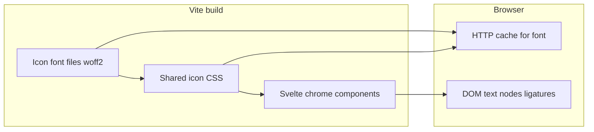

# Web UI icons: move from inline SVG to an icon font

**Status:** Speculative (spec-start; headless)

## Context

GitHub issue [#818](https://github.com/fullsend-ai/fullsend/issues/818) asks to stop embedding raw SVGs for icons in the web UIs so styling is easier to control and payloads are more efficient on the wire. Triage noted inline SVGs in the docs shell (hamburger / close controls), tree navigation glyphs, the admin sign-in GitHub mark, and separately called out dynamically generated SVG from Mermaid in the docs renderer.

**Canonical prompt (issue title + body):** adopt an **icon font** for icons instead of raw inline SVG, for styling and transfer efficiency.

**Repo touchpoints today (static inline SVG in Svelte):**

- `web/docs/src/App.svelte` — small chrome icons (outline toggle / close patterns using `currentColor` paths).
- `web/docs/src/lib/DocTreeNav.svelte` — chevron plus open/closed folder glyphs.
- `web/admin/src/App.svelte` — GitHub mark on the “Sign in with GitHub” control.

The monorepo root `package.json` drives Vite builds for both `web/docs` and `web/admin`; there is no shared icon package yet, so any dependency or CSS should be wired deliberately for **both** apps or extracted to a small shared module if duplication becomes painful.

**Related but out of scope for a literal “icon font” pass:** Mermaid’s client-side render produces SVG inside the article body. That is graph output, not UI chrome icons. Treat it under **Non-goals** unless product later wants a different diagram engine.

## Goals

- Replace **UI chrome** inline SVG icons in the docs and admin Svelte apps with glyphs from a **single icon font family** (or a documented pair, e.g. UI font + brand webfont) so color, size, and weight track typography and CSS variables.
- Reduce repeated SVG path markup in components; prefer **one** font request (with effective browser caching) over many duplicated path fragments in HTML.
- Keep **accessibility** at least as good as today: decorative icons stay `aria-hidden`; interactive controls keep visible text or `aria-label` as they do now.
- Align with existing stack: **Svelte 5**, **Vite 6**, Node **≥22** per `package.json`.

## Non-goals

- Rewriting **Mermaid** output or replacing Mermaid with a non-SVG renderer.
- Redesigning layouts, navigation behavior, or information architecture beyond what icon swapping requires.
- Introducing a large icon **component library** whose primary value is hundreds of SVG React/Svelte components (that would fight the “icon font” direction unless explicitly chosen later).
- Licensing-sensitive **GitHub logo** usage changes without a legal/design review; the spec assumes we either pick a font that includes an approved mark glyph or keep a **single** minimal inline SVG for that one brand asset if required.

## Architectural approach

### Option A — Google **Material Symbols** (variable font, self-hosted)

**Idea:** Add the Material Symbols font (Outlined or Rounded) as an npm package or vendored font files, declare `@font-face` in shared CSS imported by both Vite apps, and render icons as `menu` (ligature mode) or numeric codepoints per project convention.

**Pros:** Very wide coverage; variable font supports **weight** and **optical size** axes that map well to “better styling control”; one family can cover docs + admin; active ecosystem.

**Cons:** Visual language is distinctly “Material”; bundle size is larger than a tiny custom subset unless you subset aggressively; licensing is open (OFL) but still verify for your distribution channel.

### Option B — **Font Awesome** (classic webfont + optional SVG-with-js)

**Idea:** Use the classic webfont CSS for solid/regular icons; use the **brands** stylesheet for the GitHub mark if policy allows.

**Pros:** Familiar to contributors; brand icons available; easy class-based styling.

**Cons:** Free tier vs Pro features; easy to accidentally pull **far more icons** than needed and bloat CSS/font payloads; “today’s standard” skews more toward SVG sprites or tree-shaken kits than global webfonts unless carefully subset.

### Option C — **Custom subset icon font** (build-time)

**Idea:** At build time, generate a font containing **only** the dozen or so glyphs you need (menu, close, folder, chevron, etc.) via a subsetting tool, ship `woff2` + minimal CSS.

**Pros:** Smallest wire cost and most precise alignment with issue motivation.

**Cons:** Highest engineering overhead (pipeline, regeneration when icons change, contributor ergonomics); must document how to add a new glyph.

### Recommendation

**Start with Option A (Material Symbols Outlined), self-hosted through npm + Vite static asset pipeline**, with a thin project convention:

- One CSS module (e.g. `web/shared/icon-font.css` or per-app imports from a documented path) that defines `@font-face` and base `.fs-icon` utility classes (font-size, line-height, `font-variation-settings` for weight).
- Replace inline `<svg>` blocks in the three Svelte files above with ``/`<i>` elements using ligature names that match Material’s documented names, preserving `aria-hidden` and button labels.
- For the **GitHub mark**, spike whether Material / another approved glyph is acceptable; if not, explicitly carve out a **brand exception** (single inline SVG or raster) documented in `qna.md` so the rest of the chrome still benefits from the font.

If Material’s aesthetic is rejected in review, **Option C** is the best technical fit to the issue’s efficiency argument, at the cost of build complexity—schedule as a follow-up spike rather than defaulting to it day one.

## Components and data flow

- **Font delivery:** Prefer **self-hosted** `woff2` from `node_modules` or `web/*/public` so previews and production behave the same and CSP stays tight. Avoid introducing a third-party **runtime** dependency on `fonts.googleapis.com` unless Cloudflare / headers already allow it.
- **Styling contract:** Icons inherit `color` from `currentColor` via `color` on parent buttons/links (same as today’s SVG `stroke`/`fill` usage). Document expected sizes (`rem` scale) per component.
- **Testing:** Add or extend lightweight DOM tests only if the repo already patterns that way; otherwise rely on `svelte-check`, visual review, and snapshot of rendered HTML class names.

## Error handling and edge cases

- **FOIT/FOUT:** If the font fails to load, ligature text may flash readable names (“menu”, “close”) before the font applies. Mitigations: `font-display: swap` (default tradeoff), optional `size-adjust`, or visually hidden text + `aria-label` on the control (preferred pattern for icon-only buttons—many controls here already include visible text).
- **High contrast / forced colors:** Verify Windows high-contrast mode; icon fonts generally respect `color` but may need `forced-colors` adjustments if regressions appear.
- **Print / PDF exports of docs:** Low risk today; note under open questions if printable docs matter.

## Security and licensing

- **Subresource integrity** is N/A for first-party hosted fonts; ensure font files are pinned versions in `package-lock.json`.
- **GitHub logo** must follow GitHub brand guidelines if using a third-party glyph or SVG.

## Testing strategy

- Run existing **`npm run check`** (Svelte check for both apps) after refactors.
- Manually smoke **docs** shell: narrow vs wide viewport, folder expand/collapse, mobile outline open/close.
- Manually smoke **admin** sign-in screen: GitHub button alignment and focus ring.

## Rollout

1. Land font + CSS + documentation for class naming.
2. Migrate `web/docs` chrome, then `web/admin` sign-in button, or vice versa—keep PRs small if implementation is split.
3. Remove unused SVG-specific CSS if any existed solely to size inline SVGs.

## References

- Issue: https://github.com/fullsend-ai/fullsend/issues/818
- `web/docs/src/App.svelte`
- `web/docs/src/lib/DocTreeNav.svelte`
- `web/admin/src/App.svelte`
- Root `package.json` (workspace scripts and engines)

## Open questions (summary)

See `qna.md` for assumptions, detailed questions on font choice, GitHub mark policy, CDN vs self-host, and Mermaid boundary.
