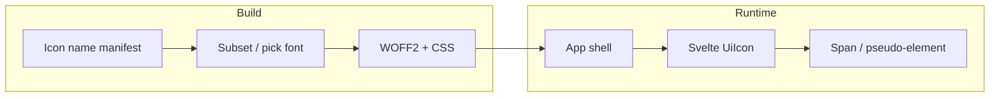

# Web UIs: adopt icon fonts instead of embedded SVGs

**Status:** Speculative (spec-start; headless)

## Context

- **Issue:** [fullsend-ai/fullsend#818](https://github.com/fullsend-ai/fullsend/issues/818) — *Change "icons" in web UIs to use an icon font rather then embed raw SVGs*
- **Issue body:** Moving to an icon font should improve styling control and reduce bytes on the wire compared to repeating inline SVG markup.
- **Labels / triage:** The issue is marked **needs-info**. Triage notes (GitHub comment, 2026-05-12) describe current inline SVG usage across the docs site (for example close / hamburger controls), tree navigation folder/document glyphs, the GitHub mark in the admin dashboard, and dynamically generated SVG in graph visualization. This spec treats that inventory as the **expected baseline** for the upstream product even if a given checkout has a smaller Svelte surface at the moment.
- **Human comment:** A maintainer signaled openness to Font Awesome but did not pick a standard; library choice remains open.

## Goals

- Replace **decorative / UI chrome** icons that today ship as inline SVG in Svelte (or equivalent) with **icon-font–based rendering** so color, size, and weight track typography and CSS with minimal duplicated markup.
- Cut **wire and DOM weight** for repeated icons (one font + short ligature/PUA markup vs many duplicated `<path>` trees), subject to font subsetting and caching strategy.
- Establish a **single house style** for icon usage across `web/docs`, `web/admin`, and any other first-party web surfaces, including accessibility conventions (exposed name, decorative vs informative).

## Non-goals

- Rewriting **data-driven** or **bespoke** visuals (for example graph layout edges/nodes, charts, or illustrations) as icon fonts when SVG remains the correct model—those may stay SVG or move to a different abstraction, but are not required to become font glyphs.
- Choosing **npm package names and exact import paths** in this spec (implementation PR picks versions and pins licenses).
- Internationalizing **third-party** brand marks beyond what license and trademark policy already require.

## Architectural approach (options)

### Option A — Variable icon font (Material Symbols–style)

**Idea:** Load one variable font (WOFF2), map icons via ligatures or codepoints, style with `font-variation-settings` / axes (weight, fill, optical size).

**Pros:** Large catalog; strong alignment with “icon font” wording; one network artifact after first load; very flexible styling.

**Cons:** Heavier than a tight subset until subsetting is configured; Google-fonts vs self-host trade-offs; brand icons may still be exceptions.

### Option B — Classic webfont pack (Font Awesome–style)

**Idea:** Use a familiar webfont with documented Unicode / class conventions; subset to used glyphs in the build.

**Pros:** Well-understood ergonomics; predictable licensing tiers; tooling for subsetting.

**Cons:** Less expressive than variable-font axes unless using newer FA variable builds; bundle/licensing choices need explicit approval.

### Option C — SVG sprite sheet + currentcolor (not an icon font)

**Idea:** Centralize SVGs as `<symbol>` defs or external sprite, reference via `<use>`.

**Pros:** Crisp at all sizes; easy for one-off brand paths.

**Cons:** Does **not** satisfy the issue’s request for an **icon font**; keeps more DOM for repeated icons than a font + single codepoint per icon.

### Recommendation

**Lead with Option A (variable icon font)** for the majority of UI chrome, paired with a **narrow exception list** for glyphs that are poor font fits (for example the GitHub mark if trademark guidance prefers the official SVG, and graph primitives). Where Option A’s licensing or operational constraints bite, **Option B** is the fallback without changing the overall “font for chrome icons” direction.

**Explicitly deferred:** swapping every bespoke graph SVG for font glyphs (likely infeasible); any broad redesign of the graph renderer.

## Components and responsibilities

| Area | Responsibility |
|------|------------------|
| **Font delivery** | Self-hosted WOFF2 in-repo or via locked CDN URL per security/CSP posture; cache headers and preload hints as appropriate for Vite builds. |
| **Svelte integration** | Thin wrapper component (for example `<UiIcon name="close" />`) that renders the correct element (`` with text / ligature or PUA) and forwards `class` / `style` / ARIA. |
| **CSS contract** | Document how consumers set size (`font-size`), color (`color` / `currentColor`), and weight/fill axes for variable fonts. |
| **A11y** | Decorative icons: `aria-hidden="true"`; informative icons: `aria-label` or visually hidden text—mirror whatever patterns exist today for SVG titles. |
| **Build / subsetting** | CI or build step lists allowed icon names → shrinks font payload; fail closed when requesting unknown names in dev. |

## Data flow (runtime)

1. App shell loads icon stylesheet + font once per navigation session (or per deploy hash).
2. Components request icons by **stable logical name** (not raw codepoint) through the wrapper.
3. CSS maps logical name → glyph (ligature table or `::before { content }` with escaped codepoint).

## Error handling and edge cases

- **Missing glyph:** Dev-time console warning + visible placeholder; production build should fail CI if manifest references unknown name.
- **CSP:** Font and stylesheet hosts must match documented CSP allowlist; avoid inline `@font-face` if policy forbids.
- **Dark mode / themes:** Icons inherit `color`; verify contrast for outline vs filled variants when using variable axes.

## Security / licensing

- Confirm **font license** allows redistribution/self-hosting for the chosen pack.
- **Third-party logos** (GitHub): comply with brand guidelines; prefer retaining SVG where required rather than forcing a font glyph.

## Testing strategy

- **Visual smoke:** Representative pages in docs and admin with icons at default and large `font-size`.
- **Accessibility:** Quick axe or manual screen-reader pass on nav toggles and inline “icon only” buttons.
- **Bundle:** Compare hashed font + CSS size vs previous inline SVG aggregate for a few hot routes (rough budget, not a hard gate unless maintainers want one).

## Rollout

1. Land font + wrapper + CSS behind no flag if risk is low; otherwise a short-lived feature flag only if parallel maintenance is otherwise unavoidable (prefer direct migration for small surfaces).
2. Migrate high-repeat icons first (nav toggles, tree chevrons), then long tail.
3. Document contributor guidance in `web/README.md` or adjacent developer docs: when to use `UiIcon`, when to keep SVG.

## References

- Issue: https://github.com/fullsend-ai/fullsend/issues/818
- Triage comment on the issue (2026-05-12) summarizing SVG call sites.
- `package.json` / Vite workspace for current web build layout.

## Q&A index

- [Q-01 — Which icon font family should be canonical?](./qna.md#q-01--which-icon-font-family-should-be-canonical)
- [Q-02 — What stays SVG on purpose?](./qna.md#q-02--what-stays-svg-on-purpose)
- [Q-03 — How strict is “no inline SVG” for admin/docs chrome?](./qna.md#q-03--how-strict-is-no-inline-svg-for-admindocs-chrome)
- [Q-04 — Subsetting and build-time manifest ownership](./qna.md#q-04--subsetting-and-build-time-manifest-ownership)
- [Q-05 — Fork / sparse web tree vs upstream triage inventory](./qna.md#q-05--fork--sparse-web-tree-vs-upstream-triage-inventory)
