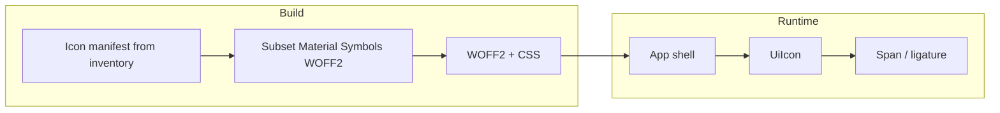

# Web UIs: adopt icon fonts instead of embedded SVGs

**Status:** Speculative (spec-refine; PR #907)

## Context

- **Issue:** [fullsend-ai/fullsend#818](https://github.com/fullsend-ai/fullsend/issues/818) — *Change "icons" in web UIs to use an icon font rather than embed raw SVGs* [sic on “than” in issue title]
- **Issue body:** Moving to an icon font should improve styling control and reduce bytes on the wire compared to repeating inline SVG markup.
- **PR:** [fullsend-ai/fullsend#907](https://github.com/fullsend-ai/fullsend/pull/907) — spec-only follow-up to issue #818.
- **Scope (confirmed in review):** **UI chrome icons only**—not Mermaid diagram output, not Cytoscape/graph node shapes, not other data-driven SVG.

## Goals

- Replace **decorative / UI chrome** icons that today ship as inline SVG in Svelte with **icon-font–based rendering** so color, size, and weight track typography and CSS with minimal duplicated markup.
- Cut **wire and DOM weight** for repeated icons (one font + short ligature/PUA markup vs many duplicated `<path>` trees), subject to font subsetting and caching strategy.
- Establish a **single house style** across `web/docs`, `web/admin`, and related surfaces, including accessibility conventions (decorative vs informative).

## Non-goals

- **Graph / visualization SVG** (`web/public/index.html` document graph: node shapes, edge decorations, layout helpers)—remain SVG or canvas.
- **Mermaid** (and similar) content rendered inside doc articles—out of scope; not UI chrome.
- Choosing **npm package names and exact import paths** in this spec (implementation PR picks versions and pins licenses).
- Forcing **third-party brand marks** into a font when guidelines prefer official artwork.

## Canonical icon font (decision)

**Primary:** **Material Symbols** (variable font, self-hosted WOFF2 subset)—see [Q-01 comparison](./qna.md#q-01--which-icon-font-family-should-be-canonical).

**Fallback:** **Font Awesome 6 Free** webfont subset if Material licensing or hosting is blocked.

**Rejected for primary use:** Lucide/Heroicons-as-font (non-standard distribution); SVG sprite sheet as the main approach (does not satisfy issue #818).

## Icon migration inventory

Audit date: 2026-05-14 (`web/**` on `main`). Logical names are the proposed `UiIcon` manifest keys; **Material Symbols** names are the recommended glyph IDs (adjust during implementation if ligature names differ).

| Surface | File (approx.) | UI element | Current inline SVG | `UiIcon` name | Material glyph (recommended) | Action |
|---------|----------------|------------|-------------------|---------------|------------------------------|--------|
| Docs | `web/docs/src/App.svelte` | Sidebar “close outline” (desktop) | 24×24 “X” | `close` | `close` | **Replace** with font |
| Docs | `web/docs/src/App.svelte` | Sidebar “close outline” (mobile) | Same X (duplicate) | `close` | `close` | **Replace** (dedupe markup via shared component) |
| Docs | `web/docs/src/App.svelte` | Top bar hamburger / outline toggle | 24×24 three-line menu | `menu` | `menu` | **Replace** |
| Docs | `web/docs/src/lib/DocTreeNav.svelte` | Folder row expand chevron | 12×12 stroke chevron | `chevron-right` | `chevron_right` | **Replace** (rotate when open via CSS) |
| Docs | `web/docs/src/lib/DocTreeNav.svelte` | Folder open state | 16×16 open-folder path | `folder-open` | `folder_open` | **Replace** |
| Docs | `web/docs/src/lib/DocTreeNav.svelte` | Folder closed state | 16×16 closed-folder path | `folder` | `folder` | **Replace** |
| Docs | `web/docs/src/lib/DocTreeNav.svelte` | File row | 16×16 document path | `file` | `description` | **Replace** |
| Admin | `web/admin/src/App.svelte` | “Sign in with GitHub” button mark | GitHub Octocat path | — | — | **Keep SVG** (brand; pragmatic exception) |
| Site graph | `web/public/index.html` | Node markers (circle/rect/triangle) | JS-built SVG strings | — | — | **Keep SVG** (data-driven viz) |
| Site graph | `web/public/index.html` | Resize handle texture | data-URI SVG line | — | — | **Keep** or replace with pure CSS (optional) |
| Site graph | `web/public/index.html` | Small legend/connector SVG | inline in template | — | — | **Keep SVG** (viz chrome tied to graph) |
| Docs content | `web/docs/src/App.svelte` (`runMermaid`) | Diagram output in article | Mermaid-generated SVG | — | — | **Out of scope** (not UI chrome) |

## Architectural approach

### Delivery

- Self-hosted **Material Symbols** WOFF2 subset driven by a manifest of logical icon names (see inventory).
- Thin Svelte wrapper (`<UiIcon name="close" />`) mapping logical names → glyph/ligature; forwards `class`, `style`, and ARIA.
- CSS: size via `font-size`, color via `currentColor`, optional variable axes (`FILL`, `wght`) for outline vs filled states.

### Pragmatic SVG exceptions (documented)

1. **GitHub mark** on admin sign-in (brand).
2. **Document graph** dynamic shapes and related helpers in `web/public/index.html`.
3. Any future mark where trademark guidance forbids font substitution.

All other **static chrome** icons in the table above should migrate off inline SVG.

## Components and responsibilities

| Area | Responsibility |
|------|------------------|
| **Font delivery** | Self-hosted WOFF2; preload in Vite builds; CSP-aligned `@font-face`. |
| **Svelte integration** | Shared `UiIcon` in a small shared module consumed by docs (and admin where applicable). |
| **CSS contract** | Document size/color/axis usage for contributors. |
| **A11y** | Decorative: `aria-hidden="true"`; informative: `aria-label` or visible text. |
| **Build / subsetting** | Manifest = inventory logical names; CI fails on unknown `name` in dev/build. |

## Error handling

- **Missing glyph:** Dev warning + CI failure on unknown manifest keys.
- **CSP:** Font hosts allowed in policy.
- **Themes:** Icons inherit `color`; verify contrast for outline vs filled axes.

## Security / licensing

- **Material Symbols:** Apache 2.0; confirm self-hosting steps match Google Fonts attribution requirements.
- **GitHub logo:** Keep SVG per brand guidelines.

## Testing strategy

- Visual smoke on docs sidebar/topbar and tree nav; admin login button (SVG exception unchanged).
- Accessibility on icon-only buttons (close, menu, folder toggle).
- Bundle: compare subset font + CSS vs aggregate inline SVG weight on docs routes.

## Rollout

1. Land `UiIcon`, font assets, and CSS.
2. Migrate docs chrome per inventory (highest repetition first: close/menu, tree glyphs).
3. Document exceptions and manifest rules in `web/README.md` (or adjacent dev doc).

## References

- Issue: https://github.com/fullsend-ai/fullsend/issues/818
- PR: https://github.com/fullsend-ai/fullsend/pull/907
- `web/docs/src/App.svelte`, `web/docs/src/lib/DocTreeNav.svelte`, `web/admin/src/App.svelte`, `web/public/index.html`

## Q&A index

- [Q-01 — Which icon font family should be canonical?](./qna.md#q-01--which-icon-font-family-should-be-canonical) — comparison + **Material Symbols** recommended
- [Q-02 — What stays SVG on purpose?](./qna.md#q-02--what-stays-svg-on-purpose) — **resolved:** icons-only scope
- [Q-03 — How strict is “no inline SVG”?](./qna.md#q-03--how-strict-is-no-inline-svg-for-admindocs-chrome) — **resolved:** pragmatic boundary
- [Q-04 — Subsetting and manifest ownership](./qna.md#q-04--subsetting-and-build-time-manifest-ownership) — still needs owner
