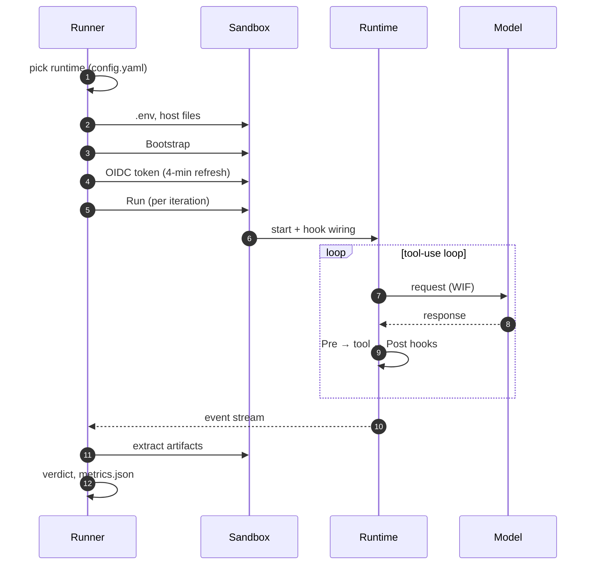
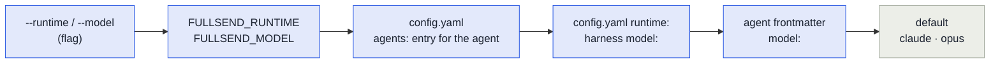

# Agent runtimes

A **runtime** is the agent program fullsend runs inside the sandbox — the thing that talks to the
model and executes tool calls. `fullsend run` delegates to it and owns everything around it: the
sandbox, the credentials, and the verdict.

| Runtime | Use it for | Status |
|---|---|---|
| **[`claude`](runtimes/claude.md)** | Production agent runs (Claude Code) | Default |
| **[`pi`](runtimes/pi.md)** | Second runtime, opt-in per org/repo — Claude, Grok and Gemini | Supported for `triage`, `prioritize`, `code`, `fix` |
| `dummy` | Behaviour tests — scripted ops, no inference | Internal |
| `opencode` | Not yet functional | Stub |

Pick one with `runtime:` in `.fullsend/config.yaml`, or per run with `--runtime`.

```bash
fullsend run triage --runtime pi --model xai-vertex/xai/grok-4.6
```

## How a run uses the runtime

The runner owns the sandbox, credentials and verdict; the runtime owns what happens between "start"
and "event stream".



## Choosing between claude and pi

| | Claude Code | pi |
|---|---|---|
| Models | Anthropic on Vertex | Claude, **Grok** and **Gemini** on Vertex |
| Sub-agents | Native (`Agent` tool) | Not wired — agents execute sub-agent definitions inline ([#6527](https://github.com/fullsend-ai/fullsend/issues/6527)) |
| Fallback model chain | `FULLSEND_FALLBACK_MODELS`, tried in order | Ignored with a warning |
| Roles | All | `review`/`retro` stay on Claude Code — they rely on sub-agent rosters |
| Effort | `--effort low..max` | `--thinking`, same levels (`high` when unset) |
| Security controls | Full matrix | Full matrix; stricter on failed-call sanitizing |

Both run unattended in the same sandbox, on the same WIF credentials, behind the same egress
allowlist. Choose `pi` when you want a non-Anthropic model; stay on `claude` when you need
sub-agents or a fallback chain.

## Selecting a runtime and model

First non-empty wins — the usual **flag > env var > config > default**. `fullsend run` resolves this
once, validates it, prints the source, and records it in `metrics.json`; runtimes never read the
override variables themselves.



| Setting | Flag | Env | Config (per-agent) | Config (repo-wide) |
|---|---|---|---|---|
| Runtime | `--runtime` | `FULLSEND_RUNTIME` | `runtime:` on the agent's `agents:` entry | `runtime:` in `.fullsend/config.yaml` (repo default) |
| Model | `--model` | `FULLSEND_MODEL` (`FULLSEND_PI_MODEL` is a lower-precedence alias on pi) | `model:` on the agent's `agents:` entry | harness `model:`, then agent frontmatter `model:` |
| Effort | `--effort` | `FULLSEND_EFFORT` | `effort:` on the agent's `agents:` entry | harness `effort:` |

In CI these are repository variables of the same name, plain or role-prefixed
(`TRIAGE_FULLSEND_MODEL`), so a repo can switch one role's model without a pull request. For
**durable** per-agent configuration that lives in the repository and is reviewable, use
the agent's `agents:` entry in `.fullsend/config.yaml` instead. Harness `env.runner` does **not** reach the
`fullsend` process.

### Per-agent runtime, model and effort

The `agents:` list is the per-agent place in `config.yaml`: an entry names an agent and can set
its `runtime`, `model` and `effort`. A built-in agent (`triage`, `code`, `review`, `fix`, `retro`,
`prioritize`) is tuned with a name-only entry; a custom agent carries the settings on its
`source:` entry.

```yaml
runtime: pi                    # repo default for agents that set none
agents:
  - name: triage
    model: xai-vertex/xai/grok-4.6
  - name: code
    runtime: claude
    model: sonnet
    effort: high
  - source: https://raw.githubusercontent.com/acme/agents/<sha>/harness/lint.yaml#sha256=…
    model: haiku
```

Or from the CLI, which validates the entry before writing it:

1. `fullsend agent set code --fullsend-dir .fullsend --runtime claude --model sonnet --effort high`
2. `fullsend agent list --fullsend-dir .fullsend` shows the settings next to each agent —
   `code  (built-in)  [runtime=claude model=sonnet effort=high]`, or the `source:` path for a custom
   agent.
3. The next `fullsend run code` names the entry as the source —
   `Runtime: claude (from <config path> agents.code)` — and a `--runtime`/`--model` flag on that
   run still wins.

An invalid value is refused before the write — `invalid effort "turbo": must be one of low, medium,
high, xhigh, max` — and the same check runs on every `fullsend run`, so a hand-edited entry fails the
run before a sandbox starts rather than being skipped.

A `source:` entry needs no `name:` — the agent's name is derived from the source file
(`harness/lint.yaml` → `lint`, ADR 0058), and that is the name the settings, `fullsend run lint`
and `fullsend agent set lint` all use; add `name:` only to override it.

Names are agent names as passed to `fullsend run <agent>` — **not** harness `role:` values (`code`
and `fix` both carry `role: coder`) — matched case-insensitively. A name-only entry for anything
that is not a built-in agent fails validation (`coder` gets a "did you mean `code`" hint); a custom
agent gets its settings on its own entry.

Precedence: flag > env var > the agent's `agents:` entry > repo-wide `runtime:` / harness
`model:` `effort:` > default. Entries merge per field across the layered config (`config.yaml`
over `config.base.yaml`), so a preset base can tune agents too. `fullsend run` validates the
whole `agents:` list in every layer (names, runtime, model syntax, effort) and fails the run with
an error naming the file and entry rather than silently skipping a mistyped entry or handing a
bad value to the runtime.

A value that came from here shows up as `<config path> agents.<name>` wherever the selection is
surfaced (plan block, stderr, `metrics.json` — see below); the path is the effective config file.

`provider/id` is pi's model form. The syntax is accepted for every runtime (model ids are not a
closed set), but an entry that pairs `runtime: claude` with a `provider/id` model gets a warning
in the plan block — Claude Code expects an alias (`opus`, `sonnet`, …) or an Anthropic model id.

**Migrating from repository variables.** A repo that carries `<ROLE>_FULLSEND_MODEL` /
`<ROLE>_FULLSEND_RUNTIME` variables can move them onto `agents:` entries one-to-one: the variable
prefix is the agent name (`CODE_FULLSEND_RUNTIME=claude` → `- name: code` / `runtime: claude`).
Delete the variable afterwards — while it exists it still wins, so the config entry would be
silently shadowed. Bump the workflow's fullsend pin to a version that carries per-agent settings
*before* adding them: an older pinned CLI rejects an enabled `agents:` entry without a `source`,
whereas a current CLI validates the settings on every run.

Set the runtime per repo with `fullsend github setup <owner/repo> --runtime pi`. Repos on pi need a
sandbox image that carries `PI_VERSION`.

## Models

On Claude Code, pass an alias (`opus`, `sonnet`, `haiku`, `fable`) or a model id.

On pi, a model is `provider/id` — aliases and bare ids still work, and the provider comes from
`FULLSEND_PI_PROVIDER` (default `anthropic-vertex`). pi reaches Claude, Gemini **and** Grok, each
through its own provider; see [Pi › Models and providers](runtimes/pi.md#models-and-providers).

Harness `model:` and `agents:` entry `model:` values accept provider-qualified `provider/id` syntax
(e.g. `google-vertex/gemini-3.7-flash`). On pi, a harness can also select a provider with a bare
`model:` plus `FULLSEND_PI_PROVIDER`.

## Where the selection appears

| Surface | What it shows |
|---|---|
| Run plan block | `Runtime: <name> (from <source>)` next to Model and Effort; `<source>` is the flag, the variable, or `<config path>` (suffixed ` agents.<name>` when the agent's entry decided) |
| stderr | `runtime: selected "<name>" from <source>` |
| Status comment / `::notice::` | `Runtime · Model: <requested → reported> · Effort · Cost` |
| OTel span | `fullsend.runtime`, next to `gen_ai.request.model` |
| `metrics.json` | `runtime`, `requested_runtime`, `runtime_source`, `requested_model`, `override_source` |

`requested_model` is what was handed to the runtime after overrides, and `override_source` says where
it came from — so a silent override is visible after the fact. The reported model is the
provider-stripped id (`claude-opus-4-6`); for a provider whose ids are publisher-qualified it keeps
that segment (`xai/grok-4.6`), since that is the wire id.

## Harness config keys per runtime

Harness keys are runtime-neutral in YAML; each runtime owns the translation.

| Harness key | Claude Code | pi |
|---|---|---|
| `model` | `--model` | alias table, then `provider/id`; see [Models](#models) |
| `effort` | `--effort` | `--thinking` (superset of the harness levels; `high` when unset) |
| `tools:` | Native Claude permission syntax | `--tools` (strict) + a first-token Bash allowlist |
| `skills` | `CLAUDE_CONFIG_DIR/skills/` | `PI_CODING_AGENT_DIR/skills/`, discovered natively |
| `plugins` | Marketplace layout | Unsupported — warned and skipped |
| `security.sandbox_hooks` | `hooks.json` via `--settings` | Hook scripts + manifest + adapter extension |
| `validation_loop.feedback_mode` | Replaces the prompt on retry | Same |

Full per-key detail, including the exact `--tools` mapping and allowlist parsing rules, is in
[Implementing an agent runtime](contributing/runtime-implementation.md).

## Related docs

- [Claude Code](runtimes/claude.md) — models, fallback chains, behaviour notes
- [Pi](runtimes/pi.md) — models and providers, behaviour differences, troubleshooting
- [Implementing an agent runtime](contributing/runtime-implementation.md) — security matrix, interfaces, hook contract, sandbox layout
- [Running agents locally](guides/user/running-agents-locally.md) — step-by-step local runs
- [architecture.md](architecture.md) — where the runtime sits
