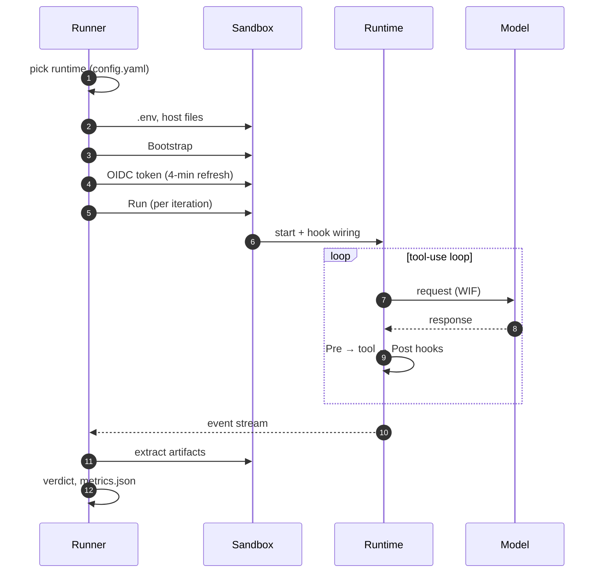
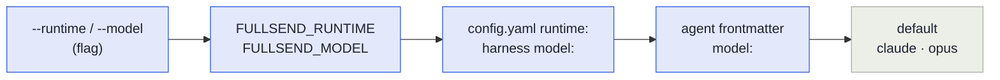
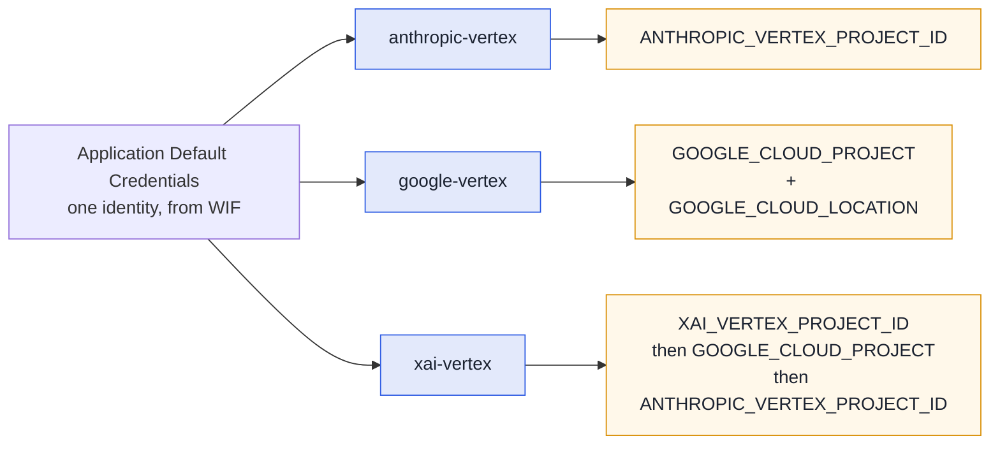

# Agent runtimes

A **runtime** is the agent program fullsend runs inside the sandbox — the thing that talks to the
model and executes tool calls. `fullsend run` delegates to it and owns everything around it: the
sandbox, the credentials, and the verdict.

| Runtime | Use it for | Status |
|---|---|---|
| **`claude`** | Production agent runs (Claude Code) | Default |
| **`pi`** | Second runtime, opt-in per org/repo — [more models, incl. Grok and Gemini](#models) | Supported for `triage`, `prioritize`, `code`, `fix` |
| `dummy` | Behaviour tests — scripted ops, no inference | Internal |
| `opencode` | Not yet functional | Stub |

Pick one with `runtime:` in `.fullsend/config.yaml`, or per run with `--runtime`.

```bash
fullsend run triage --runtime pi --model xai-vertex/xai/grok-4.6
```

## How a run uses the runtime

The runner owns the sandbox, credentials and verdict; the runtime owns what happens between "start"
and "event stream".



## Choosing between claude and pi

| | Claude Code | pi |
|---|---|---|
| Models | Anthropic on Vertex | Claude, **Grok** and **Gemini** on Vertex |
| Sub-agents | Native (`Agent` tool) | Not wired — agents execute sub-agent definitions inline ([#6527](https://github.com/fullsend-ai/fullsend/issues/6527)) |
| Fallback model chain | `FULLSEND_FALLBACK_MODELS`, tried in order | Ignored with a warning |
| Roles | All | `review`/`retro` stay on Claude Code — they rely on sub-agent rosters |
| Effort | `--effort low..max` | `--thinking`, same levels (`high` when unset) |
| Security controls | Full matrix | Full matrix; stricter on failed-call sanitizing |

Both run unattended in the same sandbox, on the same WIF credentials, behind the same egress
allowlist. Choose `pi` when you want a non-Anthropic model; stay on `claude` when you need
sub-agents or a fallback chain.

## Selecting a runtime and model

First non-empty wins — the usual **flag > env var > config > default**. `fullsend run` resolves this
once, validates it, prints the source, and records it in `metrics.json`; runtimes never read the
override variables themselves.



| Setting | Flag | Env | Config |
|---|---|---|---|
| Runtime | `--runtime` | `FULLSEND_RUNTIME` | `runtime:` in `.fullsend/config.yaml` |
| Model | `--model` | `FULLSEND_MODEL` (`FULLSEND_PI_MODEL` is a lower-precedence alias on pi) | harness `model:`, then agent frontmatter `model:` |
| Effort | `--effort` | `FULLSEND_EFFORT` | harness `effort:` |

In CI these are repository variables of the same name, plain or role-prefixed
(`TRIAGE_FULLSEND_MODEL`), so a repo can switch one role's model without a pull request. Harness
`env.runner` does **not** reach the `fullsend` process.

Set the runtime per repo with `fullsend github setup <owner/repo> --runtime pi`. Repos on pi need a
sandbox image that carries `PI_VERSION`.

## Models

On Claude Code, pass an alias (`opus`, `sonnet`, `haiku`, `fable`) or a model id.

On pi, a model is `provider/id`. Aliases and bare ids still work — `opus`/`sonnet`/`haiku` resolve
through fullsend's table, and a bare id gets the provider from `FULLSEND_PI_PROVIDER` (default
`anthropic-vertex`).

| Model | Spec | Provider |
|---|---|---|
| Claude | `anthropic-vertex/claude-opus-4-6` | vendored extension |
| Gemini | `google-vertex/gemini-3.7-flash` | pi built-in |
| Grok | `xai-vertex/xai/grok-4.6` | vendored extension |

> **Grok's spec has three segments on purpose.** pi sends the model id on the wire verbatim and
> Vertex wants the publisher-qualified `xai/grok-4.6`, so the id keeps its slash. Use the full
> `xai-vertex/xai/grok-4.6`; a bare `xai/grok-4.6` would otherwise reach pi's **built-in** `xai`
> provider, which talks to xAI's own API and wants `XAI_API_KEY`. fullsend normalises the short form
> and a bare id under `FULLSEND_PI_PROVIDER=xai-vertex`, case-insensitively, so both land on the
> canonical spec.

Because harness `model:` cannot contain `/` (`validModelName` is `^[a-zA-Z0-9_.@-]+$`), a harness
selects a pi provider with a bare `model:` plus `FULLSEND_PI_PROVIDER`.

### Each provider has its own GCP project

Every Vertex provider on pi resolves its **own** project variable, so one run can reach models that
live in different projects. That matters because Model Garden availability is per-project — Grok may
well be enabled somewhere other than Claude.



ADC supplies the identity for all three — only the *project* differs, so one credential covers them.
A pi run leaves an explicitly-set `XAI_VERTEX_PROJECT_ID` alone and only defaults it to the fleet's
Vertex project, so Grok can be pointed at a project where it is actually enabled.

**Endpoints and regions.** `anthropic-vertex` uses `CLOUD_ML_REGION` (then `GOOGLE_CLOUD_LOCATION`).
`xai-vertex` is fixed to the **global** endpoint — Vertex serves Grok only there, and regional
endpoints answer `FAILED_PRECONDITION` — so region variables are deliberately ignored for it.

## Running pi

Everything below is pi-specific; skip it if you are on Claude Code.

| | |
|---|---|
| Credentials | Same WIF `external_account` + refreshed OIDC token as Claude Code. `ANTHROPIC_*` unset on the Claude provider, `XAI_API_KEY` unset on the Grok one, so a stray key cannot shadow a Vertex provider |
| Unattended | No approval prompts, stdin closed, bounded retries; a missing credential exits 1 |
| Artifacts | `output.jsonl`, `transcripts/<agent>-<ts>_<id>.jsonl`, `metrics.json` with `runtime: pi`, plus `pi-debug.log` with `--debug` |
| Extra knobs | `FULLSEND_PI_PROVIDER` (prefix for bare ids), `FULLSEND_PI_BASH_ALLOWLIST=enforce` |
| Not supported | Sub-agents, fallback chains, `plugins:`, Bedrock/Azure providers |

**Running it locally?** See [Run a minimal agent on the pi
runtime](guides/user/running-agents-locally.md#run-a-minimal-agent-on-the-pi-runtime) — no fleet repo
required.

### Behaviour differences worth knowing

- **No permission system.** pi's posture is "run in a container". The sandbox, its egress policy and
  credential placeholders are the boundary ([ADR 0027](ADRs/0027-allowed-and-disallowed-tools-for-agents.md));
  fullsend's hook adapter is defense-in-depth on top.
- **Reads `AGENTS.md` natively** — no `CLAUDE.md` bridge is injected.
- **The agent body is appended** to pi's own system prompt rather than replacing it, so pi's default
  tool guidance stays. Claude Code's `--agent` replaces it.
- **`--tools` is enforced strictly**, unlike Claude Code. `Bash(a,b)` becomes a first-token allowlist
  that is advisory by default; `FULLSEND_PI_BASH_ALLOWLIST=enforce` makes it block.
- **Failed tool calls are sanitized too** — pi fires its post-tool event on failures, which Claude
  Code does not, so redaction and unicode normalization apply on both paths.
- **Fast release cadence** (~weekly minors, with wire-format changes inside a minor) — versions are
  pinned exactly and the stream-parser fixtures are tied to the pinned version.

### Not yet exercised

`runtime: pi` is selectable and has been run end to end, but no **fleet lifecycle** run on Vertex is
recorded yet. Pilot on a disposable org with `triage`/`prioritize` before `code`/`fix`. `review` and
`retro` are unsupported — they need sub-agents, and would run in a single context without per-persona
models. `extension_error` events are not mapped.

## Troubleshooting

**The model is not found, or the provider is missing.** A pi provider comes from an extension loaded
with `-e`, and a failed extension is dropped **silently** — it simply does not appear. Re-run with
`--debug` and read `pi-debug.log`, which captures pi's stderr including extension load errors.

**`No API key found for <provider>`.** The provider is registered but its credentials did not
resolve. For Vertex providers that means ADC — check the project variable for *that* provider in the
table above, not a shared one.

**403 `PERMISSION_DENIED` on a Vertex call.** The credentials work but the model is not enabled in
that project's Model Garden, or the provider resolved a different project than you expect.

**The model says it is a different model than you selected.** Do not trust the reply — a model
asked about itself will often repeat whatever the conversation history said. `metrics.json` records
the model that actually served the run, and the session JSONL under `transcripts/` records the
provider and model per message.

## Where the selection appears

| Surface | What it shows |
|---|---|
| Run plan block | `Runtime: <name> (from <source>)` next to Model and Effort |
| stderr | `runtime: selected "<name>" from <source>` |
| Status comment / `::notice::` | `Runtime · Model: <requested → reported> · Effort · Cost` |
| OTel span | `fullsend.runtime`, next to `gen_ai.request.model` |
| `metrics.json` | `runtime`, `requested_runtime`, `runtime_source`, `requested_model`, `override_source` |

`requested_model` is what was handed to the runtime after overrides, and `override_source` says where
it came from — so a silent override is visible after the fact. The reported model is the
provider-stripped id (`claude-opus-4-6`); for a provider whose ids are publisher-qualified it keeps
that segment (`xai/grok-4.6`), since that is the wire id.

## Harness config keys per runtime

Harness keys are runtime-neutral in YAML; each runtime owns the translation.

| Harness key | Claude Code | pi |
|---|---|---|
| `model` | `--model` | alias table, then `provider/id`; see [Models](#models) |
| `effort` | `--effort` | `--thinking` (superset of the harness levels; `high` when unset) |
| `tools:` | Native Claude permission syntax | `--tools` (strict) + a first-token Bash allowlist |
| `skills` | `CLAUDE_CONFIG_DIR/skills/` | `PI_CODING_AGENT_DIR/skills/`, discovered natively |
| `plugins` | Marketplace layout | Unsupported — warned and skipped |
| `security.sandbox_hooks` | `hooks.json` via `--settings` | Hook scripts + manifest + adapter extension |
| `validation_loop.feedback_mode` | Replaces the prompt on retry | Same |

Full per-key detail, including the exact `--tools` mapping and allowlist parsing rules, is in
[Implementing an agent runtime](contributing/runtime-implementation.md).

## Related docs

- [Implementing an agent runtime](contributing/runtime-implementation.md) — security matrix, interfaces, hook contract, sandbox layout
- [Running agents locally](guides/user/running-agents-locally.md) — step-by-step local runs
- [architecture.md](architecture.md) — where the runtime sits
- [problems/security-threat-model.md](problems/security-threat-model.md) — threat model and scanner paths
