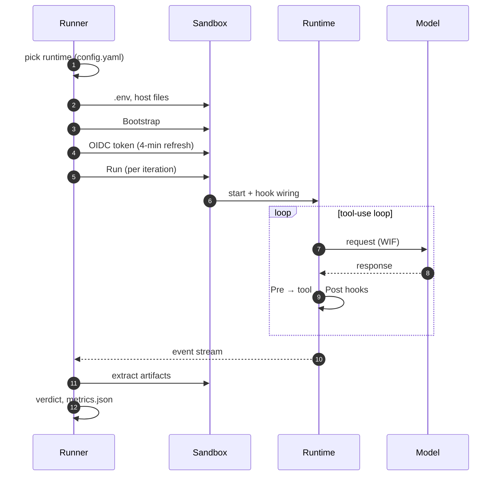
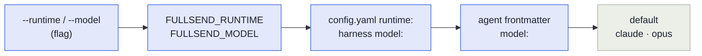

# Agent runtimes

A **runtime** is the agent program fullsend runs inside the sandbox — the thing that talks to the
model and executes tool calls. `fullsend run` delegates to it and owns everything around it: the
sandbox, the credentials, and the verdict.

| Runtime | Use it for | Status |
|---|---|---|
| **[`claude`](runtimes/claude.md)** | Production agent runs (Claude Code) | Default |
| **[`pi`](runtimes/pi.md)** | Second runtime, opt-in per org/repo — Claude, Grok and Gemini | Supported for `triage`, `prioritize`, `code`, `fix` |
| `dummy` | Behaviour tests — scripted ops, no inference | Internal |
| `opencode` | Not yet functional | Stub |

Pick one with `runtime:` in `.fullsend/config.yaml`, or per run with `--runtime`.

```bash
fullsend run triage --runtime pi --model xai-vertex/xai/grok-4.6
```

## How a run uses the runtime

The runner owns the sandbox, credentials and verdict; the runtime owns what happens between "start"
and "event stream".



## Choosing between claude and pi

| | Claude Code | pi |
|---|---|---|
| Models | Anthropic on Vertex | Claude, **Grok** and **Gemini** on Vertex |
| Sub-agents | Native (`Agent` tool) | Not wired — agents execute sub-agent definitions inline ([#6527](https://github.com/fullsend-ai/fullsend/issues/6527)) |
| Fallback model chain | `FULLSEND_FALLBACK_MODELS`, tried in order | Ignored with a warning |
| Roles | All | `review`/`retro` stay on Claude Code — they rely on sub-agent rosters |
| Effort | `--effort low..max` | `--thinking`, same levels (`high` when unset) |
| Security controls | Full matrix | Full matrix; stricter on failed-call sanitizing |

Both run unattended in the same sandbox, on the same WIF credentials, behind the same egress
allowlist. Choose `pi` when you want a non-Anthropic model; stay on `claude` when you need
sub-agents or a fallback chain.

## Selecting a runtime and model

First non-empty wins — the usual **flag > env var > config > default**. `fullsend run` resolves this
once, validates it, prints the source, and records it in `metrics.json`; runtimes never read the
override variables themselves.



| Setting | Flag | Env | Config |
|---|---|---|---|
| Runtime | `--runtime` | `FULLSEND_RUNTIME` | `runtime:` in `.fullsend/config.yaml` |
| Model | `--model` | `FULLSEND_MODEL` (`FULLSEND_PI_MODEL` is a lower-precedence alias on pi) | harness `model:`, then agent frontmatter `model:` |
| Effort | `--effort` | `FULLSEND_EFFORT` | harness `effort:` |

In CI these are repository variables of the same name, plain or role-prefixed
(`TRIAGE_FULLSEND_MODEL`), so a repo can switch one role's model without a pull request. Harness
`env.runner` does **not** reach the `fullsend` process.

Set the runtime per repo with `fullsend github setup <owner/repo> --runtime pi`. Repos on pi need a
sandbox image that carries `PI_VERSION`.

## Models

On Claude Code, pass an alias (`opus`, `sonnet`, `haiku`, `fable`) or a model id.

On pi, a model is `provider/id` — aliases and bare ids still work, and the provider comes from
`FULLSEND_PI_PROVIDER` (default `anthropic-vertex`). pi reaches Claude, Gemini **and** Grok, each
through its own provider; see [Running pi › Models and providers](runtimes/pi.md#models-and-providers).

Because harness `model:` cannot contain `/` (`validModelName` is `^[a-zA-Z0-9_.@-]+$`), a harness
selects a pi provider with a bare `model:` plus `FULLSEND_PI_PROVIDER`.

## Where the selection appears

| Surface | What it shows |
|---|---|
| Run plan block | `Runtime: <name> (from <source>)` next to Model and Effort |
| stderr | `runtime: selected "<name>" from <source>` |
| Status comment / `::notice::` | `Runtime · Model: <requested → reported> · Effort · Cost` |
| OTel span | `fullsend.runtime`, next to `gen_ai.request.model` |
| `metrics.json` | `runtime`, `requested_runtime`, `runtime_source`, `requested_model`, `override_source` |

`requested_model` is what was handed to the runtime after overrides, and `override_source` says where
it came from — so a silent override is visible after the fact. The reported model is the
provider-stripped id (`claude-opus-4-6`); for a provider whose ids are publisher-qualified it keeps
that segment (`xai/grok-4.6`), since that is the wire id.

## Harness config keys per runtime

Harness keys are runtime-neutral in YAML; each runtime owns the translation.

| Harness key | Claude Code | pi |
|---|---|---|
| `model` | `--model` | alias table, then `provider/id`; see [Models](#models) |
| `effort` | `--effort` | `--thinking` (superset of the harness levels; `high` when unset) |
| `tools:` | Native Claude permission syntax | `--tools` (strict) + a first-token Bash allowlist |
| `skills` | `CLAUDE_CONFIG_DIR/skills/` | `PI_CODING_AGENT_DIR/skills/`, discovered natively |
| `plugins` | Marketplace layout | Unsupported — warned and skipped |
| `security.sandbox_hooks` | `hooks.json` via `--settings` | Hook scripts + manifest + adapter extension |
| `validation_loop.feedback_mode` | Replaces the prompt on retry | Same |

Full per-key detail, including the exact `--tools` mapping and allowlist parsing rules, is in
[Implementing an agent runtime](contributing/runtime-implementation.md).

## Related docs

- [Running Claude Code](runtimes/claude.md) — models, fallback chains, behaviour notes
- [Running pi](runtimes/pi.md) — models and providers, behaviour differences, troubleshooting
- [Implementing an agent runtime](contributing/runtime-implementation.md) — security matrix, interfaces, hook contract, sandbox layout
- [Running agents locally](guides/user/running-agents-locally.md) — step-by-step local runs
- [architecture.md](architecture.md) — where the runtime sits
