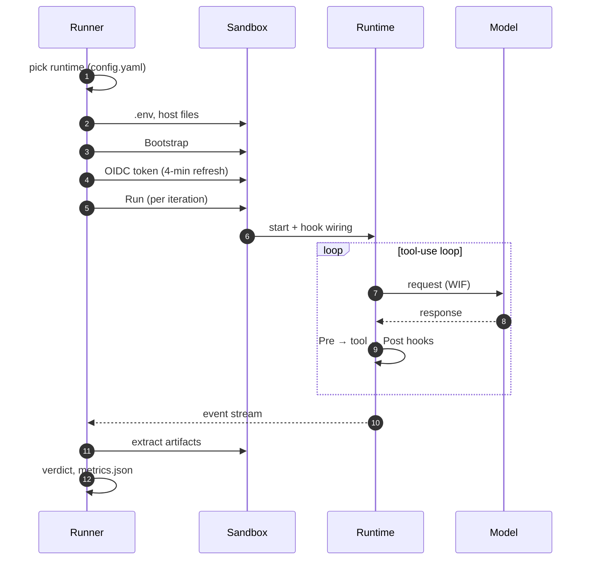
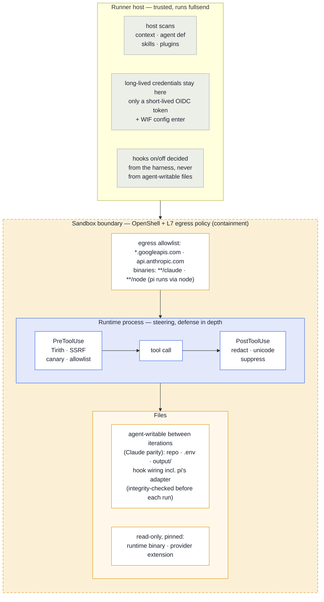
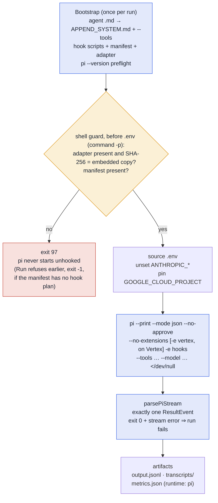

# Agent runtimes

Fullsend's `fullsend run` command delegates in-sandbox agent execution to a pluggable **runtime**. Recognized values in org `config.yaml` `defaults.runtime` (and per-repo `runtime`) are **`claude`** (production default), **`pi`** (opt-in, #6464) and **`dummy`** (behaviour tests only). Select it per repo with `fullsend github setup <owner/repo> --runtime pi` or by setting `runtime: pi` in the repo's `.fullsend/config.yaml` (org-level: `defaults.runtime: pi`; `fullsend admin install --runtime` also accepts it for org installs) — no per-repo workflow change is needed, but the harness `image:` must be a sandbox build that includes `PI_VERSION` (the digest pinned in fullsend-ai/agents `harness/*.yaml` has to be bumped to such a build first; an older image has no `pi` binary and the run fails at the preflight). The runner resolves the backend via `runtime.ResolveFromConfig()` after loading the org config and prints `runtime: selected "<name>" from <source>` at the start of every run.

## How a run uses the runtime

Every runtime is driven the same way. The runner owns the sandbox, credentials and verdict; the runtime owns what happens between "start" and "event stream". Where pi and Claude Code differ is noted inline.



When adding a runtime, fill in the security matrix below and register it in `runtime.Resolve()`.

## Registered runtimes

| Runtime | Purpose | Inference |
|---------|---------|-----------|
| `claude` | Production agent runs via Claude Code | Required |
| `opencode` | OpenCode agent runs (stub — not yet functional; resolved by `runtime.Resolve()` but not in `ValidRuntimes()` until implemented) | Required |
| `pi` | Pi agent runs ([earendil-works/pi](https://github.com/earendil-works/pi), `pi --print --mode json` on Claude-on-Vertex; opt-in per org/repo, see [Pi-specific known constraints](#pi-specific-known-constraints-6464) for what is not yet exercised, #6464) | Required |
| `dummy` | Behaviour tests — scripted ops in real sandbox | None |

## Security feature matrix

The sandbox is the containment boundary; everything a runtime does with hooks and tool restrictions is steering inside it ([ADR 0027](ADRs/0027-allowed-and-disallowed-tools-for-agents.md)). Read the matrix with that picture in mind:



| Feature | Where it runs | Claude Code | OpenCode (stub) | Pi | Notes for future runtimes |
|---------|---------------|-------------|-----------------|-----------|---------------------------|
| **Host-side context injection scan** (DeBERTa / LLM Guard, unicode, SSRF patterns on repo context files) | Host + sandbox `scan context` | ✓ | N/A — stub | ✓ (runner-level, runtime-agnostic) | Requires sandbox image with ML models; harness `security.host_scanners` |
| **Host-side runtime content scan** (agent def, SKILL.md, plugin JSON before upload) | Host (`scanRuntimeContent`) | ✓ | N/A — stub | ✓ (runner-level, runtime-agnostic) | Uses `security.InputPipeline()`; not part of `Runtime` interface — runner responsibility |
| **Tirith** (Bash command scanning) | Sandbox PreToolUse hook | ✓ (loaded via `--settings`, #6358) | N/A — stub | ✓ via `fullsend-hooks.js` (pi `tool_call` → `HookPlan` PreToolUse scripts) | `tirith_check.py`; harness `security.sandbox_hooks.tirith`; fails open on missing binary/timeout unless `TIRITH_REQUIRED=1` |
| **SSRF pre-tool** | Sandbox PreToolUse hook | ✓ (`hooks-loaded.feature` runs under the dummy runtime, which installs no hooks — it guards the sandbox egress boundary; the hook itself is unit-tested) | N/A — stub | ✓ via `fullsend-hooks.js` (pi `tool_call` → `HookPlan` PreToolUse scripts) | `ssrf_pretool.py`; default on |
| **Canary token detection** | Sandbox Pre/PostToolUse hooks | pre ✓; post-tool via `posttool_chain.py` on successful tool calls (`tool_response` / `updatedToolOutput`, #6357); failed calls: the same driver on `PostToolUseFailure` (detect + halt, the error text cannot be rewritten) | N/A — stub | ✓ pre via `fullsend-hooks.js` `tool_call`; post via `tool_result` (sequential chain, block withholds the result) | `canary_pretool.py` / `canary_posttool.py`; both inert unless `FULLSEND_CANARY_TOKEN` is set. Post-tool canary is an in-process chain stage so it cannot race sanitizer rewrites. Claude Code `decision:block` does not hide PostToolUse output, so the chain also redacts the token in `updatedToolOutput`. |
| **Secret redaction** | Sandbox PostToolUse hook | ✓ via `posttool_chain.py` on successful tool calls (#6357); failed calls carry error text only, which Claude Code does not let a hook rewrite | N/A — stub | ✓ via `fullsend-hooks.js` `tool_result` → the same `posttool_chain.py` (sent `tool_response` + `tool_result`; `updatedToolOutput` applied to the result the model sees) | `secret_redact_posttool.py` |
| **Unicode normalization** | Sandbox PostToolUse hook | ✓ via `posttool_chain.py` on successful tool calls (#6357); failed calls carry error text only, which Claude Code does not let a hook rewrite | N/A — stub | ✓ via `fullsend-hooks.js` `tool_result` → the same `posttool_chain.py` (sent `tool_response` + `tool_result`; `updatedToolOutput` applied to the result the model sees) | `unicode_posttool.py` |
| **Context suppression** | Sandbox PostToolUse hook | ✓ via `posttool_chain.py` on successful tool calls (#6357); failed calls carry error text only, which Claude Code does not let a hook rewrite | N/A — stub | ✓ via `fullsend-hooks.js` `tool_result` → the same `posttool_chain.py` (sent `tool_response` + `tool_result`; `updatedToolOutput` applied to the result the model sees) | `context_suppress_posttool.py` |
| **Tool allowlist** | Sandbox PreToolUse hook | opt-in; ✓ when enabled | N/A — stub | ✓ `tool_allowlist_pretool.py` via `tool_call` (names translated to Claude vocabulary first, #608) plus pi's native `--tools` from the agent `tools:` and the `Bash(a,b)` first-token allowlist enforced in the extension | `tool_allowlist_pretool.py`; requires `FULLSEND_TOOL_ALLOWLIST` (fail-closed when unset) |
| **Prompt injection (DeBERTa)** | Host Path A + sandbox Path B | ✓ | N/A — stub | ✓ (runner-level Path A; Path B via `scan context`, runtime-agnostic) | Same scanner stack as context files when enabled in harness |
| **Sandbox tool hooks wiring** | `SandboxHooksBootstrap` type assert in `Bootstrap` | ✓ scripts at `claude-config/hooks/`, wiring at `claude-config/hooks.json` via `--settings` (#6358) | ✗ — `Bootstrap` is a stub; must wire `security.HookPlan` via OpenCode plugin hooks | ✓ `Bootstrap` installs `security.HookFiles` under `/sandbox/pi-config/hooks/`, writes the `HookPlan` into `fullsend-manifest.json` and loads the embedded `fullsend-hooks.js` extension with `-e` under `--no-extensions` (per pi v0.84.2 `docs/extensions.md`); a script that cannot be spawned blocks (fail closed); whether the adapter is loaded is decided from the runner's own security signal, never from the agent-writable manifest, `Run` refuses to start pi (exit -1) when security is enabled but the manifest carries no hook plan, and the run command fails closed (exit 97) if the adapter or manifest file is missing or the adapter's SHA-256 differs from the embedded copy (checked before `.env` is sourced, with `command -p`) — pi silently skips a missing `-e` path — while an adapter loaded with a manifest lacking a hook plan blocks every tool call) | Hook scripts and wiring plan are runtime-neutral (see [Sandbox hook contract](#sandbox-hook-contract)); a runtime that ignores `SandboxHooksBootstrap` installs **no** sandbox tool hooks — say so explicitly here |
| **Transcript / debug artifacts** | `TranscriptHandler` (+ optional `DebugLogNamer`) | ✓ (stream-json, `claude-debug.log`) | No-op — see #1935 | ✓ session JSONL under `PI_CODING_AGENT_SESSION_DIR` (`ExtractTranscripts`), `pi-debug.log` (`DebugLogNamer`; pi's stderr when `--debug` is set), `ParseTranscriptFile` judges the tee'd `--mode json` stream and session files | Format-specific; not shared across runtimes. Debug-log filename defaults to `agent-debug.log` unless the runtime implements `DebugLogNamer` |

### Fail modes

Harness `security.fail_mode` controls whether critical findings **block** the run (`closed`, default) or **warn** and continue (`open`). This applies to host scans, sandbox `scan context`, and host-side runtime content scan alike.

### Runtime interface contract

| Interface | Responsibility |
|-----------|----------------|
| `runtime.Runtime` | Name, config dir, env exports, bootstrap, run loop, per-iteration artifact cleanup |
| `runtime.BootstrapInput` | Portable agent name/path, skill dirs, and plugin dirs to upload |
| `runtime.SandboxHooksBootstrap` | Optional `BootstrapInput` extension — runtime-neutral sandbox tool hook config (`security.SandboxHookConfig`); every runtime should honour it |
| `runtime.TranscriptHandler` | Extract transcripts/debug logs; parse errors for CI annotations |
| `runtime.DebugLogNamer` | Optional — names the per-iteration debug-log artifact (default `agent-debug.log`) |
| `runtime.ContextBridger` | Optional — runtime auto-loads only `CLAUDE.md`, so the runner injects a `CLAUDE.md`→`AGENTS.md` pointer (Claude Code: yes; runtimes that read `AGENTS.md` natively: omit) |

A runtime whose `Bootstrap` does not type-assert `SandboxHooksBootstrap` will **not** install Tirith, SSRF, canary, or the other hook scripts. The primary security boundary is the OpenShell sandbox, its L7 egress policy, and credential placeholders (ADR 0017, ADR 0025); the hooks are defense-in-depth that every runtime should wire rather than silently drop ([ADR 0090](ADRs/0090-runtime-neutral-sandbox-hooks-contract.md)). Fill in the matrix column above either way.

### Sandbox hook contract

**Contract version: v2** — PostToolUse scripts consume Claude Code's `tool_response` (falling back to `tool_result` for adapters/tests) and replace output via `hookSpecificOutput.updatedToolOutput`. v1 (`tool_result` in/out only) was inert under Claude Code (#6357).

The hook scripts in `internal/security/hooks/*.py` are plain programs with no Claude Code dependency; Claude Code invokes them through `settings.json`. Any runtime can call them from its own tool-call interception point (OpenCode `tool.execute.before/after`, pi TypeScript extension API `tool_call`/`tool_result` with `{block: true, reason}` structured denial, Cursor hooks, …).

- **Files:** `security.HookFiles(cfg)` returns `filename → script bytes` for the enabled hooks; `runtime.installHookScripts(sandbox, dir, cfg)` creates `dir` in the sandbox and uploads them there (executable) — any directory works. Claude uses `/sandbox/claude-config/hooks/` (`security.SandboxHooksDir`), with the wiring at `/sandbox/claude-config/hooks.json` (`security.SandboxHooksSettings`) loaded via `--settings`.
- **Wiring:** `security.HookPlan(cfg)` returns ordered `HookGroup{Phase, Tools, Scripts}` entries. `Phase` is `PreToolUse`, `PostToolUse` or `PostToolUseFailure` (the last carries Claude Code's failed-call payload — `hook_event_name`, `tool_name`, `tool_input`, a string `error` — and allows no output rewrite, so the chain runs canary detection only there; adapters whose post-tool event already fires for failed calls, like pi, map it onto nothing); `Tools` are Claude Code tool names (`Bash`, `Read`, `WebFetch`, `*` = all) — runtimes with other names translate before matching (see #608). PostToolUse is a **single** `posttool_chain.py` script on `*` that applies unicode → canary → suppress → redact in-process. Unicode normalization runs first because every later content decision is made on its output: an attacker who splits a canary or a secret with zero-width or fullwidth characters must not evade detection and then have the chain reassemble the clean value (Claude Code runs matching hooks in parallel and does not merge two `updatedToolOutput` rewrites). Individual sanitizer files and `canary_posttool.py` are shipped as libraries the driver imports; adapters should invoke the chain, not the stages. `GenerateHooksConfig` is rendered from `HookPlan`, so the two cannot diverge.
- **Wire protocol (per script):** JSON on stdin — `{"tool_name": ..., "tool_input": {...}}` for PreToolUse. PostToolUse payloads include the tool output as `tool_response` (Claude Code; string or structured object such as Bash `{stdout, stderr, interrupted, isImage}`) with `tool_result` accepted as a fallback. Exit `0` = allow. *Blocking* scripts (all PreToolUse scripts, standalone `canary_posttool.py`, and `posttool_chain.py` when its canary stage fires) exit `1` and print `{"decision":"block","reason":"..."}` on stdout; the adapter must stop the tool call (or, post-tool, drop the result) and surface the reason. *Sanitizing* stages (suppress/unicode/redact) always exit `0` and, when they changed something, print `{"hookSpecificOutput":{"hookEventName":"PostToolUse","updatedToolOutput": <same shape as the input value>}, "tool_result": <scan text>}`. Empty stdout = unchanged. `updatedToolOutput` must match the tool's output shape — a bare string is ignored for built-in Claude Code tools. `scan_text` flattens every string field (including `stderr`), newline-joined so a needle cannot match across a field boundary (such a match would be unredactable, since the redactors rewrite each field independently); `apply_text` writes a replacement into the first text slot and blanks the rest, or leaves unrecognized structured shapes unchanged. Unicode normalization skips identifier fields (`hook_io.IDENTIFIER_KEYS`: paths, URLs, commands, exact-match edit strings) — NFKC would hand Claude a path that does not exist on disk; secret redaction still walks them, since it only replaces matched patterns.
- **Sanitizer scope (what is rewritten, and what is not):** the PostToolUse stages exist to remove *controls-relevant* content and nothing else, because an agent edits against what it reads — a rewritten `Read` result means `Edit.old_string` no longer matches the file, and a `Write` of what it saw persists the rewrite. *Secret redaction* masks credential-shaped values only: the prefix patterns (`ghp_…`, `sk-…`, `AKIA…`, bearer headers, private-key blocks, database URLs) plus env/JSON shapes that need both a secret-bearing name (`…_TOKEN`, `api_key`, `accessToken`, not `TOKEN_URL`/`KEY_ID`/`publicKey`) and a value that is not an identifier, member path (`request.headers.authorization`), URL, path, placeholder or word phrase (`test-secret`, `ghs_policy_token`); a source-style `name = expr` counts only when the value is a quoted literal. A sweep of 900 fullsend files through the chain rewrites only test files holding token-shaped fakes. *Context suppression* condenses the output of exactly one verification command (`go test`, `pytest`, `npm test`, `make test`, `pre-commit run`, `gitleaks detect`, `scan-secrets`) with optional setup prefixes (`cd`, `export`, `source`), and only from positive evidence the tool printed (`ok <pkg>`, `N passed`, `<hook>…Passed`, `no leaks`) — silence is never condensed into "passed", because a hook whose interpreter is missing is silent too and Claude Code's Bash result carries no exit code (so linters and `go vet`/`go build`, whose clean run prints nothing, are never condensed); the command must *start* with the tool (after `VAR=…`/`uvx`/`npx` prefixes) — a command that merely mentions it, such as `grep -n scan-secrets hooks.py`, keeps its output; pipelines (`| tail` can cut the `FAIL` line; a `|` inside quotes such as `-run 'A|B'` is not a pipeline), `$(…)`, chains of two tools (`pytest; go test`, and deliberately also `go test && go vet` — one summary cannot speak for two), a trailing `echo $?`, and any output carrying a failure marker (`FAIL`, `panic:`, `Traceback`, `3 failed`) pass through untouched; comment lines and backslash continuations are tolerated. *Unicode* strips invisible, bidi, tag, NUL and ANSI/OSC characters and runs of variation selectors, but keeps compatibility characters (fullwidth, ligatures, CJK punctuation) and single emoji/CJK selectors — NFKC is applied to a *detection copy* (canary, secret patterns); a field is emitted normalized only when the normalized copy reveals an escape sequence or a secret the original hid. Every rewrite attaches `hookSpecificOutput.additionalContext` so the agent knows the output was changed and why, and every hook entry carries `timeout: 30` (Claude Code's 600 s default fails open — so does the 30 s one, for PreToolUse blockers included; the scripts finish in milliseconds and `tirith_check.py` bounds its own scan at 5 s, so the budget is headroom, not a ceiling the scripts approach).
- **Fail modes:** blocking scripts fail **closed** on malformed JSON or oversized input (> 10 × 1024 × 1024 characters, read from text-mode stdin) — they block. Empty/whitespace-only stdin is treated as "no tool call" and allowed by every script; a payload without `tool_name` blocks only in the allowlist hook. `tirith_check.py` fails **open** when the `tirith` binary is missing, times out or errors, unless `TIRITH_REQUIRED=1` (which `appendHookEnv` writes when Tirith is enabled — adapters must make sure it reaches the script). Sanitizing scripts and each `posttool_chain.py` sanitizer stage fail **open** — malformed input or a stage exception is passed through unchanged (exit 0; the unicode hook logs an `input_truncated` finding), and a stage failure is recorded in `findings.jsonl` as `<stage>_stage_error`. Adapters must not treat a sanitizer's empty stdout as an error. The **canary stage fails closed**: a scan that raises is treated as a hit, a hit whose redaction cannot be verified clean withholds the output entirely rather than emitting it, and `exit 1` is unconditional. Because `posttool_chain.py` is the only PostToolUse entry point Claude Code schedules, input the driver cannot read — malformed JSON, or more than the 10 MB limit — also blocks (`exit 1`, `continue: false`) whenever `FULLSEND_CANARY_TOKEN` is set, instead of skipping detection; with no canary token configured it stays fail-open. Detection and redaction share one case-insensitive matcher (`hook_io.canary_pattern`), so a token that is detected is always one that can be redacted.
- **Environment:** `runtime.appendHookEnv` writes `TIRITH_FAIL_ON` / `TIRITH_REQUIRED` into `/sandbox/workspace/.env`; the runtime must launch the scripts with that file sourced (Claude's run command does). Scripts also read `FULLSEND_TRACE_ID`, `FULLSEND_TOOL_ALLOWLIST` (allowlist hook, fail-closed when unset) and `FULLSEND_CANARY_TOKEN` (both canary hooks are no-ops when it is empty; supply it via harness `env.sandbox`/`host_files`), and write findings to `/sandbox/workspace/.security/findings.jsonl`.
- **Claude Code caveats (#6358, #6357):** (1) *Loading* — fixed by #6358: the hook wiring is written to the runner-owned `/sandbox/claude-config/hooks.json` and passed explicitly via `--settings`, so it loads regardless of the CLI's working directory (previously it sat unread in `/sandbox/workspace/.claude/`); the `hooks-loaded.feature` behaviour scenario guards the "silently not loaded" regression class. Note Claude Code still auto-loads a target repo's own `<repo>/.claude/settings.json` hooks from `<cwd>` — a separate exposure to assess. (2) *Payload (fixed in #6357, contract v2)* — scripts read `tool_response` (fallback `tool_result`) and replace output via `hookSpecificOutput.updatedToolOutput` with the original shape preserved. Sanitizer order and canary detection share `posttool_chain.py` so two PostToolUse hooks cannot race. `scan_text` inspects every string field (including `stderr`). (3) *Failed tool calls* — Claude Code fires `PostToolUse` only when a tool **succeeds**; a failed call (non-zero-exit Bash included) fires `PostToolUseFailure`, which delivers the error text but supports no output rewrite. `HookPlan` wires the same `posttool_chain.py` there, where it runs canary detection only, over every string in the payload rather than one named key (the documented field is `error`; doc versions differ), halting via `continue: false` (the only decision control the event honours), also on a detection copy that is NFKC-normalized with combining marks and variation selectors removed; suppression, unicode normalization and redaction cannot apply to a failed call under Claude Code — pi sanitizes those too, because its `tool_result` event fires for failures. `interrupted` on a Bash `tool_response` marks a cancelled tool, not an exit code — the `Exit code` prefix check in `looks_failed` therefore serves the v1 adapter path only. (4) *Blocking* — Claude Code keys on the stdout JSON on any exit code (`decision:"block"` is deprecated for PreToolUse but still maps to `deny`) and treats a bare exit `1` as non-blocking (exit `2` is its own blocking code); a local control run confirmed the scripts' "exit 1 + `{"decision":"block"}`" convention does block once the settings are loaded. For PostToolUse, `decision:"block"` **only appends `reason` next to the tool result — Claude still sees the original output**. `canary_posttool.py` therefore also emits `updatedToolOutput` with the token redacted to `[CANARY_REDACTED]`, and sets the universal `continue: false` field — the documented control that actually halts the session — so a leak still terminates the run. Net: after #6358 and #6357, both PreToolUse and PostToolUse halves of the contract are effective under Claude Code.

### Runtime-specific config key support

Harness keys are runtime-neutral in the YAML but each runtime owns their translation. Claude Code passes them through unchanged; other runtimes must document their mapping here (this is also an acceptance criterion in #6319).

| Harness key | Claude Code | OpenCode (stub) | Pi | Dummy | Notes for new runtimes |
|-------------|-------------|-----------------|-----------|-------|------------------------|
| `model` | `--model` (identity; aliases like `opus` resolved by the CLI) | — | alias table `opus\|sonnet\|haiku` → pi 0.84.2 catalog ids (`claude-opus-4-6`, `claude-sonnet-4-6`, `claude-haiku-4-5`), bare ids get the provider prefix (`anthropic-vertex` by default), `provider/id` passes through; overrides: `FULLSEND_PI_PROVIDER`, `FULLSEND_PI_MODEL` (runner env); harness `model:` wins over the agent frontmatter `model:`; see [Pi-specific known constraints](#pi-specific-known-constraints-6464) | ignored | `validModelName` is `^[a-zA-Z0-9_.@-]+$` — no `/`. Runtimes with `provider/model` ids need an alias table or a follow-up regex change |
| `effort` | `--effort` (`low\|medium\|high\|xhigh\|max`, #6218) | — | `--thinking <effort>` (pi levels `off\|minimal\|low\|medium\|high\|xhigh\|max` ⊇ harness levels); unset or unknown → `--thinking high`, matching Claude Code's default effort on Vertex/API-key (pi's own default is `medium`, so the fleet agents — which set no `effort:` — would otherwise reason lower on pi); pi maps the level onto Anthropic adaptive effort and clamps it for models without reasoning | ignored | Map to the runtime's reasoning knob or reject with a clear error |
| `plugins` | Claude plugin marketplace layout (`bootstrapPlugins`) | — | unsupported — `Bootstrap` warns and skips each plugin (pi uses TypeScript extensions, not plugins) | ignored | Claude-specific format; warn and skip if unsupported |
| Agent frontmatter `tools:` (`Bash(gh,jq)` syntax, ADR 0027) | Native Claude permission syntax | — | `Bash/Read/Write/Edit/Grep/Glob/LS` → `--tools bash,read,write,edit,grep,find,ls` (strict pi allowlist); `Skill` maps to no tool but adds `read` (pi's skills are prompt-driven — the system prompt tells the model to read `SKILL.md`, and that section is only emitted when `read` is active; `read` is also added whenever the harness ships skills); other names warn and drop; `Bash(a,b)` becomes a first-token allowlist checked by the `fullsend-hooks.js` extension on every simple command — advisory by default (logged), matching Claude Code where it is steering rather than enforcement (ADR 0027); `FULLSEND_PI_BASH_ALLOWLIST=enforce` in the runner environment makes it block. Enforce mode is a first-token check, not a shell parser: it splits on `;`, `\|`/`\|&`, `&&`, `\|\|`, newlines and a backgrounding `&` (fd redirections such as `2>&1` are not separators) and checks each side; it refuses command substitution, subshells/groups, paths to binaries (unless the path itself is allowlisted), every `VAR=value` prefix (loader variables like `PATH=`/`LD_*`, but also program-specific ones like `GH_PAGER=` that make an allowlisted program spawn a command) and `eval`/`exec`/`sh`/`bash`/`source`/`command`/`env`/`xargs` wrappers; heredoc body lines are judged as if they were commands (in practice refused); redirections (`> /dev/tcp/…`) and an allowlisted program's own exec features (`gh extension exec`, `git -c core.pager=…`, `find -exec`) are not checked — egress is the sandbox's and the SSRF hook's job | ignored | Enforce via `--tools`/allowlist plus a hook adapter; Claude tool names differ in case from most runtimes (#608) |
| `skills` | `CLAUDE_CONFIG_DIR/skills/` | — | uploaded to `PI_CODING_AGENT_DIR/skills/` (`rt.ConfigDir()+"/skills"`), discovered by pi natively | ignored | Agent Skills spec (`SKILL.md`) is portable; destination is `rt.ConfigDir() + "/skills"` (also used by the runtime fetch service) |
| `security.sandbox_hooks` | `SandboxHooksBootstrap` → hooks.json via `--settings` | ✗ (stub) | ✓ `SandboxHooksBootstrap` → hook scripts + `HookPlan` manifest + `fullsend-hooks.js` extension (ADR 0090) | ignored | See [Sandbox hook contract](#sandbox-hook-contract) |
| `--debug` (CLI flag) | `--debug-file`, artifact `claude-debug.log` | — | pi has no debug flag: `Run` appends its stderr to `/sandbox/workspace/pi-debug.log` (artifact `pi-debug.log` via `DebugLogNamer`) instead of the console — startup diagnostics (argument errors, extension load failures, the adapter's hook roster) move there too; the exit code still reaches the runner | no-op | Implement `DebugLogNamer` to name the artifact |

## Sandbox workspace layout

The sandbox has two key directories that map to Claude Code's config levels (plus a runner-owned config directory per additional runtime, e.g. `pi-config/` for pi):

```
/sandbox/
├── pi-config/                       ← PI_CODING_AGENT_DIR (pi runtime; written by PiRuntime.Bootstrap)
│   ├── APPEND_SYSTEM.md                Agent definition body (appended to pi's default system prompt)
│   ├── settings.json                   defaultProjectTrust: never, quietStartup, retry/compaction on
│   ├── skills/<name>/SKILL.md          Harness skills (pi's native skill discovery)
│   ├── hooks/*.py                      Security hook scripts (same files as claude-config/hooks/)
│   ├── fullsend-hooks.js               Hook adapter extension (loaded with -e; --no-extensions otherwise)
│   ├── fullsend-manifest.json          Agent tools/allowlist, HookPlan, pi version — read by Run and the extension
│   └── sessions/                       PI_CODING_AGENT_SESSION_DIR (session JSONL → transcripts)
│
├── claude-config/                   ← CLAUDE_CONFIG_DIR (personal level)
│   ├── agents/
│   │   └── <name>.md                   Agent definition (filename derived from the agent name)
│   ├── skills/
│   │   ├── code-review/SKILL.md        Built-in skills (personal level — wins on collision)
│   │   ├── pr-review/SKILL.md
│   │   └── ...
│   ├── plugins/
│   │   └── ...                         Plugin state (simplified; see bootstrapPlugins())
│   ├── hooks/                          Security hook scripts (PreToolUse, PostToolUse)
│   └── hooks.json                      Hook wiring (loaded via --settings in buildRunCommand)
│
└── workspace/                       ← SandboxWorkspace
    ├── .env                            Environment variables (sourced before claude)
    ├── .env.d/                         Additional env files (host_files expand)
    │
    └── <repo-name>/                 ← Claude Code's working directory (cd target)
        ├── CLAUDE.md                   Project instructions (repo's own or injected bridge)
        ├── AGENTS.md                   Project rules (repo's own or org default injected)
        ├── .claude/skills/             Repo skills (project level — shadowed on collision)
        │   └── custom-lint/SKILL.md
        └── src/...                     Target repo source code
```

## Agent rule layering

When `fullsend run` executes an agent, Claude Code loads instructions from
multiple sources. These compose — they occupy different layers, not competing
slots:

```
┌────────────────────────────────────────────────────────┐
│  Layer 1: Agent Definition (system prompt)             │
│  Source: /sandbox/claude-config/agents/<name>.md       │
│  Loaded via: --agent flag                              │
│  Controls: role, task, tools, disallowedTools, model,  │
│            built-in skills list                        │
│  Authority: highest — repo cannot modify               │
├────────────────────────────────────────────────────────┤
│  Layer 2: Project Instructions (advisory)              │
│  Source: /sandbox/workspace/<repo>/CLAUDE.md           │
│         /sandbox/workspace/<repo>/AGENTS.md            │
│  Loaded via: Claude Code auto-loads from working dir   │
│  Controls: conventions, architecture, domain context   │
│  Authority: advisory — cannot override layer 1         │
├────────────────────────────────────────────────────────┤
│  Layer 3: Skills                                       │
│  Personal: /sandbox/claude-config/skills/ (fullsend)   │
│  Project:  <repo>/.claude/skills/ (repo)               │
│  Precedence: personal > project (name collision →      │
│              fullsend wins, repo version shadowed)     │
│  Repo skills extend the agent; use config-driven       │
│  agent registration for org-level skill overrides      │
└────────────────────────────────────────────────────────┘
```

### AGENTS.md injection logic

`run.go` step 8a (`hasAgentsMD()` / `injectClaudeMDPointer()`):

1. If target repo has no AGENTS.md → inject org-level default from config repo,
   add to `.git/info/exclude`
2. If the runtime implements `ContextBridger` (Claude Code does), target
   repo has AGENTS.md but no CLAUDE.md → inject bridge CLAUDE.md pointing to
   AGENTS.md, add to `.git/info/exclude`
3. If target repo has both → use as-is

### Context file security scanning

`run.go` steps 8c and 9b:

Repo context files (CLAUDE.md, AGENTS.md, SKILL.md) are scanned in two
defense-in-depth passes before the agent starts:

1. **Host-side (Path A, step 8c):** `scanRepoContextFiles()` runs the
   `InputPipeline` (unicode normalizer, context injection scanner) on the
   host before files enter the sandbox.
2. **Sandbox-side (Path B, step 9b):** `buildScanContextCommand()` runs
   `fullsend scan context` inside the sandbox after all files are assembled.

Critical findings block the run in `fail_mode: closed`.

## Dummy runtime operations

The `dummy` runtime executes a YAML script of operations inside the real sandbox (behaviour tests only). Besides `write_fixture` and `fail`, dispatch behaviour tests use:

| Op | Args | Purpose |
|----|------|---------|
| `assert_env` | `VAR_NAME` | Assert env var is set and non-empty in the sandbox |
| `assert_file` | `path` | Assert file exists and is readable under the workspace |
| `assert_json` | `path,json_path` | Assert JSON file exists and dot-path field is present and non-null (uses `jq`) |

### Pi-specific known constraints (#6464)

#### At a glance

| | Status |
|---|---|
| Select per repo | `runtime: pi` in `.fullsend/config.yaml` (or `fullsend github setup <owner/repo> --runtime pi`); needs a sandbox image that includes `PI_VERSION` |
| Roles | `triage`, `prioritize`, then `code`/`fix`; `review` and `retro` stay on Claude Code (sub-agents) |
| Security | every fullsend control in the matrix below is at least as effective as under Claude Code (PostToolUse sanitizers run through the same `posttool_chain.py` on both), stricter on failed-call sanitizing, repo-owned config and hook-wiring integrity; pi itself has no permission system — the sandbox is the boundary (ADR 0027) |
| Credentials | same WIF `external_account` + refreshed OIDC token path; `ANTHROPIC_*` unset for the Vertex provider |
| Unattended | no approval prompts; missing credential exits 1; stdin closed; bounded retries |
| Artifacts | `output.jsonl`, `transcripts/<agent>-<timestamp>_<id>.jsonl`, `metrics.json` with `runtime: pi`, `pi-debug.log` with `--debug`; `analyze-transcript` reads them |
| Knobs | `FULLSEND_PI_MODEL`, `FULLSEND_PI_PROVIDER`, `FULLSEND_PI_BASH_ALLOWLIST=enforce` |
| Not yet | fleet lifecycle run on Vertex, sub-agents, Bedrock/Azure providers, `plugins:` |

One iteration, end to end — the amber decision is what makes "hooks enabled" enforceable, since pi silently skips a missing `-e` extension:



- **No permission system at all** — pi's stated posture is "run in a container". The OpenShell sandbox + L7 egress policy + credential placeholders (ADR 0017/0025) are the boundary, with the fullsend extension adapter as defense-in-depth (same posture as accepted for OpenCode in #1260 / ADR 0090).
- **`--mode json` exits 0 on model error** — only text mode maps `stopReason: error|aborted` to exit 1. `parsePiStream` is the intended detector (assistant `stopReason` on `message_end.message` / last `agent_end.messages` entry) for the runner's exit-0-override (#2786/#5361). `Run` tees the stream to `output.jsonl`, `ParseTranscriptFile` reads it, and `Run` itself returns 1 on a stream-reported error, so the override and the runtime agree.
- **No `--max-turns`/`--timeout`** — runner's exec timeout covers it; pi's `bash` tool has no default command timeout either (`core/tools/bash.ts`), so a runaway command is bounded only by the iteration timeout, as with Claude Code.
- **Runs unattended** (parity with `claude -p --dangerously-skip-permissions`, verified against pi v0.84.2 source and empirically on the pinned build) — pi has no tool-approval layer at all (nothing in `core/tools/*` or `core/bash-executor.ts` prompts); in `--print` mode extensions get a no-op UI context, so `ctx.ui.confirm/select/input/editor` resolve immediately (`modes/print-mode.ts`, `core/extensions/runner.ts`); `--no-approve` sets the project-trust override, so the trust-gated project resources — `.pi/{settings.json,extensions,skills,prompts,themes,SYSTEM.md,APPEND_SYSTEM.md}` and `.agents/skills` (`core/trust-manager.ts`); `AGENTS.md` itself is still read as context — are ignored without a dialog (`cli/args.ts`, `main.ts`), and `defaultProjectTrust: never` in the global settings covers the no-flag case (verified on the pinned build: a planted `.pi/extensions/evil.js` in the repo does not load under `--no-approve` and does under `--approve`); first-run setup, theme selection, telemetry consent and the version check are interactive-only code paths (`PI_TELEMETRY=0`, `PI_SKIP_VERSION_CHECK=1`/`PI_OFFLINE=1` set anyway); a missing credential raises `No API key found` and exits 1 — no `/login` prompt (`core/agent-session.ts`, `modes/print-mode.ts`); retries are bounded (`retry.maxRetries: 3`, 2/4/8 s) and compaction is automatic. The one blocker found: print mode reads a non-TTY stdin to EOF before the first prompt, even with a positional message (`main.ts` `readPipedStdin`), so an exec that keeps stdin open with no writer hangs pi — `Run` therefore appends `</dev/null` to the `pi` invocation; an idle upstream pipe then exits immediately (verified: open pipe without the redirect → killed by timeout; with it → proceeds).
- **No built-in MCP** — out of scope; fleet uses none.
- **Claude-on-Vertex via an interim extension** — pi's `google-vertex` provider is Gemini-only and the upstream `anthropic-vertex` provider is an open PR (earendil-works/pi#5262, still open as of 2026-08-22). The sandbox image vendors [`twoGiants/pi-anthropic-vertex`](https://github.com/twoGiants/pi-anthropic-vertex) v0.1.13 (commit `d3c9d10d`, MIT; reviewed — a ~300-line entry point plus ~220 lines mirrored from pi's `streamSimple` helpers; it registers provider `anthropic-vertex` and delegates streaming to pi's built-in Anthropic provider through an `AnthropicVertex` client) under `/opt/pi-extensions/anthropic-vertex`, pinned by tag + tarball SHA256 (`PI_ANTHROPIC_VERTEX_VERSION`/`_SHA256`). It is root-owned and outside `PI_CODING_AGENT_DIR`, so pi never auto-loads it; for the `anthropic-vertex` provider `Run` passes it with `-e` (`runtime.piVertexExtensionPath`; other providers get pi's built-ins only) and unsets `ANTHROPIC_API_KEY`/`ANTHROPIC_AUTH_TOKEN`/`ANTHROPIC_BASE_URL`/`ANTHROPIC_VERTEX_BASE_URL` after sourcing `.env` and pins `GOOGLE_CLOUD_PROJECT` to `ANTHROPIC_VERTEX_PROJECT_ID` when that is set, so pi targets the same project as Claude Code on Vertex. Project resolution order is `GOOGLE_CLOUD_PROJECT`, `GCLOUD_PROJECT`, `ANTHROPIC_VERTEX_PROJECT_ID`, `GOOGLE_CLOUD_PROJECT_ID` (the fleet env exports both the first and the third; the pin above keeps them equal so the extension's first-wins order cannot diverge from Claude Code); region is `CLOUD_ML_REGION`, then `GOOGLE_CLOUD_LOCATION`, default `us-east5`; auth is Google's `google-auth-library` reading `GOOGLE_APPLICATION_CREDENTIALS` — in CI that is the Workload Identity Federation `external_account` config the runner delivers via `host_files` (ADR 0025 tier 4), whose `credential_source.file` is the OIDC token at `/sandbox/workspace/.gcp-oidc-token` that the runner refreshes every 4 minutes; the library exchanges it at `sts.googleapis.com` for a short-lived access token (direct federated identity, no impersonation) — exactly the path Claude Code uses, under the same `*.googleapis.com` egress allowlist and `**/node` binary rule. The bundled Vertex client (`@anthropic-ai/vertex-sdk` 0.14.4 over `@anthropic-ai/sdk` 0.91.1) honours `ANTHROPIC_VERTEX_BASE_URL` as its endpoint and would send a stray `ANTHROPIC_API_KEY` to Google as `X-Api-Key`; `ANTHROPIC_AUTH_TOKEN` and `ANTHROPIC_BASE_URL` are overridden by the Google bearer and the explicit Vertex base URL, but pi's built-in `anthropic` provider reads `ANTHROPIC_AUTH_TOKEN` and the SDK would read `ANTHROPIC_BASE_URL` for any provider that leaves `baseURL` unset, so `Run` unsets all four for the `anthropic-vertex` provider (matched case-insensitively, as pi resolves provider prefixes) and keeps them for a direct `anthropic` provider, which needs the key. The `tool_call`/`tool_result` event shapes the hook adapter relies on (`toolName`, `input`, `content`, `isError`; `{block, reason}` and `{content, isError}` replies) are verified against pi v0.84.2 `src/extensions/types.ts`/`runner.ts`; the lifecycle run is the live confirmation. Known risks, to re-check on every `PI_VERSION` or extension bump: v0.1.13 was synced against pi 0.81.1 (upstream sync issue twoGiants/pi-anthropic-vertex#24 is open) and its mirrored option mapping can drift; the extension pins `@anthropic-ai/sdk` via `overrides` and that must match the SDK version in pi's `packages/ai/package.json` (both 0.91.1 today) because the Vertex client is cast to pi's Anthropic client type; and it copies pi's first-party Anthropic `compat` flags (strict tools, eager input streaming, adaptive thinking) onto the Vertex models — the Run PR must smoke an adaptive and a non-adaptive model against Vertex and, if Vertex rejects any of these, override them in `PI_CODING_AGENT_DIR/models.json` rather than patching the extension. Replace with the upstream provider once #5262 ships in a pinned release.
- **Binary present but unhooked** — the pinned `pi` CLI and the vendored Vertex extension ship in every sandbox image (so Bootstrap/Run work targets a reviewed version), so an agent on another runtime can invoke `pi -e /opt/pi-extensions/anthropic-vertex` ad hoc from Bash with none of that runtime's tool hooks — and in a Claude-on-Vertex sandbox the ADC credentials and project id it needs are already in the environment, so that is a working nested agent, not an inert binary. This is the same class of exposure as any interpreter the agent can run (`python`, `node`, `curl` with the same ADC token): the sandbox tool hooks are defense-in-depth and only see the top-level tool call (ADR 0090); the boundary remains the OpenShell sandbox, its L7 egress allowlist and the credential placeholders, which a nested `pi` cannot escape either. The image bakes `PI_OFFLINE=1`/`PI_TELEMETRY=0` and the runner-owned config paths as defaults; treat the `N/A — stub` matrix cells as "not wired", not "cannot run".
- **Fast release cadence** (~weekly minors; 0.84.0 changed `message_update` wire shape) — pin exact versions; `parsePiStream` fixtures are hand-authored to `packages/coding-agent/docs/json.md` (and `core/agent-session.ts` for the session-level events) for the pinned version; `internal/runtime/testdata/pi/regen.sh` re-records `basic_run.ndjson` from a live run.
- **Tool names are lowercase** (`bash`, `read`, `write`, `edit`) — the hook adapter translates to the contract's Claude-name vocabulary (#608).
- **Reads AGENTS.md natively** — no CLAUDE.md bridge needed (does not implement `ContextBridger`).
- **Hardening levers in use** — `Run` executes `pi --print --mode json --no-approve --no-extensions --no-prompt-templates --no-themes --session-dir /sandbox/pi-config/sessions [-e /opt/pi-extensions/anthropic-vertex] [-e /sandbox/pi-config/fullsend-hooks.js] [--tools …] --model <provider/id> [--thinking …] 'Run the agent task' </dev/null [2>>/sandbox/workspace/pi-debug.log]`; `settings.json` sets `defaultProjectTrust: never` (repo-owned `.pi/` never loaded); `PI_OFFLINE=1`/`PI_TELEMETRY=0`/`PI_SKIP_VERSION_CHECK=1` come from `EnvExports`. Context files (`AGENTS.md`) and skills stay on — they are the harness's own inputs. `PI_CODING_AGENT_DIR/extensions/` is arbitrary TypeScript loaded at startup and the config dir is not a permission boundary, which is why only the two explicit `-e` paths load.
- **Agent definition translation** — the Claude-style agent `.md` is parsed by `Bootstrap`: body → `APPEND_SYSTEM.md` (pi's default prompt and tool guidance are kept; `SYSTEM.md` would replace them — a deliberate difference from Claude Code, whose `--agent` makes the body *the* system prompt; the lifecycle run should confirm the fleet prompts tolerate pi's preamble, otherwise switch to `--system-prompt`), frontmatter `tools:` → `--tools` (pi enforces this strictly, Claude Code ≥ 2.1.119 enforces it unreliably) + an advisory Bash allowlist, `model:` → fallback for the harness `model:`, `description` → header line. `metrics.json`/`InitEvent` carry the bare model id (`claude-opus-4-6`), as for Claude Code; the provider is `gen_ai.system`'s job. Everything `Run` and the hook extension need is in `fullsend-manifest.json` because `Bootstrap` and `Run` are separate calls with no shared process state.
- **Hook adapter contract** — `fullsend-hooks.js` sends the scripts `{tool_name, tool_input, tool_result, tool_response}` with Claude tool names (`bash→Bash`, `read→Read`, `write→Write`, `edit→Edit`, `grep→Grep`, `find→Glob`, `ls→LS`; `path` mirrored to `file_path`) and reads back either the v1 `tool_result` or the v2 `hookSpecificOutput.updatedToolOutput` (#6357), so the same extension works before and after the PostToolUse chain lands. PreToolUse groups run in `HookPlan` order and stop at the first block; a script that cannot be spawned blocks; PostToolUse blocks withhold the result and mark it `isError`. An unreadable manifest, or one without a hook plan, blocks every tool call; because pi silently skips a missing `-e` path, `Run` checks — before sourcing the agent-writable `.env`, with `command -p sha256sum` / `command -p cut` so nothing in the shell environment can stand in for them — that the adapter exists and matches the embedded copy's SHA-256 and that the manifest exists, failing closed (exit 97) otherwise, refuses to start at all when security is enabled but the manifest carries no hook plan, and decides whether to load the adapter from the runner's security signal rather than the manifest. The manifest and the hook scripts themselves stay agent-writable between iterations — the same residue Claude Code has with `claude-config/hooks.json` and its scripts (both are written once at `Bootstrap`). Edit inputs keep pi's `edits[]` shape, with `path` mirrored to `file_path` and the first `oldText`/`newText` pair mirrored to `old_string`/`new_string`; no shipped script reads the latter. pi fires `tool_result` for failed calls too, so — unlike Claude Code's `PostToolUse` — errored tool output is sanitized as well.
- **Exit code** — `Run` returns 1 when pi exited 0 but the stream's single `ResultEvent` reports an error (model error, incomplete stream), so the runner's exit-0 override and this agree; `ParseTranscriptFile` gives the same verdict from the tee'd `output.jsonl`.
- **Not yet exercised** — `runtime: pi` is selectable, but no fleet lifecycle run on Vertex has been recorded yet: the Vertex model ids and the copied `compat` flags have not been exercised against Vertex (smoke an adaptive and a non-adaptive model first; override with `FULLSEND_PI_MODEL` if an id is rejected); parser fixtures are hand-authored to the v0.84.2 wire docs (re-record with `internal/runtime/testdata/pi/regen.sh` once a run exists); `extension_error` events are not mapped; the behaviour scenario `features/runtime/pi.feature` (a real haiku run on Vertex of a minimal tool-using agent, asserting `metrics.json` `runtime: pi`, a `toolCall` in the pi session transcript and token usage) is gated on `BEHAVIOUR_CAPABILITIES=runtime-pi` until `fullsend-sandbox:latest` carries `PI_VERSION`, and `features/triage/triage.feature` asserts the runtime selected from the repo config on every run. Pilot on a disposable org with `triage`/`prioritize` (no sub-agent assumptions) before `code`/`fix`; `review`/`retro` rely on Claude sub-agent rosters and are not supported: pi v0.84.2 has no sub-agent tool or `agents/*.md` concept in core — only the bundled example extension (`examples/extensions/subagent/`, spawns `pi -p --mode json` children without our hook adapter, Vertex provider, `--no-approve` or session dir) and the SDK route (`createAgentSession()` per child; parent extensions do not fire for children) — so a fullsend-owned sub-agent extension with the full child flag set is a follow-up tracked on #6464.
- **Other clouds** — pi ships native `amazon-bedrock` (SDK default credential chain, incl. `AWS_WEB_IDENTITY_TOKEN_FILE`) and `azure-openai-responses` (`api-key` only, no Entra ID) providers; neither is wired into `Run`'s alias table, credential hygiene or the runner's OIDC refresh yet, and the egress profile allows only Anthropic + Google hosts. Follow-up tracked against #6464.

## Related docs

- [cli-internals.md](guides/dev/cli-internals.md) — sandbox constants, key sandbox operations
- [architecture.md](architecture.md) — Agent Runtime layer
- [problems/security-threat-model.md](problems/security-threat-model.md) — threat model and scanner paths
- [problems/agent-architecture.md](problems/agent-architecture.md) — pluggable runtimes (#1260, #579, #70)
