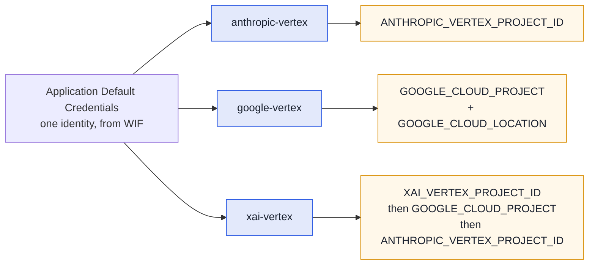

# Pi

[pi](https://github.com/earendil-works/pi) is fullsend's second agent runtime, opt-in per repo. It reaches models Claude Code cannot — **Grok** and **Gemini** alongside Claude — through the
same sandbox, credentials and egress policy.

```bash
fullsend run triage --runtime pi --model xai-vertex/xai/grok-4.6
```

Selecting it, and how it compares to Claude Code, is in [Agent runtimes](../runtimes.md). This page
is what changes once you are on it.

## Models and providers

A model on pi is `provider/id`. Aliases and bare ids still work — `opus`/`sonnet`/`haiku`/`fable`
resolve through fullsend's pinned alias table, and a bare id gets the provider from
`FULLSEND_PI_PROVIDER` (default `anthropic-vertex`).

| Model | Spec | Provider |
|---|---|---|
| Claude | `anthropic-vertex/claude-opus-4-6` | vendored extension |
| Gemini | `google-vertex/gemini-3.8-flash` | pi built-in |
| Grok | `xai-vertex/xai/grok-4.6` | vendored extension |
| GPT | `openai/gpt-5.6-luna` | pi built-in |

> **Grok's spec has three segments on purpose.** pi sends the model id on the wire verbatim and
> Vertex wants the publisher-qualified `xai/grok-4.6`, so the id keeps its slash. Use the full
> `xai-vertex/xai/grok-4.6`; a bare `xai/grok-4.6` would otherwise reach pi's **built-in** `xai`
> provider, which talks to xAI's own API and wants `XAI_API_KEY`. fullsend normalises the short form
> and a bare id under `FULLSEND_PI_PROVIDER=xai-vertex`, case-insensitively, so both land on the
> canonical spec.

> **GPT via OpenAI** needs no API key in CI: the runner exchanges the job's GitHub identity for a
> short-lived OpenAI token (give fullsend three identifiers with `fullsend github setup --openai-*`
> or repository variables — see [OpenAI Workload
> Identity](../guides/infrastructure/openai-workload-identity.md); GitHub Actions only) and keeps it
> in a provider that belongs to this run, refreshed before it expires and removed when the run
> ends. Locally, put `OPENAI_API_KEY` in an env file for the runner ([Running agents
> locally](../guides/user/running-agents-locally.md#get-an-openai-key-gpt-on-pi-or-codex)). Declare
> `providers: [openai]` on the harness; the sandbox can then reach `api.openai.com` for the
> Responses API and nothing else, and never sees the credential
> ([ADR 0092](../ADRs/0092-openai-wif-credential-delivery.md)). A custom harness must carry a
> `policy:` (the fleet's `policies/base.yaml`); without one the image's default policy leaves an
> uninspected route to `api.openai.com` and the run stops before the agent starts. **Exercised so
> far:** the local static-key path end to end on 2026-08-27 (OpenShell 0.0.115, pi 0.84.3,
> `gpt-5.6-luna`: placeholder in the sandbox, pi reading it from the runner-seeded `auth.json`, tool
> calls through the hook adapter, run-scoped provider deleted at the end, expired in place under
> `--keep-sandbox`), plus the placeholder-generation experiments recorded in the ADR. The WIF path
> has no live run yet; `features/runtime/pi-openai.feature` stays gated on `runtime-pi-openai`
> until an OpenAI organization is mapped to the pool repositories.

Harness `model:` and `agents:` entry `model:` values accept the `provider/id` form directly
(`xai-vertex/xai/grok-4.6`); a harness can also select a provider with a bare `model:` plus
`FULLSEND_PI_PROVIDER`.

### Per-repo alias overrides

fullsend pins what each alias means. Vertex enables models per project, so your project may be
able to run a newer one than the pin — point the alias at it in `.fullsend/config.yaml`:

```yaml
models:
  aliases:
    sonnet: claude-sonnet-5
```

- Only the aliases you set change; the rest keep the fleet default.
- Keys are `opus`, `sonnet`, `haiku`, `fable`. A value is a model id or `provider/id`;
  it cannot be another alias. **Cross-vendor overrides** (e.g., `sonnet: google-vertex/gemini-3.8-flash`)
  are deprecated and will become a validation error in a future release — use
  `agents[].subagents` to route individual personas to a different vendor's model.
- The override applies to both the parent run and sub-agent dispatch — a child that asks for
  `sonnet` resolves it through the same merged alias table as the parent.
- The same block applies on [Claude Code](claude.md#models).

**What you see.** The plan block prints the remap — `Model: sonnet (from ...) → claude-sonnet-5
(from <config path> models.aliases)` — and `metrics.json` records it in `override_source`.

**If it goes wrong.** A key or value the block does not accept stops `fullsend run` before the
sandbox is created, naming the key (`models.aliases: unknown alias key "grok"`). A model your
project cannot serve is not caught here: the run fails at the first model call, and pi has no
fallback.

### Each provider has its own GCP project

Every Vertex provider on pi resolves its **own** project variable, so one run can reach models that
live in different projects. That matters because Model Garden availability is per-project — Grok may
well be enabled somewhere other than Claude.



ADC supplies the identity for all three — only the *project* differs, so one credential covers them.
A pi run leaves an explicitly-set `XAI_VERTEX_PROJECT_ID` alone and only defaults it to the fleet's
Vertex project, so Grok can be pointed at a project where it is actually enabled.

**Endpoints and regions.** `anthropic-vertex` uses `CLOUD_ML_REGION` (then `GOOGLE_CLOUD_LOCATION`).
`xai-vertex` is fixed to the **global** endpoint — Vertex serves Grok only there, and regional
endpoints answer `FAILED_PRECONDITION` — so region variables are deliberately ignored for it.

## At a glance

| | |
|---|---|
| Credentials | Same WIF `external_account` + refreshed OIDC token as Claude Code for Vertex providers. `ANTHROPIC_*` unset on the Claude provider, `XAI_API_KEY` unset on the Grok one; `OPENAI_BASE_URL`/`AZURE_OPENAI_API_KEY` unset on the OpenAI one. OpenAI uses a runner-exchanged WIF token (ADR 0092) |
| Unattended | No approval prompts, stdin closed, bounded retries; a missing credential exits 1 |
| Artifacts | `output.jsonl`, `transcripts/<agent>-<ts>_<id>.jsonl` (plus `<agent>-sub<n>-…` per sub-agent and `<agent>-subagents-usage.jsonl`), `metrics.json` with `runtime: pi`, plus `pi-debug.log` with `--debug` |
| Extra knobs | `FULLSEND_PI_PROVIDER` (prefix for bare ids), `FULLSEND_PI_BASH_ALLOWLIST=enforce`, `FULLSEND_PI_SUBAGENT_THINKING` |
| Plugins | The pi-format entries of the harness's `plugins:` list, uploaded and loaded with `-e` after a tree-hash preflight ([Plugins](#plugins-pi-extensions)) |
| Sub-agents | `Agent` (alias `Task`) via a fullsend extension: children are `pi` processes with the same hooks, providers and tool allowlist ([Sub-agents](#sub-agents)) |
| Not supported | Fallback chains, Claude-format plugins (named and skipped), Bedrock/Azure providers |

## Running it locally

Complete [Running agents locally](../guides/user/running-agents-locally.md) first — the CLI,
OpenShell, credentials and the fleet clone are the same. Every example there runs on pi by adding
`--runtime pi` to the same command:

```bash
fullsend run triage \
  --fullsend-dir /tmp/fullsend-agents/ \
  --target-repo /tmp/target-repo/ \
  --env-file fullsend-gcp.env \
  --env-file fullsend-triage.env \
  --runtime pi
```

The plan block confirms the selection — overridden values carry their source, harness defaults
print bare — and `metrics.json` records the same (`runtime`, `runtime_source`, `requested_model`,
`override_source`):

```
    Model: opus
    Effort: high
    Runtime: pi (from --runtime flag)
...
runtime: selected "pi" from --runtime flag
...
→ Agent: claude-opus-4-6 (v0.84.2)
→ Result: stop
  ✓ Agent exited with code 0 (131.9s)
```

Pick a model the same way — on pi the model name is also the provider choice, and the same Vertex
credentials cover Gemini:

```bash
fullsend run triage ... --runtime pi --model google-vertex/gemini-3.8-flash
```

To keep an agent on pi (or off it) without passing flags every time, set `runtime:`/`model:` on
its `agents:` entry in `config.yaml` — see [per-agent settings](../runtimes.md#per-agent-runtime-model-and-effort).

What a local pi run needs, beyond the guide:

- **fullsend v0.37.0+** — the first release that carries the pi runtime; the release download
  and the container image both work as-is.
- **A sandbox image that includes pi** — `ghcr.io/fullsend-ai/fullsend-sandbox` v0.37.0+ (the image
  bakes `PI_VERSION`). A stale image fails preflight with `pi preflight: pi --version exited 127`;
  `podman pull ghcr.io/fullsend-ai/fullsend-sandbox:latest` fixes it.
- **Platforms** — verified end to end on macOS Apple Silicon (podman machine, Homebrew `openshell`)
  and Fedora with rootless Podman; the guide's platform notes apply unchanged.
- **`review` and `retro`** run their real sub-agent roster through the `Agent` tool; the children
  default to `--thinking medium`, which keeps the roster inside the 20-minute review budget (see
  [Sub-agents](#sub-agents)).
- **Knobs** — `FULLSEND_PI_PROVIDER` sets the provider for bare model ids (default
  `anthropic-vertex`); `FULLSEND_PI_BASH_ALLOWLIST=enforce` makes the Bash first-token allowlist
  block instead of warn.
- **Security hooks are fail-closed** — a missing or modified hook adapter stops the run with exit
  97 by design; repo-owned `.pi/` content is never loaded.
- **Debugging** — `--debug='*'` (the `=` is required); sandbox-side failures land in `pi-debug.log`
  inside the run directory, next to the transcripts, not in the runner's output.

## Behaviour differences worth knowing

- **No permission system.** pi's posture is "run in a container". The sandbox, its egress policy and
  credential placeholders are the boundary ([ADR 0027](../ADRs/0027-allowed-and-disallowed-tools-for-agents.md));
  fullsend's hook adapter is defense-in-depth on top.
- **Reads `AGENTS.md` natively** — no `CLAUDE.md` bridge is injected.
- **The agent body is appended** to pi's own system prompt rather than replacing it, so pi's default
  tool guidance stays. Claude Code's `--agent` replaces it.
- **`--tools` is enforced strictly**, unlike Claude Code. `Bash(a,b)` becomes a first-token allowlist
  that is advisory by default; `FULLSEND_PI_BASH_ALLOWLIST=enforce` makes it block.
- **Failed tool calls are sanitized too** — pi fires its post-tool event on failures, which Claude
  Code does not, so redaction and unicode normalization apply on both paths.
- **Fast release cadence** (~weekly minors, with wire-format changes inside a minor) — versions are
  pinned exactly and the stream-parser fixtures are tied to the pinned version.

## Plugins (pi extensions)

pi's tool surface grows through extensions — JavaScript/TypeScript modules pi loads with `-e`. A
harness ships its own under the same `plugins:` key Claude Code plugins use
([ADR 0094](../ADRs/0094-pi-extensions-are-harness-resources.md)).

```yaml
# harness/code.yaml
plugins:
  - extensions/go-diagnostics                 # directory in the harness repo
  - path: extensions/pi-fff                   # object form only when env or a flag is needed
    env:
      FFF_MULTIGREP: "1"
    pi:
      args: ["--fff-mode", "override"]
```

That is the whole configuration: no manifest file, no tool-mapping table, no allowlist bookkeeping.
An extension is harness-repo content with the same trust as `scripts:` and `skills:` —
org-allowlisted URL base, content-addressed fetch, injection scan of every text file. Nothing is
ever picked up from the target repository.

### What makes a valid extension directory

`fullsend run` validates every entry before the sandbox starts, and names the rule that failed
(`fullsend lock` applies the same check to a URL-sourced harness). Check yours against this list:

- **It has an entry point pi resolves.** Either `index.js`, `index.ts`, `index.mjs` or `index.cjs`
  at the top level, or a `package.json` `main` pointing at an existing file, or a `package.json`
  `"pi": {"extensions": [...]}` list. A top-level `tools.js`, or an `index.js` one directory down,
  is **not** an entry point.
- **Once a `pi` object exists, only `pi.extensions` counts.** `main` and `index.*` are never
  consulted again, so `{"pi": {}}` — or a `pi.extensions` whose entries resolve to nothing — loads
  nothing at all, silently. Every entry must stay inside the directory: no absolute path, no `..`.
- **No `extensions/`, `prompts/`, `skills/` or `themes/` entry** unless you list your entry points
  in `pi.extensions`. Any of those names — even as a plain file — makes pi read the directory as a
  *package* and ignore `index.js`.
- **Commit `node_modules`, then delete `node_modules/.bin/`.** The sandbox never runs
  `npm install`, and no symlink may appear anywhere in the tree — npm fills `.bin/` with them.
  Nothing in the sandbox needs it: no package script and no vendored CLI is ever run.
- **Do not vendor pi's own packages** (`@earendil-works/pi-coding-agent`, `pi-agent-core`,
  `pi-tui`). pi resolves those imports to the running pi, so an extension written against the
  pinned `PI_VERSION` just works.
- **Pick a free name.** Not `fullsend-hooks`, `anthropic-vertex` or `xai-vertex` — those are the
  runner's own sandbox names — and not the directory name another entry already uses. Allowed
  characters are `a-z`, `A-Z`, `0-9`, `_` and `-`.
- **Give a path or a pinned URL, not a package source.** Entries are paths relative to the harness
  repository, or forge `/tree/` URLs pinned with `#sha256=` — the `skills:` rule. `npm:`/`git:`/`ssh:`
  sources and `..` segments are refused: pi would fetch them from the network at startup.

### `pi.args` and `env`

`pi.args` are flags the extension registered with `pi.registerFlag`, written `--flag` or
`--flag=value`. pi's own option names (`--model`, `--tools`, `--extension`, …) belong to the runner
and are refused, and single-dash forms do not exist in pi. One bare value may follow a `--flag`
written without `=`; every other bare word is prompt text pi would prepend to the agent's prompt, so
it is rejected rather than passed on.

`env` is for the extension's own settings — `FFF_MULTIGREP`, `GO_DIAG_LEVEL`. Names belonging to the
runtime, an interpreter, a proxy or a credential are refused; the deny-list is in
[Harness Field Reference § `plugins`](../reference/harness-reference.md#field-details).

### Extension tools and `tools:`

An agent that declares `tools:` keeps its strict `--tools` allowlist and pi hides extension tools
under it — that is what a declared `tools:` means. An agent whose `tools:` maps to nothing pi
provides gets `--no-builtin-tools`, and its extensions still load: `-e` is independent of `--tools`.
An agent without `tools:` gets pi's default set plus whatever its extensions register.

The hook adapter treats an extension tool like any other — every PreToolUse and PostToolUse hook
runs on it, with no bypass. If your org enables the optional `tool_allowlist_pretool.py` hook, list
the extension's tool names in `FULLSEND_TOOL_ALLOWLIST` the same way `mcp__*` names are listed.

### What happens at run time

Each directory is uploaded to `/sandbox/pi-config/extensions/<name>/` and logged as
`Extension "<name>": uploaded to sandbox`. pi loads it after the provider extension and the hook
adapter, so the sandbox hooks see every tool call before any extension does. Before each iteration
the runner verifies the sandbox copy still matches the host directory; a mismatch stops the
iteration with exit 96 and `fullsend: pi extension "<name>" is missing or was modified`, and nothing
from the extension runs — so an extension must not write into its own directory, only into the
workspace or `/tmp`. First use of each extension tool is logged as
`[fullsend-hooks] extension tool: <name>`, and the `session_start` roster line ends with
`extensions=<names>`.

### Troubleshooting plugins

| Symptom | Cause | Fix |
|---|---|---|
| Exit 96, `fullsend: pi extension "<name>" is missing or was modified` | The sandbox copy diverged from the host: the agent or the extension wrote into `/sandbox/pi-config/extensions/`, or planted a symlink or directory there | Write to the workspace or `/tmp` instead; re-run |
| `Failed to load extension "<path>"` on stderr, exit 1 | pi could not import the entry point at run time even though validation accepted the directory | Re-run with `--debug='*'` and read `pi-debug.log` in the run directory |
| `Unknown option --x` at startup | `pi.args` names a flag the extension does not register with `pi.registerFlag` | Drop the flag, or register it in the extension |
| The extension loads, registers nothing, and prints no message | `package.json` has a `pi` object whose `pi.extensions` resolves to nothing — pi exits 0 in silence | Name real entry points in `pi.extensions`, or remove the `pi` object. Validation refuses this shape, so it can only appear if the directory changed after it was validated |
| `Plugin "<name>": skipped — pi does not support Claude plugins` | The directory has `plugin.json` at its root or `.claude-plugin/plugin.json`, so it is read as a Claude plugin whatever else it contains | Remove the marker (`plugin.json` or `.claude-plugin/plugin.json`) if the directory is meant to be a pi extension; keep the entry as it is if the harness also runs under Claude Code |

How the runner protects this path — the tree hash, the loader cache, the symlink rule, the `env`
deny-list — is in
[Runtime Implementation § Pi extensions](../contributing/runtime-implementation.md#pi-extensions-adr-0094).

## Sub-agents

The `Agent` tool (registered under its legacy alias `Task` as well) comes from a runner-owned pi
extension, `fullsend-agent.js`, so skills written for Claude Code's sub-agent roster — `pr-review`,
`retro-analysis` — dispatch unchanged. Each child is its own `pi --print` process.

| Parameter | Meaning |
|---|---|
| `prompt` (required) | The whole task. The child starts with no memory of the conversation, so the prompt must carry its own context package |
| `description` | Short label; shows in the run log |
| `model` | A model this run can serve (see below). Omitted → the parent's model |
| `subagent_type` | `Explore` gives a read-only child; a registered persona name dispatches with that persona's resolved model and tools; any other non-empty value is rejected when personas are registered. Omitted or empty: the parent's tool set and model |
| `run_in_background` | Accepted and ignored — a child always runs to completion inside the call |

The call returns the child's final assistant message, trimmed and capped at 64 KB with a
`[truncated]` marker.

### Choosing a model

For a run that reaches all three Vertex providers:

| `model` | The child runs on |
|---|---|
| `sonnet` (also `opus`, `haiku`) | Claude on Vertex, whatever provider the parent runs on |
| `claude-sonnet-4-6` | the same — a bare Claude id resolves through that alias table, and a persona-style `@default` suffix is dropped |
| `google-vertex/gemini-3.8-flash` | Gemini, on pi's built-in provider |
| `xai/grok-4.6` | Grok on Vertex — normalized to `xai-vertex/xai/grok-4.6`, as the runner does for the parent |

Anything else is **rejected, with the accepted forms listed in the error**, so the orchestrator can
correct itself instead of losing the dispatch. The accepted set is closed — the run's model table,
the parent's own spec, and the ids registered for a provider that has no table entry — rather than a
provider-prefix check, so an id the model invented (`google-vertex/gemini-9`,
`anthropic-vertex/claude-sonnet-4-20250514`) is refused even under a provider the run can reach. A
trailing `:<thinking level>` is dropped rather than passed through.

### Per-persona model configuration

A review dispatches nine sub-agents, each a **persona** — a file under `sub-agents/*.md` in
the `pr-review` skill. Each one names the tier it was written for in its frontmatter, and
that is what runs when you configure nothing:

| Persona | Frontmatter tier | What it does |
|---|---|---|
| `correctness`, `security`, `challenger` | `opus` | detail work on the diff |
| `risk-assessment`, `intent-coherence`, `cross-repo-contracts`, `docs-currency`, `style-conventions` | `sonnet` | one review dimension each |
| `security-triage` | `haiku` | a cheap pre-pass that decides whether `security` runs |

`agents[].subagents` is for deviating from that — putting one persona on a cheaper model, a
different vendor, or a newer generation — without touching the skill.

#### Set it

A repo where Grok is the cost-effective coder, Gemini Flash handles document checks, Opus is
kept for detail work, and Sonnet is enough to orchestrate:

```bash
fullsend agent set review --fullsend-dir .fullsend --model sonnet \
  --subagent challenger=xai/grok-4.6 \
  --subagent docs-currency=google-vertex/gemini-3.8-flash \
  --subagent style-conventions=google-vertex/gemini-3.8-flash
```

```console
  ✓ Set agent "review": runtime="" model="sonnet" effort="" (empty = inherit) subagents: challenger=xai/grok-4.6 docs-currency=google-vertex/gemini-3.8-flash style-conventions=google-vertex/gemini-3.8-flash
```

That writes into `.fullsend/config.yaml`, which you can also edit by hand:

```yaml
agents:
  - name: review
    model: sonnet                               # the orchestrator
    subagents:
      challenger: xai/grok-4.6                  # cross-vendor is explicit, pi only
      docs-currency: google-vertex/gemini-3.8-flash
      style-conventions: google-vertex/gemini-3.8-flash
      # correctness and security stay on opus, the rest on sonnet, and
      # security-triage on haiku — their frontmatter, untouched.
```

Everything not named keeps its frontmatter tier. A name that matches no persona is an
error, not a silent no-op, so a typo cannot leave `correctness` quietly somewhere else. A run
prints every persona it registered ([below](#what-you-see)), which is the quickest way to
learn the names.

#### If you configure nothing

Nothing changes. A repo with no `subagents:` block dispatches, resolves models, restricts
tools and is billed exactly as before. Persona files are still validated, but a file that
fails — a `name:` that does not match its filename, a tool pi cannot serve, a `Bash(...)`
allowlist — is warned about and skipped, never fatal on its own; it only fails the run if
your config names that persona (or sets `default` and it would have applied). Dispatching a
skipped persona gets the usual "not a registered persona" reply listing what did register.
Claude Code's built-in type names (`general-purpose`, `Plan`, and friends) keep working as
plain sub-agents, since skills send them today.

The one thing that does change without config: on pi, uploading a `sub-agents/*.md` file
**is** the opt-in. A skill that ships `sub-agents/foo.md` and dispatches `subagent_type: foo`
is asking for foo as defined — foo's `model:` and `tools:` win over a `model` argument on the
call, which is logged as ignored. That is the contract the fleet skills are moving to; a
skill that wants the argument to win should not name a persona.

#### The rules

Each persona's model is the first of these that is set:

1. repo `subagents.<persona>` — the explicit per-persona entry
2. the persona's frontmatter `model:`, resolved through [`models.aliases`](#per-repo-alias-overrides)
3. repo `subagents.default` — the floor, for a persona that names no model
4. the parent's model — what a sub-agent gets today

`default` means "when nothing else says": it never overrides a persona that names its own
model, so on `review`, where all nine do, it changes nothing. It is the lever for `retro`,
whose children name no persona and so carry no model of their own; there it is the only
way to move them off the parent's model:

```bash
fullsend agent set retro --fullsend-dir .fullsend --subagent default=sonnet
```

```console
  ✓ Set agent "retro": runtime="" model="" effort="" (empty = inherit) subagents: default=sonnet
```

Setting a key to YAML null tombstones it — the persona goes back to having no explicit
entry, so its frontmatter model applies, and `default` only if it has none.
`--subagent challenger=` writes exactly this:

```yaml
    subagents:
      challenger: ~                 # back to frontmatter: opus
```

Values are an alias, a model id, or `provider/id`. The runner resolves and canonicalises
each one at Bootstrap and checks it against the same closed set a `model` argument goes
through, so a model this run cannot serve fails the run at Bootstrap — after the sandbox is
created but before the agent starts — rather than at the first dispatch, when a
half-finished review would already have cost you. A malformed key or model *reference* is
caught earlier still, by config validation, before the sandbox exists.

Once a run registers personas, the orchestrator dispatches one by name —
`subagent_type: correctness` — and omits `model`; a `model` argument passed anyway is
logged and ignored, because the runner's resolution is the authoritative one. `Explore`
keeps its meaning, and any other unrecognised value is rejected naming the registered
personas.

#### What you see

Bootstrap prints the resolved table, one line per persona, with where each model came from —
after the plan block, once the harness's skills have been read. This is a real run of the
configuration above:

```console
subagents: challenger → xai-vertex/xai/grok-4.6 (from subagents.challenger)
subagents: correctness → anthropic-vertex/claude-opus-4-6 (from frontmatter)
subagents: cross-repo-contracts → anthropic-vertex/claude-sonnet-4-6 (from frontmatter)
subagents: docs-currency → google-vertex/gemini-3.8-flash (from subagents.docs-currency)
subagents: intent-coherence → anthropic-vertex/claude-sonnet-4-6 (from frontmatter)
subagents: risk-assessment → anthropic-vertex/claude-sonnet-4-6 (from frontmatter)
subagents: security → anthropic-vertex/claude-opus-4-6 (from frontmatter)
subagents: security-triage → anthropic-vertex/claude-haiku-4-5 (from frontmatter)
subagents: style-conventions → google-vertex/gemini-3.8-flash (from subagents.style-conventions)
```

Every discovered persona is listed, named or not. Each child then logs the persona it ran as:

```console
[fullsend-agent] #1 [correctness] anthropic-vertex/claude-opus-4-6 start "probe correctness"
[fullsend-agent] #2 [challenger] xai-vertex/xai/grok-4.6 start "probe challenger"
[fullsend-agent] #3 [docs-currency] google-vertex/gemini-3.8-flash start "probe docs"
[fullsend-agent] #4 [security-triage] anthropic-vertex/claude-haiku-4-5 start "probe triage"
```

Afterwards `metrics.json` breaks the cost down by model in `per_model_usage` — one entry per
model the run actually used, the parent included, which is what makes the split visible:

```json
"anthropic-vertex/claude-haiku-4-5":  {"requests": 1, "cost_usd": 0.0006809},
"anthropic-vertex/claude-opus-4-6":   {"requests": 1, "cost_usd": 0.0022345},
"anthropic-vertex/claude-sonnet-4-6": {"requests": 1, "cost_usd": 0.04662345},
"google-vertex/gemini-3.8-flash":     {"requests": 1, "cost_usd": 0.00253875},
"xai-vertex/xai/grok-4.6":            {"requests": 1, "cost_usd": 0.007148}
```

and each child's transcript carries the persona in its name:

```console
probe-sub1-correctness-2026-09-05T03-22-09-306Z_01a06f96-8019-76bc-8ac2-c37bf17a9068.jsonl
probe-sub2-challenger-2026-09-05T03-22-09-322Z_01a06f96-8029-7091-9159-19c5038f6a09.jsonl
probe-sub3-docs-currency-2026-09-05T03-22-09-402Z_01a06f96-8078-73a2-8a8c-3fe8ce7cf016.jsonl
probe-sub4-security-triage-2026-09-05T03-22-09-320Z_01a06f96-8028-71bf-8a85-242bf587a689.jsonl
```

#### If it goes wrong

| Symptom | Cause | Fix |
|---|---|---|
| `subagents.<key>: no persona "<key>" was discovered; discovered personas: ...` | The key is not a persona name — usually a typo, or a persona the skills in this harness do not ship | Use one of the names in the message; `default` is the blanket key |
| `persona "<name>": resolved model "<spec>" is not available in this run; accepted: ...` | The model is not one this run can serve — an invented id, or a provider this run has no credentials for | Use one of the accepted specs; catalog membership is not availability, so a model the project does not serve still fails at the first call |
| `persona "<name>": tools ... cannot be served on the pi runtime` | The persona's `tools:` names a Claude-only tool (`WebFetch`, `TodoWrite`, ...) | Use the tools pi serves. It fails rather than dropping them, because a persona whose tools all dropped would otherwise inherit the parent's full set |
| `persona "<name>": a Bash(...) allowlist ... is not supported yet` | A persona declared `Bash(git)`; the child would run under the parent's Bash allowlist, so the restriction would not hold | Declare plain `Bash` and restrict it on the agent |
| `subagent_type "<x>" is not a registered persona; available: ...` | The orchestrator dispatched a name that is not registered | Nothing to do in config — the skill should dispatch one of the listed names |
| A persona ran on `subagents.default` when you expected its own tier | Its frontmatter has no `model:`, so `default` is the first thing that names one | Give the persona an explicit entry, or a `model:` in its file |
| A persona ran on the parent's model | Nothing set a model for it: no entry, no `default`, no frontmatter `model:` | Give it an entry, or set `subagents.default` |

### Running children in parallel

Put several `Agent` calls in one assistant message: pi runs sibling tool calls from one message
concurrently. At most four children run at once and the rest queue. The runtime note appended to the
agent's system prompt says so, so a skill that asks for "dispatch these in parallel" gets it.

### What a child inherits, and what it does not

A child starts with the parent's posture — `--no-approve`, `--no-extensions` with an explicit `-e`
list, no prompt templates or themes, its own session dir, and a `--tools` allowlist
(`--no-builtin-tools` when that allowlist is empty). It inherits:

- **The sandbox hooks.** Its `-e` list carries the vendored provider extensions and the hook adapter,
  so PreToolUse/PostToolUse hooks and the Bash allowlist apply inside sub-agents too — as they do on
  Claude Code, where the same hooks run on `Agent` calls.
- **The parent's tool set**, minus `Agent`/`Task`: a child cannot dispatch children of its own.

It does not inherit:

- **Harness pi plugins.** A child's `-e` list is fixed at bootstrap, so a tool one of your
  declared pi extensions (the pi-format `plugins:` entries) registers is not available inside a sub-agent.
- **The parent's system prompt.** Children get a short sub-agent role note instead of the
  orchestrator persona, whose "make several `Agent` calls in one message" advice a child cannot act
  on.
- **Provider credentials it does not use.** The environment is rebuilt for the provider the child
  resolved to, so a Claude child under a Grok parent carries no stray `ANTHROPIC_API_KEY`.

### Thinking level

Children run at `--thinking medium`, not the parent's `high`: a full `pr-review` roster at `high`
overran the 20-minute review budget. Override with
`FULLSEND_PI_SUBAGENT_THINKING=<off|minimal|low|medium|high|xhigh|max>`; an unrecognised value warns
and falls back to `medium`.

### Where the output lands

- **Transcripts** — `transcripts/<agent>-sub<seq>-<basename>.jsonl`, one per child. The sequence
  number is the call's, so children sharing a session basename do not collide.
- **Usage** — one JSON line per child (model, usage, stop reason, duration) in
  `transcripts/<agent>-subagents-usage.jsonl`.
- **`metrics.json`** — the totals include the children, and `per_model_usage` attributes them per
  model spec, with the parent's own iteration as one entry so the breakdown sums to the totals
  ([`fullsend run` § metrics.json](../cli/run.md#per-model-usage)). A record with no model spec is
  bucketed under `unknown`.
- **Run log** — `[fullsend-agent] #<seq> <model> start "<description>"` and
  `[fullsend-agent] #<seq> done <ms>ms <stopReason>` per child.

### Turning it off

The tool is enabled when the agent's definition has no `tools:` frontmatter (the default set, as
under Claude Code) or lists `Agent`/`Task`. An agent that lists tools without them gets no `Agent`
tool, and the runtime note telling it to execute sub-agent definitions itself, in order.

### Troubleshooting sub-agents

| Symptom | Cause | Fix |
|---|---|---|
| `model "<spec>": ...; use opus, sonnet, haiku, or one of ...` | The `model` argument is not one this run can serve | Use one of the forms the message lists, or omit `model` to inherit the parent's |
| `manifest changed since load; refusing to dispatch` | `fullsend-manifest.json` changed after the extension read it | Runner-owned config was rewritten inside the sandbox — treat it as tampering, not a transient |
| `hook adapter changed since load; refusing to dispatch` | `fullsend-hooks.js` changed after bootstrap recorded its digest | The same: the child would otherwise have come up unhooked |
| A child call fails after 15 minutes | The per-child deadline; the child is signalled and reaped | Narrow the child's prompt, or split the task across more children |
| A child call reports `error` or `aborted` | The child's own run failed — model error, non-zero exit, or no `agent_end` | Read that child's transcript under `transcripts/<agent>-sub<seq>-*.jsonl` |

How children are launched and kept honest — prompt delivery, the stop sequence, the per-dispatch
digest re-checks — is in
[Runtime Implementation § Pi sub-agents](../contributing/runtime-implementation.md#pi-sub-agents-the-agent-tool-contract).

## Not yet exercised

`runtime: pi` is selectable and has been run end to end, but no **fleet lifecycle** run on Vertex is
recorded yet. Pilot on a disposable repo with `triage`/`prioritize` before `code`/`fix`. The
sub-agent roster of `review`/`retro` has been exercised locally, not yet on a fleet lifecycle run —
watch the wall clock on the first one (see [Sub-agents](#sub-agents)). `extension_error` events are
not mapped.

## Troubleshooting

**The model is not found, or the provider is missing.** A pi provider comes from an extension loaded
with `-e`, so an extension that did not load takes its provider with it. The table in
[Plugins § Troubleshooting plugins](#troubleshooting-plugins) separates the two ways that happens — the loud
one (`Failed to load extension`, exit 1) and the silent one (pi exits 0 having loaded nothing).

**`No API key found for <provider>`.** The provider is registered but its credentials did not
resolve. For Vertex providers that means ADC — check the project variable for *that* provider in the
table above, not a shared one.

**403 `PERMISSION_DENIED` on a Vertex call.** The credentials work but the model is not enabled in
that project's Model Garden, or the provider resolved a different project than you expect.

**`[pi-anthropic-vertex] disabled: set GOOGLE_CLOUD_PROJECT ...`.** The sandbox environment comes
from the harness (`host_files`, `env.sandbox`), not from `--env-file`, which only reaches the runner
process (ADR 0055). Files sourced from `.env.d/` need `export` on each line. The fleet harnesses
already wire this; a custom harness must too.

**The run used Claude instead of pi.** The runtime falls back to `claude` when neither the config's
`runtime:` (repo-wide or on the agent's `agents:` entry) nor `--runtime`/`FULLSEND_RUNTIME` selects
pi; the plan block's `Runtime:` line and stderr's `runtime: selected ...` show which one ran and why.

**`--debug "..."` fails with `accepts 1 arg(s)`.** `--debug` takes an optional value: write
`--debug='*'` (with `=`).

**The agent fails with nothing in the terminal.** Sandbox-side pi failures land in `pi-debug.log`
inside the run directory, next to the transcripts; kept sandboxes must be removed manually
(`openshell sandbox delete <name>`).

**The model says it is a different model than you selected.** Do not trust the reply — a model
asked about itself will often repeat whatever the conversation history said. `metrics.json` records
the model that actually served the run, and the session JSONL under `transcripts/` records the
provider and model per message.

## See also

- [Agent runtimes](../runtimes.md) — choosing and selecting a runtime
- [Running agents locally](../guides/user/running-agents-locally.md) — the local-run flow that [Running it locally](#running-it-locally) builds on
- [pi runtime internals](../contributing/runtime-implementation.md#pi-runtime-internals-6464) — verification provenance and what to re-check on a version bump
