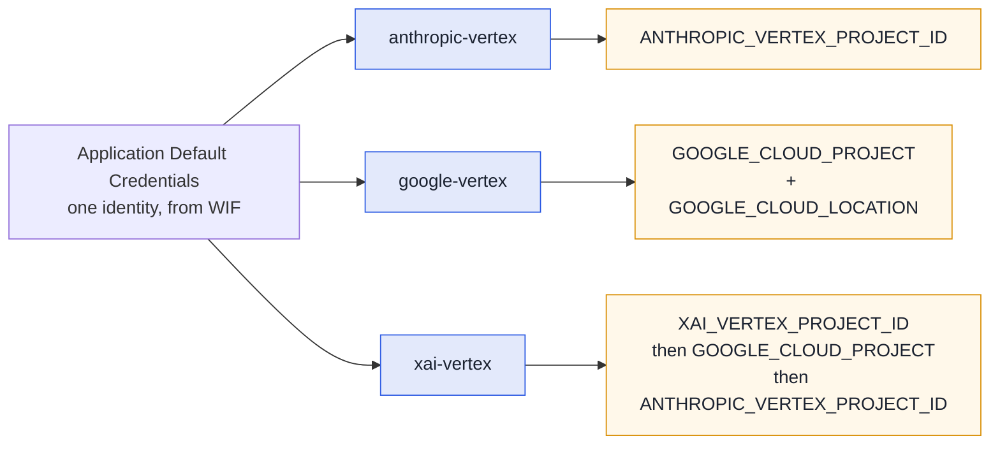

# Running pi

[pi](https://github.com/earendil-works/pi) is fullsend's second agent runtime, opt-in per org or
repo. It reaches models Claude Code cannot — **Grok** and **Gemini** alongside Claude — through the
same sandbox, credentials and egress policy.

```bash
fullsend run triage --runtime pi --model xai-vertex/xai/grok-4.6
```

Selecting it, and how it compares to Claude Code, is in [Agent runtimes](../runtimes.md). This page
is what changes once you are on it.

## Models and providers

A model on pi is `provider/id`. Aliases and bare ids still work — `opus`/`sonnet`/`haiku` resolve
through fullsend's table, and a bare id gets the provider from `FULLSEND_PI_PROVIDER` (default
`anthropic-vertex`).

| Model | Spec | Provider |
|---|---|---|
| Claude | `anthropic-vertex/claude-opus-4-6` | vendored extension |
| Gemini | `google-vertex/gemini-3.7-flash` | pi built-in |
| Grok | `xai-vertex/xai/grok-4.6` | vendored extension |

> **Grok's spec has three segments on purpose.** pi sends the model id on the wire verbatim and
> Vertex wants the publisher-qualified `xai/grok-4.6`, so the id keeps its slash. Use the full
> `xai-vertex/xai/grok-4.6`; a bare `xai/grok-4.6` would otherwise reach pi's **built-in** `xai`
> provider, which talks to xAI's own API and wants `XAI_API_KEY`. fullsend normalises the short form
> and a bare id under `FULLSEND_PI_PROVIDER=xai-vertex`, case-insensitively, so both land on the
> canonical spec.

Because harness `model:` cannot contain `/` (`validModelName` is `^[a-zA-Z0-9_.@-]+$`), a harness
selects a pi provider with a bare `model:` plus `FULLSEND_PI_PROVIDER`.

### Each provider has its own GCP project

Every Vertex provider on pi resolves its **own** project variable, so one run can reach models that
live in different projects. That matters because Model Garden availability is per-project — Grok may
well be enabled somewhere other than Claude.



ADC supplies the identity for all three — only the *project* differs, so one credential covers them.
A pi run leaves an explicitly-set `XAI_VERTEX_PROJECT_ID` alone and only defaults it to the fleet's
Vertex project, so Grok can be pointed at a project where it is actually enabled.

**Endpoints and regions.** `anthropic-vertex` uses `CLOUD_ML_REGION` (then `GOOGLE_CLOUD_LOCATION`).
`xai-vertex` is fixed to the **global** endpoint — Vertex serves Grok only there, and regional
endpoints answer `FAILED_PRECONDITION` — so region variables are deliberately ignored for it.

## At a glance

| | |
|---|---|
| Credentials | Same WIF `external_account` + refreshed OIDC token as Claude Code. `ANTHROPIC_*` unset on the Claude provider, `XAI_API_KEY` unset on the Grok one, so a stray key cannot shadow a Vertex provider |
| Unattended | No approval prompts, stdin closed, bounded retries; a missing credential exits 1 |
| Artifacts | `output.jsonl`, `transcripts/<agent>-<ts>_<id>.jsonl`, `metrics.json` with `runtime: pi`, plus `pi-debug.log` with `--debug` |
| Extra knobs | `FULLSEND_PI_PROVIDER` (prefix for bare ids), `FULLSEND_PI_BASH_ALLOWLIST=enforce` |
| Not supported | Sub-agents, fallback chains, `plugins:`, Bedrock/Azure providers |

**Running it locally?** See [Run a minimal agent on the pi
runtime](../guides/user/running-agents-locally.md#run-a-minimal-agent-on-the-pi-runtime) — no fleet repo
required.

### Behaviour differences worth knowing

- **No permission system.** pi's posture is "run in a container". The sandbox, its egress policy and
  credential placeholders are the boundary ([ADR 0027](../ADRs/0027-allowed-and-disallowed-tools-for-agents.md));
  fullsend's hook adapter is defense-in-depth on top.
- **Reads `AGENTS.md` natively** — no `CLAUDE.md` bridge is injected.
- **The agent body is appended** to pi's own system prompt rather than replacing it, so pi's default
  tool guidance stays. Claude Code's `--agent` replaces it.
- **`--tools` is enforced strictly**, unlike Claude Code. `Bash(a,b)` becomes a first-token allowlist
  that is advisory by default; `FULLSEND_PI_BASH_ALLOWLIST=enforce` makes it block.
- **Failed tool calls are sanitized too** — pi fires its post-tool event on failures, which Claude
  Code does not, so redaction and unicode normalization apply on both paths.
- **Fast release cadence** (~weekly minors, with wire-format changes inside a minor) — versions are
  pinned exactly and the stream-parser fixtures are tied to the pinned version.

### Not yet exercised

`runtime: pi` is selectable and has been run end to end, but no **fleet lifecycle** run on Vertex is
recorded yet. Pilot on a disposable org with `triage`/`prioritize` before `code`/`fix`. `review` and
`retro` are unsupported — they need sub-agents, and would run in a single context without per-persona
models. `extension_error` events are not mapped.

## Troubleshooting

**The model is not found, or the provider is missing.** A pi provider comes from an extension loaded
with `-e`, and a failed extension is dropped **silently** — it simply does not appear. Re-run with
`--debug` and read `pi-debug.log`, which captures pi's stderr including extension load errors.

**`No API key found for <provider>`.** The provider is registered but its credentials did not
resolve. For Vertex providers that means ADC — check the project variable for *that* provider in the
table above, not a shared one.

**403 `PERMISSION_DENIED` on a Vertex call.** The credentials work but the model is not enabled in
that project's Model Garden, or the provider resolved a different project than you expect.

**The model says it is a different model than you selected.** Do not trust the reply — a model
asked about itself will often repeat whatever the conversation history said. `metrics.json` records
the model that actually served the run, and the session JSONL under `transcripts/` records the
provider and model per message.

## See also

- [Agent runtimes](../runtimes.md) — choosing and selecting a runtime
- [Running agents locally](../guides/user/running-agents-locally.md#run-a-minimal-agent-on-the-pi-runtime) — a local pi run, no fleet repo required
- [pi runtime internals](../contributing/runtime-implementation.md#pi-runtime-internals-6464) — verification provenance and what to re-check on a version bump
