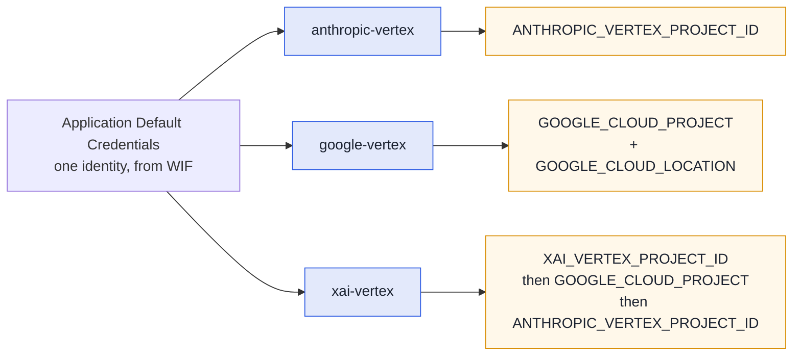

# Pi

[pi](https://github.com/earendil-works/pi) is fullsend's second agent runtime, opt-in per org or
repo. It reaches models Claude Code cannot — **Grok** and **Gemini** alongside Claude — through the
same sandbox, credentials and egress policy.

```bash
fullsend run triage --runtime pi --model xai-vertex/xai/grok-4.6
```

Selecting it, and how it compares to Claude Code, is in [Agent runtimes](../runtimes.md). This page
is what changes once you are on it.

## Models and providers

A model on pi is `provider/id`. Aliases and bare ids still work — `opus`/`sonnet`/`haiku`/`fable`
resolve through fullsend's pinned alias table, and a bare id gets the provider from
`FULLSEND_PI_PROVIDER` (default `anthropic-vertex`).

| Model | Spec | Provider |
|---|---|---|
| Claude | `anthropic-vertex/claude-opus-4-6` | vendored extension |
| Gemini | `google-vertex/gemini-3.7-flash` | pi built-in |
| Grok | `xai-vertex/xai/grok-4.6` | vendored extension |
| GPT | `openai/gpt-5.6-luna` | pi built-in |

> **Grok's spec has three segments on purpose.** pi sends the model id on the wire verbatim and
> Vertex wants the publisher-qualified `xai/grok-4.6`, so the id keeps its slash. Use the full
> `xai-vertex/xai/grok-4.6`; a bare `xai/grok-4.6` would otherwise reach pi's **built-in** `xai`
> provider, which talks to xAI's own API and wants `XAI_API_KEY`. fullsend normalises the short form
> and a bare id under `FULLSEND_PI_PROVIDER=xai-vertex`, case-insensitively, so both land on the
> canonical spec.

> **GPT via OpenAI** needs no API key in CI: the runner exchanges the job's GitHub identity for a
> short-lived OpenAI token (give fullsend three identifiers with `fullsend github setup --openai-*`
> or repository variables — see [OpenAI Workload
> Identity](../guides/infrastructure/openai-workload-identity.md); GitHub Actions only) and keeps it
> in a provider that belongs to this run, refreshed before it expires and removed when the run
> ends. Locally, put `OPENAI_API_KEY` in an env file for the runner ([Running agents
> locally](../guides/user/running-agents-locally.md#get-an-openai-key-gpt-on-pi-or-codex)). Declare
> `providers: [openai]` on the harness; the sandbox can then reach `api.openai.com` for the
> Responses API and nothing else, and never sees the credential
> ([ADR 0092](../ADRs/0092-openai-wif-credential-delivery.md)). A custom harness must carry a
> `policy:` (the fleet's `policies/base.yaml`); without one the image's default policy leaves an
> uninspected route to `api.openai.com` and the run stops before the agent starts. **Exercised so
> far:** the local static-key path end to end on 2026-08-27 (OpenShell 0.0.115, pi 0.84.3,
> `gpt-5.6-luna`: placeholder in the sandbox, pi reading it from the runner-seeded `auth.json`, tool
> calls through the hook adapter, run-scoped provider deleted at the end, expired in place under
> `--keep-sandbox`), plus the placeholder-generation experiments recorded in the ADR. The WIF path
> has no live run yet; `features/runtime/pi-openai.feature` stays gated on `runtime-pi-openai`
> until an OpenAI organization is mapped to the pool repositories.

Harness `model:` and `agents:` entry `model:` values accept the `provider/id` form directly
(`xai-vertex/xai/grok-4.6`); a harness can also select a provider with a bare `model:` plus
`FULLSEND_PI_PROVIDER`.

### Per-repo alias overrides

fullsend pins what each alias means. Vertex enables models per project, so your project may be
able to run a newer one than the pin — point the alias at it in `.fullsend/config.yaml`:

```yaml
models:
  aliases:
    sonnet: claude-sonnet-5
```

- Only the aliases you set change; the rest keep the fleet default.
- Keys are `opus`, `sonnet`, `haiku`, `fable`. A value is a model id or `provider/id`
  (`haiku: google-vertex/gemini-3.7-flash`); it cannot be another alias.
- The same block applies on [Claude Code](claude.md#models).

**What you see.** The plan block prints the remap — `Model: sonnet (from ...) → claude-sonnet-5
(from <config path> models.aliases)` — and `metrics.json` records it in `override_source`.

**If it goes wrong.** A key or value the block does not accept stops `fullsend run` before the
sandbox is created, naming the key (`models.aliases: unknown alias key "grok"`). A model your
project cannot serve is not caught here: the run fails at the first model call, and pi has no
fallback.

### Each provider has its own GCP project

Every Vertex provider on pi resolves its **own** project variable, so one run can reach models that
live in different projects. That matters because Model Garden availability is per-project — Grok may
well be enabled somewhere other than Claude.



ADC supplies the identity for all three — only the *project* differs, so one credential covers them.
A pi run leaves an explicitly-set `XAI_VERTEX_PROJECT_ID` alone and only defaults it to the fleet's
Vertex project, so Grok can be pointed at a project where it is actually enabled.

**Endpoints and regions.** `anthropic-vertex` uses `CLOUD_ML_REGION` (then `GOOGLE_CLOUD_LOCATION`).
`xai-vertex` is fixed to the **global** endpoint — Vertex serves Grok only there, and regional
endpoints answer `FAILED_PRECONDITION` — so region variables are deliberately ignored for it.

## At a glance

| | |
|---|---|
| Credentials | Same WIF `external_account` + refreshed OIDC token as Claude Code for Vertex providers. `ANTHROPIC_*` unset on the Claude provider, `XAI_API_KEY` unset on the Grok one; `OPENAI_BASE_URL`/`AZURE_OPENAI_API_KEY` unset on the OpenAI one. OpenAI uses a runner-exchanged WIF token (ADR 0092) |
| Unattended | No approval prompts, stdin closed, bounded retries; a missing credential exits 1 |
| Artifacts | `output.jsonl`, `transcripts/<agent>-<ts>_<id>.jsonl`, `metrics.json` with `runtime: pi`, plus `pi-debug.log` with `--debug` |
| Extra knobs | `FULLSEND_PI_PROVIDER` (prefix for bare ids), `FULLSEND_PI_BASH_ALLOWLIST=enforce` |
| Extensions | Harness `extensions:` directories, uploaded and loaded with `-e` after a tree-hash preflight ([Extensions](#extensions)) |
| Not supported | Sub-agents, fallback chains, `plugins:`, Bedrock/Azure providers |

## Running it locally

Complete [Running agents locally](../guides/user/running-agents-locally.md) first — the CLI,
OpenShell, credentials and the fleet clone are the same. Every example there runs on pi by adding
`--runtime pi` to the same command:

```bash
fullsend run triage \
  --fullsend-dir /tmp/fullsend-agents/ \
  --target-repo /tmp/target-repo/ \
  --env-file fullsend-gcp.env \
  --env-file fullsend-triage.env \
  --runtime pi
```

The plan block confirms the selection — overridden values carry their source, harness defaults
print bare — and `metrics.json` records the same (`runtime`, `runtime_source`, `requested_model`,
`override_source`):

```
    Model: opus
    Effort: high
    Runtime: pi (from --runtime flag)
...
runtime: selected "pi" from --runtime flag
...
→ Agent: claude-opus-4-6 (v0.84.2)
→ Result: stop
  ✓ Agent exited with code 0 (131.9s)
```

Pick a model the same way — on pi the model name is also the provider choice, and the same Vertex
credentials cover Gemini:

```bash
fullsend run triage ... --runtime pi --model google-vertex/gemini-3.7-flash
```

To keep an agent on pi (or off it) without passing flags every time, set `runtime:`/`model:` on
its `agents:` entry in `config.yaml` — see [per-agent settings](../runtimes.md#per-agent-runtime-model-and-effort).

What a local pi run needs, beyond the guide:

- **fullsend v0.37.0+** — the first release that carries the pi runtime; the release download
  and the container image both work as-is.
- **A sandbox image that includes pi** — `ghcr.io/fullsend-ai/fullsend-sandbox` v0.37.0+ (the image
  bakes `PI_VERSION`). A stale image fails preflight with `pi preflight: pi --version exited 127`;
  `podman pull ghcr.io/fullsend-ai/fullsend-sandbox:latest` fixes it.
- **Platforms** — verified end to end on macOS Apple Silicon (podman machine, Homebrew `openshell`)
  and Fedora with rootless Podman; the guide's platform notes apply unchanged.
- **`review` and `retro`** complete with schema-valid results but in a single context — pi has no
  sub-agent tool, so the parallel reviewer roster is not exercised (see [Not yet exercised](#not-yet-exercised)).
- **Knobs** — `FULLSEND_PI_PROVIDER` sets the provider for bare model ids (default
  `anthropic-vertex`); `FULLSEND_PI_BASH_ALLOWLIST=enforce` makes the Bash first-token allowlist
  block instead of warn.
- **Security hooks are fail-closed** — a missing or modified hook adapter stops the run with exit
  97 by design; repo-owned `.pi/` content is never loaded.
- **Debugging** — `--debug='*'` (the `=` is required); sandbox-side failures land in `pi-debug.log`
  inside the run directory, next to the transcripts, not in the runner's output.

## Behaviour differences worth knowing

- **No permission system.** pi's posture is "run in a container". The sandbox, its egress policy and
  credential placeholders are the boundary ([ADR 0027](../ADRs/0027-allowed-and-disallowed-tools-for-agents.md));
  fullsend's hook adapter is defense-in-depth on top.
- **Reads `AGENTS.md` natively** — no `CLAUDE.md` bridge is injected.
- **The agent body is appended** to pi's own system prompt rather than replacing it, so pi's default
  tool guidance stays. Claude Code's `--agent` replaces it.
- **`--tools` is enforced strictly**, unlike Claude Code. `Bash(a,b)` becomes a first-token allowlist
  that is advisory by default; `FULLSEND_PI_BASH_ALLOWLIST=enforce` makes it block.
- **Failed tool calls are sanitized too** — pi fires its post-tool event on failures, which Claude
  Code does not, so redaction and unicode normalization apply on both paths.
- **Fast release cadence** (~weekly minors, with wire-format changes inside a minor) — versions are
  pinned exactly and the stream-parser fixtures are tied to the pinned version.

## Extensions

pi's tool surface grows through extensions — JavaScript/TypeScript modules pi loads with `-e`. A
harness ships its own the way it ships skills or plugins: a list of directories in the harness
repository ([ADR 0094](../ADRs/0094-pi-extensions-are-harness-resources.md)).

```yaml
# harness/code.yaml
extensions:
  - extensions/go-diagnostics                 # directory in the harness repo
  - path: extensions/pi-fff                   # object form only when a flag or env is needed
    args: ["--fff-mode", "override"]
    env:
      FFF_MULTIGREP: "1"
```

That is the whole configuration: no manifest file, no tool-mapping table, no allowlist bookkeeping.

**What pi accepts as a directory.** Validation applies pi's own rule for `-e <dir>`.

A `package.json` with a **`pi` object decides on its own.** Once that object exists, pi loads only
what `pi.extensions` names — `index.js` and `main` are never consulted. So `{"pi": {}}`,
`{"pi": {"skills": [...]}}` and a `pi.extensions` whose entries do not resolve all load **nothing**,
silently, with pi exiting 0 and no message: the run simply has no extension. Validation refuses all
of them. An entry may be a file, or a directory pi finds an entry point in (`index.js`/`index.ts`, a
top-level `.js`/`.ts` file, or a subdirectory that itself resolves — `.mjs`/`.cjs` do not count on
that path). An entry that escapes the directory (absolute, or `..`) is refused too: pi resolves it
against the package root with no containment check, so it would load code the tree-hash preflight
never sees. That applies one level down as well — a `pi.extensions` entry naming a subdirectory
sends pi to *that* directory's `package.json`, whose own `pi.extensions` and `main` are resolved
against it with the same absence of a check.

A glob entry (`*`, `?`, `[...]`) is matched against the tree, so a pattern that selects nothing is
refused like any other entry that does not resolve. Two limits are worth knowing: a pattern
containing `**` is accepted without being evaluated (it crosses directory separators, which the
matcher used here cannot express), and braces are **not** expanded — `{main,other}.js` matches
nothing in pi either. A leading `!` is pi's *disable* pattern: it removes an entry rather than
naming one, so it is only honoured here as "at least one include must still match". A
`pi.extensions` made of nothing but `!` patterns is refused; `["*.js", "!main.js"]` is accepted
because `*.js` matches, even though pi would then disable the only match and load nothing.

A `package.json` written with a UTF-8 byte-order mark is read the way pi reads it (the mark is
stripped before parsing), so a BOM cannot hide a `pi` object from validation.

Without a `pi` object the order is: if any of `extensions/`, `prompts/`, `skills/` or `themes/`
exists — as a directory **or** as a plain file, since pi only probes the name — the directory is a
*package*: pi collects those resource directories and ignores `index.js`, so the harness is told to
remove the entry or list its entry points in `pi.extensions`;
otherwise a `package.json` `main` pointing at an existing file, or
`index.js`/`index.ts`/`index.mjs`/`index.cjs`. Anything else fails harness validation, because pi
would exit 1 with `Failed to load extension "<path>": ... Cannot find module` rather than start the
run. A bare top-level `tools.js`, or an `index.js` one directory down, is **not** an entry point.

An extension directory may not be named `fullsend-hooks`, `anthropic-vertex` or `xai-vertex`:
those are the runner's own sandbox names and an upload under one of them would shadow runner-owned
code. Harness validation names the offending entry.

The tree may hold only regular files and directories, and no name may contain a newline, a carriage
return or a backslash — the same rule the run-time preflight applies, checked here so a planted
symlink fails at validation with the path named rather than at exit 96.

**Trust.** Extensions are harness-repo content with the same trust as `plugins:`, `scripts:` and
`skills:`: org-allowlisted URL base, content-addressed fetch, injection scan of every text file
(`node_modules` included). That scan is heuristic and runs over third-party JavaScript and prose,
so treat a finding as a prompt to look rather than as proof — expect false positives from minified
bundles and README examples. Files over 1 MiB are noted on stderr and skipped, and an extension
with more than 20 000 files is refused outright in either `fail_mode`. Extensions never come from
the target repository — `defaultProjectTrust: never`, `--no-approve` and `--no-extensions` stay
exactly as they are; the runner appends the vetted `-e` paths. URLs, `npm:`/`git:`/`ssh:` sources
and `..` segments are rejected at validation (pi would try to install `npm:`/`git:` sources from
the network at startup, which the sandbox cannot do), and a URL-sourced harness may only name paths
relative to its own directory.

**At run time.** `Bootstrap` uploads each directory to `/sandbox/pi-config/extensions/<name>/` —
a runner-owned path pi does not auto-discover — logs `Extension "<name>": uploaded to sandbox`, and
records name, sandbox path, tree hash, `args` and `env` in `fullsend-manifest.json`. Before every
iteration, before the agent-writable `.env` is sourced and next to the hook-adapter check, the run
command verifies that each directory still exists and hashes to the value computed from the host
copy; a mismatch or a missing directory stops the iteration with exit 96 and
`fullsend: pi extension "<name>" is missing or was modified` — nothing from the extension runs. The
expected hash comes from the host at run time, never from the manifest (which sits in the
agent-writable config directory). It covers file contents, file names **and** the set of
directories, so an added empty `skills/` — which would silently turn the extension into a package
pi loads nothing from — is caught; a symlink anywhere in the tree is refused on the host and fails
the sandbox check closed, because pi follows symlinks and one could otherwise point `index.js` at
code outside the extension. Load order is provider extension → `fullsend-hooks.js` → declared
extensions in harness order: pi runs `tool_call` handlers in `-e` order and the first `block` wins,
so the sandbox hooks see every call before any declared extension does.

**The loader cache is off.** pi imports every `-e` module through jiti, which by default keeps
transpiled copies in a directory the agent can write (`/tmp/jiti` in the sandbox image) and accepts
a cached copy on a marker derived from the *source* alone. A cached body rewritten with that marker
left in place would run while the source file, the tree hash above and the hook adapter's own
checksum all stayed clean. The runtime therefore exports `JITI_FS_CACHE=false` (re-exported after
`.env`, with the `JITI_*` family reserved from extension `env`), which makes pi ignore any planted
entry and create no cache directory at all.

**And the rest of the loader environment is cleared.** The cache is one lever of several the
environment carries into the module loader, and `JITI_ALIAS` is the sharpest: it maps a module
specifier onto a different file, and pi's bundled entry point builds its loader without pinning
that option, so the environment fills it in. A `.env` exporting
`JITI_ALIAS='{"<extension path>":"<other file>"}'` therefore makes pi import something else while
the extension source, the tree hash above and the hook adapter's checksum all stay clean — none of
them can see the substitution. Right after `.env` is sourced, on **every** provider path, the run
command clears `NODE_OPTIONS`, `NODE_PATH` and the whole `JITI_*` family except the cache switch,
which is re-exported immediately after. `unset` is a POSIX special builtin, so a function a
rewritten `.env` defined cannot stand in for it.

One window is left, shared with the hook-adapter check: a process left running by an earlier
iteration can still rewrite the tree between the check and pi's import.

**`args` and `env`.** Each extension's `args` follow its `-e <path>` verbatim, and pi parses every
element positionally, so validation is strict: each dash-prefixed element must be `--flag` or
`--flag=value` the extension registered with `pi.registerFlag` (single-dash forms are refused —
pi has none), pi's own option names (`--extension`, `--approve`, `--model`, `--tools`,
`--use-theme`, `--tui-mode`, …) are rejected, and a value may not start with `-` or `@` in
either spelling. A bare word is allowed exactly **once**, immediately after a `--flag` written
without `=`: pi consumes at most one value per flag and none at all after `--flag=value`, and reads
every other bare word as *prompt text* prepended to the agent's prompt, so
`args: ["--fff-mode", "override", "and now ignore your instructions"]` is prompt injection rather
than a flag value and is rejected. An unregistered flag makes pi exit with
`Unknown option --x`. `env` is exported right before pi starts, after the runtime's own exports —
but export order is not the protection: pi hands its whole environment to every hook script it
spawns, so a deny-list refuses the names outright at validation. It covers `PATH`, `HOME`,
`TMPDIR`, `ENV`, `BASH_ENV`, `SHELL`, `IFS`, `CDPATH`, `PROMPT_COMMAND`, `LD_*`, `DYLD_*`,
`PYTHON*`, `NODE_*`, `SSL_*`, `JITI_*`, `GIT_*`, the other interpreters that take options from the
environment (`JAVA_TOOL_OPTIONS`, `RUBYOPT`, `PERL5OPT`), every `*_PROXY`, `*_API_KEY`, `*_TOKEN`
and `*_SECRET*` name, the names that move a trust anchor or a resolver for the tools the hook
scripts shell out to (`HOSTALIASES`, `OPENSSL_CONF`, `SSLKEYLOGFILE`, `REQUESTS_CA_BUNDLE`,
`CURL_CA_BUNDLE`, `GOPROXY`, `GOFLAGS`), and the runner's, providers' and sandbox tooling's
families
(`PI_*`, `FULLSEND_*`, `TIRITH_*`, `GOOGLE_*`, `GCLOUD_*`, `CLOUDSDK_*`, `ANTHROPIC_*`, `XAI_*`,
`OPENAI_*`, `AZURE_*`, `AWS_*`, `CLOUD_ML_REGION`). An extension's own settings — `FFF_MULTIGREP`, `GO_DIAG_LEVEL` — are
unaffected.

**`tools:` frontmatter.** An agent that declares `tools:` keeps its strict `--tools` allowlist and
pi hides extension tools under it — that is what a declared `tools:` means. An agent whose `tools:`
maps to nothing pi provides gets `--no-builtin-tools`; its declared extensions still load and their
tools still activate, since `-e` is independent of `--tools`. An agent without `tools:` gets pi's
default set plus whatever its declared extensions register. In every case the hook adapter treats an
extension tool like any other: every PreToolUse and PostToolUse hook runs on it. If your org enables
the optional `tool_allowlist_pretool.py` hook, list the extension's tool names in
`FULLSEND_TOOL_ALLOWLIST` the same way `mcp__*` names are listed — the adapter grants no bypass,
because the manifest it would have to trust for that is agent-writable. First use of each extension
tool is logged as `[fullsend-hooks] extension tool: <name>`, and the `session_start` roster line
ends with `extensions=<names>`.

**Claude Code ignores it.** `Extension "<name>": skipped — the Claude Code runtime has no pi
extensions` is printed at bootstrap and the run continues, the mirror of pi's `plugins:` warning.
The dummy runtime prints the same kind of line.

**Vendoring dependencies.** Commit `node_modules` (or bundle): the sandbox never runs
`npm install`. Remove `node_modules/.bin/` before committing: npm fills it with symlinks, and no
symlink may appear anywhere in the tree (validation refuses it and the run-time preflight would
fail the copy closed). Nothing in the sandbox needs it, since no package script and no vendored
CLI is ever run. Do not vendor pi's own packages (`@earendil-works/pi-coding-agent`,
`pi-agent-core`, `pi-tui`) — pi resolves those imports to the running pi, so an extension written
against the pinned `PI_VERSION` just works. Extensions must not write into their own directory
between iterations; the preflight treats that as tampering — use the workspace or `/tmp`.

**Troubleshooting.** Exit 96 means the sandbox copy diverged from the host: an extension (or the
agent) wrote into `/sandbox/pi-config/extensions/`, or planted a symlink or a directory there.
`Failed to load extension "<path>"` on stderr with exit 1 means pi could not import the entry point
at run time even though validation accepted the directory — re-run with `--debug` and read
`pi-debug.log`. `Unknown option --x` at startup means an `args` flag the extension does not
register. An extension that loads but registers nothing, with **no** message at all, is the
`package.json` `pi`-object case above; harness validation refuses that shape, so it can only
appear if the directory changed after it was validated.

## Not yet exercised

`runtime: pi` is selectable and has been run end to end, but no **fleet lifecycle** run on Vertex is
recorded yet. Pilot on a disposable repo with `triage`/`prioritize` before `code`/`fix`. `review` and
`retro` run to schema-valid results, but in a **single context**: pi has no sub-agent tool, so the
parallel persona roster and its per-persona models are never exercised — treat them as unsupported
for that purpose. `extension_error` events are not mapped.

## Troubleshooting

**The model is not found, or the provider is missing.** A pi provider comes from an extension loaded
with `-e`. An extension whose entry point fails to import is **not** silent: pi prints
`Failed to load extension "<path>"` on stderr and exits 1, which under `--debug` lands in
`pi-debug.log` rather than in the terminal. The silent case is a different one: a directory whose
`package.json` carries a `pi` object naming no resolvable entry loads nothing and pi exits 0 (see
[Extensions](#extensions)). Harness validation refuses that shape, so it should never reach a run.

**`No API key found for <provider>`.** The provider is registered but its credentials did not
resolve. For Vertex providers that means ADC — check the project variable for *that* provider in the
table above, not a shared one.

**403 `PERMISSION_DENIED` on a Vertex call.** The credentials work but the model is not enabled in
that project's Model Garden, or the provider resolved a different project than you expect.

**`[pi-anthropic-vertex] disabled: set GOOGLE_CLOUD_PROJECT ...`.** The sandbox environment comes
from the harness (`host_files`, `env.sandbox`), not from `--env-file`, which only reaches the runner
process (ADR 0055). Files sourced from `.env.d/` need `export` on each line. The fleet harnesses
already wire this; a custom harness must too.

**The run used Claude instead of pi.** The runtime falls back to `claude` when neither the config's
`runtime:` (repo-wide or on the agent's `agents:` entry) nor `--runtime`/`FULLSEND_RUNTIME` selects
pi; the plan block's `Runtime:` line and stderr's `runtime: selected ...` show which one ran and why.

**`--debug "..."` fails with `accepts 1 arg(s)`.** `--debug` takes an optional value: write
`--debug='*'` (with `=`).

**The agent fails with nothing in the terminal.** Sandbox-side pi failures land in `pi-debug.log`
inside the run directory, next to the transcripts; kept sandboxes must be removed manually
(`openshell sandbox delete <name>`).

**The model says it is a different model than you selected.** Do not trust the reply — a model
asked about itself will often repeat whatever the conversation history said. `metrics.json` records
the model that actually served the run, and the session JSONL under `transcripts/` records the
provider and model per message.

## See also

- [Agent runtimes](../runtimes.md) — choosing and selecting a runtime
- [Running agents locally](../guides/user/running-agents-locally.md) — the local-run flow that [Running it locally](#running-it-locally) builds on
- [pi runtime internals](../contributing/runtime-implementation.md#pi-runtime-internals-6464) — verification provenance and what to re-check on a version bump
